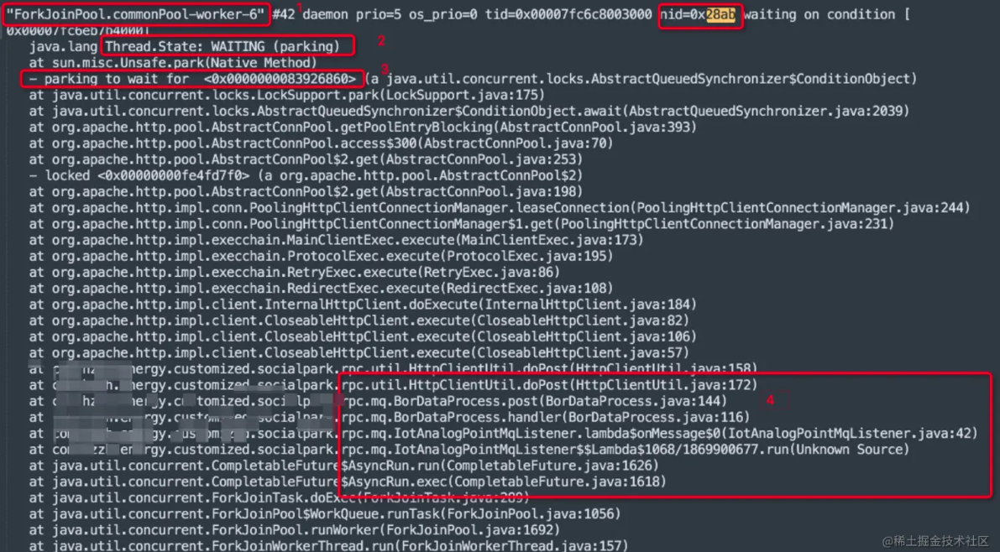
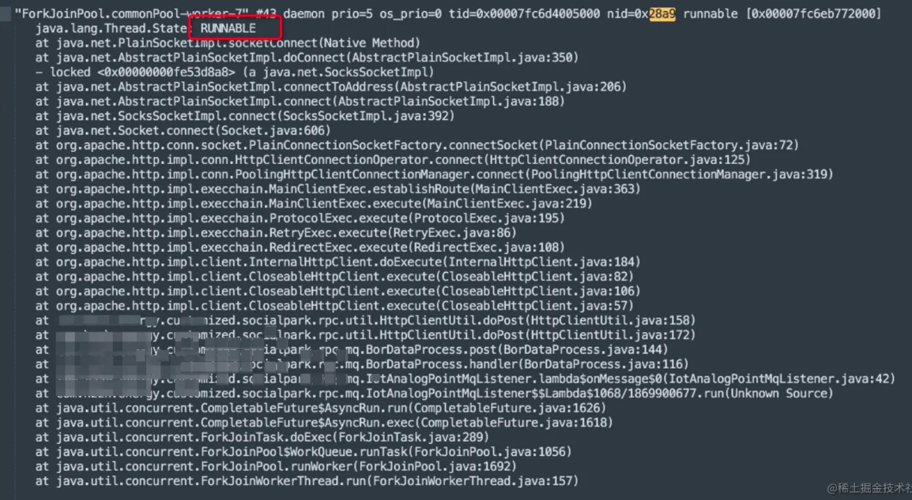

# 生产环境使用CompletableFuture遇到的坑
<!--page header-->

<a name="a9d1be2b"></a>
#### 为什么使用CompletableFuture

业务功能描述：有一个功能是需要调用基础平台接口组装我们需要的数据，在这个功能里面我们要调用多次基础平台的接口，我们的入参是一个id，但是这个id是一个集合。我们都是使用RPC调用，一般常规的想法去遍历循环这个idList，但是呢这个id集合里面的数据可能会有500个左右。说多不多，说少也不少，主要是在for循环里面多次去RPC调用是一件特别费时的事情。

我用代码大致描述一下这个需求：

```java
public List<BasicInfo> buildBasicInfo(List<Long> ids) {
         List<BasicInfo> basicInfoList = new ArrayList<>();
         for (Long id : ids) {
             getBasicData(basicInfoList, id);
         }
     }
 
     private List<BasicInfo> getBasicData(List<BasicInfo> basicInfoList, Long id) {
         BasicInfo basicInfo = rpcGetBasicInfo(id);
         return basicInfoList.add(basicInfo);
     }
 
     public BasicInfo rpcGetBasicInfo(Long id) {
         // 第一次RPC 调用
          rpcInvoking_1()...........
 
         // 拿到第一次的结果进行第二次RPC 调用
          rpcInvoking_2()...........
 
         // 拿到第二次的结果进行第三次RPC 调用、
          rpcInvoking_3()...........
 
         // 拿到第三次的结果进行第四次RPC 调用、
          rpcInvoking_4()...........
 
         // 组装结果返回
 
         return BasicInfo;
     }
```

是的，这个数据的获取就是这么的扯淡。。。如果使用循环的方式，当ids数据量在500个左右的时候，这个接口返回的时间再8s左右，这是万万不能接受的，那如果ids数据更多呢？所以不能用for循环去遍历ids呀，这样确实是太费时了。

既然远程调用避免不了，那就想办法让这个接口快一点，这时候就想到了多线程去处理，然后就想到使用CompletableFuture异步调用：

<a name="6dc326b8"></a>
#### CompletableFuture多线程异步调用

```java
List<BasicInfo> basicInfoList = new ArrayList<>();
       CompletableFuture<List<BasicInfo>> future = CompletableFuture.supplyAsync(() -> {
             ids.forEach(id -> {
                 getBasicData(basicInfoList, id);
             });
             return basicInfoList;
        });
        try {
            List<BasicInfo> basicInfos = future.get();
        } catch (Exception e) {
             e.printStackTrace();
        }
```

> 这里补充一点：**CompletableFuture是否使用默认线程池的依据，和机器的CPU核心数有关。当CPU核心数减1大于1时，才会使用默认的线程池（ForkJoinPool），否则将会为每个CompletableFuture的任务创建一个新线程去执行**。即，CompletableFuture的默认线程池，只有在**双核以上的机器**内才会使用。在双核及以下的机器中，会为每个任务创建一个新线程，**等于没有使用线程池，且有资源耗尽的风险**。


默认线程池，**池内的核心线程数，也为机器核心数减1**，这里我们的机器是8核的，也就是会创建7个线程去执行。

上面这种方式虽然实现了多线程异步执行，但是如果ids集合很多话，依然会很慢，因为`future.get();`也是堵塞的，必须等待所有的线程执行完成才能返回结果。

<a name="5cc63467"></a>
#### 改进CompletableFuture多线程异步调用

想让速度更快一点，就想到了把ids进行分隔：

```properties
ini复制代码   int pageSize = ids.size() > 8 ? ids.size() >> 3 : 1;
   List<List<Long>> partitionAssetsIdList = Lists.partition(ids, pageSize);
```

因为我们CPU核数为8核，所有当ids的大小小于8时，就开启8个线程，每个线程分一个。这里的>>3(右移运算)相当于ids的大小除以2的3次方也就是除以8；右移运算符相比除效率会高。毕竟现在是在优化提升速度。

如果这里的ids的大小是500个，就是开启9个线程，其中8个线程是处理62个数据，另一个线程处理4个数据，因为有余数会另开一个线程处理。具体代码如下：

```java
int pageSize = ids.size() > 8 ? ids.size() >> 3 : 1;
         List<List<Long>> partitionIdList = Lists.partition(ids, pageSize);
         List<CompletableFuture<?>> futures = new ArrayList<>();
         //如果ids为500，这里会分隔成9份，也就是partitionIdList.size()=9；遍历9次,也相当于创建了9个CompletableFuture对象，前8个CompletableFuture对象处理62个数据。第9个处理4个数据。
         partitionIdList.forEach(partitionIds -> {
             List<BasicInfo> basicInfoList = new ArrayList<>();
             CompletableFuture<List<BasicInfo>> future = CompletableFuture.supplyAsync(() -> {
                 partitionIds.forEach(id -> {
                     getBasicData(basicInfoList, id);
                 });
                 return basicInfoList;
             });
             futures.add(future);
         });
         // 把所有线程执行的结果进行汇总
         List<BasicInfo> basicInfoResult = new ArrayList<>();
         for (CompletableFuture<?> future : futures) {
             try {
                 basicInfoResult.addAll((List<BasicInfo>)future.get());
             } catch (Exception e) {
                 e.printStackTrace();
             }
         }
```

如果ids的大小等于500，就会被分隔成9份，创建9个CompletableFuture对象，前8个CompletableFuture对象处理62个数据(id),第9个处理4个数据(id)。这62个数据又会被分成7个线程去执行(CPU核数减1个线程)。经过分隔之后充分利用了CPU。速度也从8s减到1-2s。得到了总监和同事的夸赞，同时也被写到正向事件中；哈哈哈哈。

<a name="d8366bb9"></a>
#### 在生产环境中遇到的坑。

上面说了那么多还没有说到坑在哪里，下面我们就说说坑在哪里?

本地和测试都没有啥问题，那就找个时间上生产呗，升级到生产环境，发现这个接口堵塞了，超时了。。。


刚被记录到正向事件，可不想在被记录个负向时间。感觉去看日志。

发现日志就执行了将ids进行分隔，后面循环去创建CompletableFuture对象之后的代码都没有在执行了。然后我第一感觉测试是future.get()获取结果的时候堵塞了，所以一直没有结果返回。

<a name="e59d537f"></a>
#### 排查问题过程

我们要解决这个问题就要看看问题出现在哪里？

当执行到这个接口时候我们第一时间看了看CPU的使用率：


这是访问接口之前：


发现执行这个接口时PID为10348的这个进程的CPU突然的高了起来。

紧接着使用`jps -l` :打印出我们服务进程的PID


PID为10348正式我们现在执行这个服务。

接着我就详细的看一下这个PID为10348的进程下哪里线程占用的高：

发现这几个占用的相对高一点：


紧接着使用jstack命令生成java虚拟机当前时刻的线程快照，生成线程快照的主要目的是定位线程出现长时间停顿的原因，如线程间死锁、死循环、请求外部资源导致的长时间等待等。 线程出现停顿的时候通过jstack来查看各个线程的调用堆栈，就可以知道没有响应的线程到底在后台做什么事情，或者等待什么资源

`jstack -l 10348 >/tmp/10348.log`，使用此命令将PID为10348的进程下所有线程快照输出到log文件中。

同时我们将线程比较的PID转换成16进制：printf "%x\n" 10411


我们将转换成16进制的数值28ab，28a9在10348.log中搜索一下：





看到线程的快照发现这不是本次修改的接口呀。看到日志4处但是也是用了CompletableFuture。找到对应4处的代码发现这是监听mq消息，然后异步去执行，代码类型这样：


经过查看日志发现这个mq消息处理很频繁，每秒都会有很多的数据上来。


我们知道CompletableFuture默认是使用ForkJoinPool作为线程池。难道mq使用ForkJoinPool和我当前接口使用的都是同一个线程池中的线程？难道是共用的吗？

MQ监听使用的线程池：


我们当前接口使用的线程池：


它们使用的都是ForkJoinPool.commonPool()公共线程池中的线程！

看到这个结论就很好理解了，我们目前修改的接口使用的线程池中的线程全部都被MQ消息处理占用，我们修改优化的接口得不到资源，所以一直处于等待。

同时我们在线程快照10348.log日志中也看到我们优化的接口对应的线程处于WAITING状态！


这里`- parking to wait for <0x00000000fe2081d8>`肯定也是MQ消费线程中的某一个。由于MQ消费消息比较多，每秒都会监听到大量的数据，线程的快照日志收集不全。所以在10348.log中没有找到，这不影响我们修改bug。问题的原因已经找到了。

<a name="0483f6d1"></a>
#### 解决问题

上面我们知道两边使用的都是公共静态线程池，我们只要让他们各用各的就行了：自定义一个线程池：`ForkJoinPool pool = new ForkJoinPool();`

```java
int pageSize = ids.size() > 8 ? ids.size() >> 3 : 1;
         List<List<Long>> partitionIdList = Lists.partition(ids, pageSize);
         List<CompletableFuture<?>> futures = new ArrayList<>();
         partitionIdList.forEach(partitionIds -> {
             List<BasicInfo> basicInfoList = new ArrayList<>();
             //重新创建一个ForkJoinPool对象就可以了
             ForkJoinPool pool = new ForkJoinPool();
             CompletableFuture<List<BasicInfo>> future = CompletableFuture.supplyAsync(() -> {
                 partitionIds.forEach(id -> {
                     getMonitoringCoverage(basicInfoList, id);
                 });
                 return basicInfoList;
            //在这里使用
             },pool);
             futures.add(future);
         });
         // 把所有线程执行的结果进行汇总
         List<BasicInfo> basicInfoResult = new ArrayList<>();
         for (CompletableFuture<?> future : futures) {
             try {
                 basicInfoResult.addAll((List<BasicInfo>)future.get());
             } catch (Exception e) {
                 e.printStackTrace();
             }
         }
```

这样他们就各自用各自的线程池中的线程了。不会存在资源的等待现场了。

<a name="8c9d507e"></a>
#### 总结：

之所以测试环境和开发环境没有出现这样的问题是因为这两个环境mq没有监听到消息。大量的消息都在生产环境中才会出现。由于测试环境的数据量达不到生产环境的数据量，所以有些问题在测试环境体验不出来。

> 原文链接：[https://juejin.cn/post/7165704556540755982](https://juejin.cn/post/7165704556540755982)


<!--page footer-->
- 原文: <https://www.yuque.com/dabin-1eu6s/plc2v4/nngx5st7206zugxu>