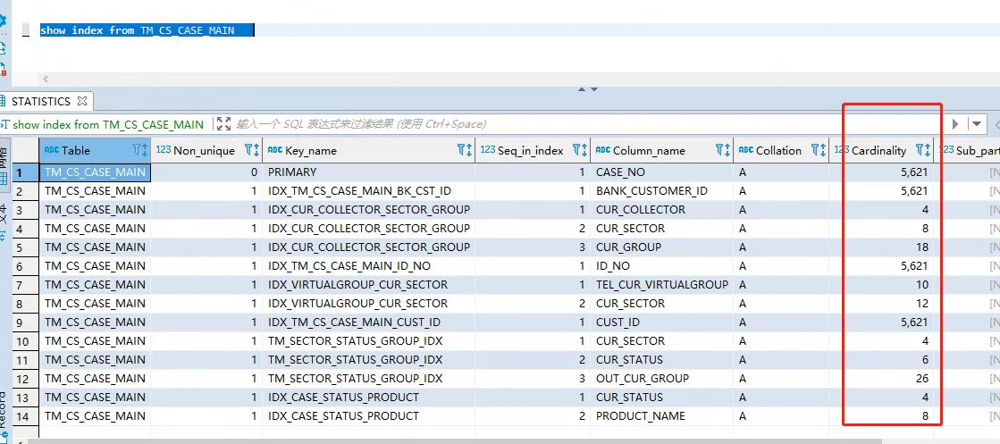

# 索引跳变导致慢查询
<!--page header-->

该篇文章的大纲如下：

1. 什么是索引跳变
2. 优化器如何选择索引
3. 为什么会产生索引跳变
4. 索引跳变的现象
5. 索引跳变的解决办法
6. 总结

<a name="ddb054eb"></a>
# 什么是索引跳变

在一张表中，如果有两个或多个索引比如IDX_A(CARD_NO)和IDX_B(TXN_TIME)，IDX_A的区分度较高，所以正常情况下会按照IDX_A走索引，并且上线运行一段时间后都正常。由于某种业务操作导致表中数据大批量被清理，Mysql优化器经过从新采样后选择了区分度更高的索引IDX_B的执行，而实际上IDX_B的数据区分度比较低，扫描行数也相应增加，从而引发了慢查询。

总结：简单的说就是DB选择了“错误”的索引，导致了慢查询。

<a name="c1a676d6"></a>
# 优化器如何选择索引

<a name="f120be7f"></a>
## 2.1 优化器选择索引的维度

索引跳变的表象是DB的优化器选择了自认为“更优”的索引，在我们看来是“错误”的索引，而实际上这个索引的执行效率更低。那优化器如何定义哪个索引“更优”呢？主要从以下三个维度进行权重统计

| 序号 | 维度 | 原因 |
| --- | --- | --- |
| 1 | 扫描行数 | 扫描行数越少，进行磁盘IO次数越少，消耗的CPU资源越少 |
| 2 | 是否使用临时表 | Group by, Union, File sort都可能会创建临时表来处理，对应的效率也会降低 |
| 3 | 是否排序 | B+树的节点天然有序，因此优化器对避免排序的权重很高，能不排序就不排序 |


<a name="69a8d9ab"></a>
## 2.2 区分度的概念

DB会事先收集一些索引的信息，来作为索引选择的重要依据，其中比较重要的是索引的区分度。一个索引不同值的个数记为基数，比如状态（初始化、进行中、已完成）会有三个不同值，基数为3。索引的基数越大，索引的区分度越好，优化器认为的该索引的效率会更优。



如果出现数据骤减或者激增的时候，DB会重新收集索引的区分度信息，如果恰好排序字段或者范围查询字段的索引区分度变高了，那么DB会优先选择对应的索引。

**3. 为什么会产生索引跳变**

产生索引跳变的话一般是以下两种模式

- WHERE A = ? AND B > ?，从索引A跳变到B

```
select * from TM_TXN_HST WHERE CARD_NO = ? and TXN_TIME >= '2021-12-01 00:00:00';
```

Ⅰ. 前提：TM_TXN_HST 表中有两个索引IDX_A(CARD_NO)和IDX_B(TXN_TIME)，均是独立索引。

Ⅱ. 正常场景：按照IDX_A(CARD_NO)索引查询

a. 筛选出CARD_NO = ?某个具体用户的流水记录，数据量比较少

b. 再根据用户流水记录，筛选TXN_TIME >= '2021-12-01 00:00:00'

Ⅲ. 异常场景：某个业务操作导致TM_TXN_HST 表的数据被清理，导致IDX_B(TXN_TIME)的区分度更高，因此Mysql优化器选择了IDX_B执行。

a. 先查询TXN_TIME = '2021-12-01' 的数据，筛选CARD_NO = ?某个具体用户

b. 再查询TXN_TIME = '2021-12-03' 的数据，筛选CARD_NO = ?某个具体用户

...

而每天的数据量又很多，导致扫描行数剧增。

Ⅳ. 总结：WHERE A = ? AND B > ?，从索引A跳变到B的原因是B引入了范围查询，数据量被清理后，Mysql优化器选择了区分度更高的IDX_B索引。

- WHERE A = ? ORDER BY B，从索引A跳变到B

```
select * from TM_TXN_HST WHERE CARD_NO = ? order by TXN_TIME desc limit 1;
```

Ⅰ. 前提：TM_TXN_HST 表中有两个索引IDX_A(CARD_NO)和IDX_B(TXN_TIME)，均是独立索引。

Ⅱ. 正常场景：按照IDX_A索引查询

a. 筛选出CARD_NO = ?某个具体用户的流水记录，数据量比较少

b. 根据TXN_TIME列排序，返回结果集

Ⅲ. 异常场景：B+数的结构中已经做好了排序，Mysql优化器觉得能不重新排序就不重新排序，因此直接按照IDX_B索引查询

a. 根据TXN_TIME 排序查询一条数据

b. 判断是否满足CARD_NO = ?条件，如果不满足重复a步骤

...

如果a步骤一直找不到符合条件的记录，可能退化成全表扫描

IV. 总结：Mysql对Order by的权重更大，优先选择IDX_B

**4. 索引跳变的现象**

索引跳变的公共现象是：

需求上线后稳定运行一段时间，某个业务操作导致表的数据大量被修改，从而出现了慢查询。

**5. 索引跳变的解决办法**

解决问题的最好办法是避免出现问题，在设计和测试阶段我们可以事先避免编写出可能会导致索引跳变的sql，如果是历史原因或者设计疏漏导致的生产问题，也有相对应的解决办法。

<a name="8b647c53"></a>
## 5. 1 设计规避

在设计阶段，我们可以对着清单一一检查，是否考虑到了对应的场景以及解决方案。

| 序号 | 检验项 |
| --- | --- |
| 1 | 是否真的需要排序，范围查询。如果业务确定要加这些筛选条件，了解清楚业务场景 |
|  | 如果待排序和范围筛选的结果集数据量较少，是否可以在程序中进行排序和范围查询 |
| 3. | 是否可以增加一个组合索引，覆盖where和order by字段 |
| 4. | 是否可以删除不必要的索引，需要结合当前的使用情况来定，风险比较高 |
| 5. | 是否存在数据骤减、数据激增的情况。如果存在，检查该表是否存在可能引发跳变的sql |
| 6. | where 条件一定要加分区字段 |
| 7. | select 必要字段，尽量不要select * |


<a name="2077ec44"></a>
## 5.2 测试规避

在测试阶段，增加相应的SQL监控和扫描规则。如果扫描到对应的慢sql，在测试阶段我们就可以规避。

<a name="7d80d45a"></a>
## 5.3 生产环境

如果历史原因或者设计没考虑全，导致在生产环境出现了慢查询，在这种情况下，我总结了现有的一些方案

| 序号 | 方案 | 优点 | 缺点 |
| --- | --- | --- | --- |
| 1 | 调整优化器的参数进行控制，比如关闭index merge参数 | 引导优化器只选择一个索引 | 可能没效果，DB最终选择的还是效率低的索引 |
| 2 | 根据语句添加最优索引，比如WHERE A = ? ORDER BY B ，可以添加组合索引IDX_AB(A, B) | 高区分度字段+避免排序组合索引引导优化器不走错误索引 | 可能没效果，因为DB最终选择了错误索引 |
| 3 | 修改sql，删掉排序和范围查询，在程序中排序和范围查询 | 引导优化器选择正确索引 | 如果数据量大，加载数据到内存中可能对服务器造成压力 |
| 4 | 使用force index 强制走指定的索引 | 强迫DB选择指定的索引 | 后期索引变更，数据库迁移都可能出现问题 |
| 5 | 使用ignore index 忽略错误索引 | 引导优化器不要选择错误索引 | 索引调整，sql也需要相应的调整 |
| 6 | 极端手段，删掉不必要的索引，比如WHERE A = ? ORDER BY B ，可以删掉索引IDX_B(B) | 优化器只有一个选择，不得不选择正确的索引 | 表数据量大时，重建索引增加DB IO，引发级联故障 |
| 7 | 使用analyze table table_name 重新统计索引信息 | 帮助优化器重新统计索引信息 | 可能没效果，因为数据变动后DB会自动收集信息。并且数据量大的时候，耗时较久 |


<!--page footer-->
- 原文: <https://www.yuque.com/dabin-1eu6s/plc2v4/vlkldv0qxda2pfpm>