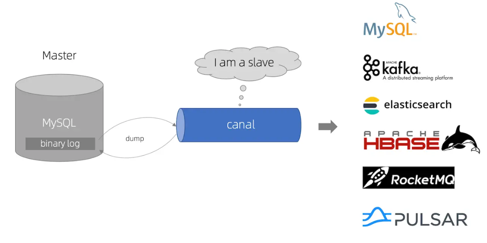
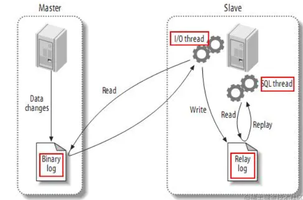
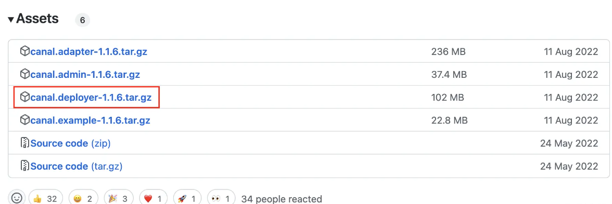
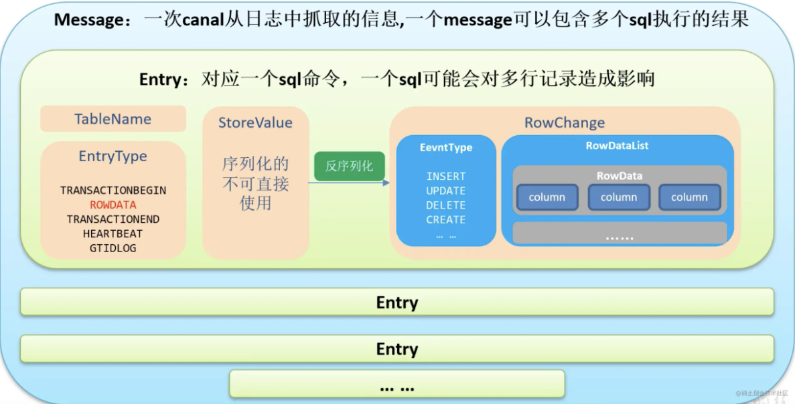

# MySQL数据如何实时同步到ES？
<!--page header-->

<a name="df368884"></a>
## 前言

我们一般会使用MySQL用来存储数据，用Es来做全文检索和特殊查询，那么如何将数据优雅的从MySQL同步到Es呢？我们一般有以下几种方式：

1.**双写**。在代码中先向MySQL中写入数据，然后紧接着向Es中写入数据。这个方法的缺点是代码严重耦合，需要手动维护MySQL和Es数据关系，非常不便于维护。

2.**发MQ，异步执行**。在执行完向Mysql中写入数据的逻辑后，发送MQ，告诉消费端这个数据需要写入Es，消费端收到消息后执行向Es写入数据的逻辑。这个方式的优点是Mysql和Es数据维护分离，开发Mysql和Es的人员只需要关心各自的业务。缺点是依然需要维护发送、接收MQ的逻辑，并且引入了MQ组件，增加了系统的复杂度。

3.**使用Datax进行全量数据同步**。这个方式优点是可以完全不用写维护数据关系的代码，各自只需要关心自己的业务，对代码侵入性几乎为零。缺点是Datax是一种全量同步数据的方式，不使用实时同步。如果系统对数据时效性不强，可以考虑此方式。

4.**使用Canal进行实时数据同步**。这个方式具有跟Datax一样的优点，可以完全不用写维护数据关系的代码，各自只需要关心自己的业务，对代码侵入性几乎为零。与Datax不同的是Canal是一种实时同步数据的方式，对数据时效性较强的系统，我们会采用Canal来进行实时数据同步。

那么就让我们来看看Canal是如何使用的。

<a name="847652d1"></a>
## 官网

[https://github.com/alibaba/canal](https://github.com/alibaba/canal)

<a name="1e64e908"></a>
## 1.Canal简介



**canal [kə'næl]** ，译意为水道/管道/沟渠，主要用途是基于 MySQL 数据库增量日志解析，提供增量数据订阅和消费

早期阿里巴巴因为杭州和美国双机房部署，存在跨机房同步的业务需求，实现方式主要是基于业务 trigger 获取增量变更。从 2010 年开始，业务逐步尝试数据库日志解析获取增量变更进行同步，由此衍生出了大量的数据库增量订阅和消费业务。

基于日志增量订阅和消费的业务包括

- 数据库镜像
- 数据库实时备份
- 索引构建和实时维护(拆分异构索引、倒排索引等)
- 业务 cache 刷新
- 带业务逻辑的增量数据处理

当前的 canal 支持源端 MySQL 版本包括 5.1.x , 5.5.x , 5.6.x , 5.7.x , 8.0.x

<a name="1cff3cc0"></a>
### **MySQL主备复制原理**



- MySQL master 将数据变更写入二进制日志( binary log, 其中记录叫做二进制日志事件binary log events，可以通过 show binlog events 进行查看)
- MySQL slave 将 master 的 binary log events 拷贝到它的中继日志(relay log)
- MySQL slave 重放 relay log 中事件，将数据变更反映它自己的数据

<a name="b3a7f141"></a>
### **canal工作原理**

- canal 模拟 MySQL slave 的交互协议，伪装自己为 MySQL slave ，向 MySQL master 发送dump 协议
- MySQL master 收到 dump 请求，开始推送 binary log 给 slave (即 canal )
- canal 解析 binary log 对象(原始为 byte 流)

<a name="7c38f11e"></a>
## 2.开启MySQL Binlog

- 对于自建 MySQL , 需要先开启 Binlog 写入功能，配置 binlog-format 为 ROW 模式，my.cnf 中配置如下

```properties
[mysqld]
log-bin=mysql-bin # 开启 binlog
binlog-format=ROW # 选择 ROW 模式
server_id=1 # 配置 MySQL replaction 需要定义，不要和 canal 的 slaveId 重复
lua
## 复制代码注意：针对阿里云 RDS for MySQL , 默认打开了 binlog , 并且账号默认具有 binlog dump 权限 , 不需要任何权限或者 binlog 设置,可以直接跳过这一步
```

- 授权 canal 链接 MySQL 账号具有作为 MySQL slave 的权限, 如果已有账户可直接 grant

```sql
CREATE USER canal IDENTIFIED BY 'canal';  
GRANT SELECT, REPLICATION SLAVE, REPLICATION CLIENT ON *.* TO 'canal'@'%';
-- GRANT ALL PRIVILEGES ON *.* TO 'canal'@'%' ;
FLUSH PRIVILEGES;
```

注意：Mysql版本为8.x时启动canal可能会出现“caching_sha2_password Auth failed”错误，这是因为8.x创建用户时默认的密码加密方式为**caching_sha2_password**，与canal的方式不一致，所以需要将canal用户的密码加密方式修改为**mysql_native_password**

```sql
ALTER USER 'canal'@'%' IDENTIFIED WITH mysql_native_password BY 'canal'; #更新一下用户密码
FLUSH PRIVILEGES; #刷新权限
```

<a name="864a32b9"></a>
## 3.安装Canal

<a name="04c9fa57"></a>
### 3.1 下载Canal

**点击下载地址，选择版本后点击canal.deployer文件下载**



<a name="769b61f4"></a>
### 3.2 修改配置文件

打开目录下conf/example/instance.properties文件，主要修改以下内容

```properties
## mysql serverId，不要和 mysql 的 server_id 重复
canal.instance.mysql.slaveId = 10
#position info，需要改成自己的数据库信息
canal.instance.master.address = 127.0.0.1:3306 
#username/password，需要改成自己的数据库信息，与刚才添加的用户保持一致
canal.instance.dbUsername = canal  
canal.instance.dbPassword = canal
```

<a name="4b51ba8a"></a>
### 3.3 启动和关闭

```bash
#进入文件目录下的bin文件夹
#启动
sh startup.sh
#关闭
sh stop.sh
```

<a name="bc69c133"></a>
## 4.Springboot集成Canal

<a name="dfd868aa"></a>
### 4.1 Canal数据结构



<a name="10808949"></a>
### 4.2 引入依赖

```xml
<!-- canal-client -->
<dependency>
    <groupId>com.alibaba.otter</groupId>
    <artifactId>canal.client</artifactId>
    <version>1.1.6</version>
</dependency>

<!-- 高版本canal需要引入这个依赖 -->
<!-- canal-protocol -->
<dependency>
    <groupId>com.alibaba.otter</groupId>
    <artifactId>canal.protocol</artifactId>
    <version>1.1.6</version>
</dependency>

<!-- Elasticsearch -->
<dependency>
    <groupId>co.elastic.clients</groupId>
    <artifactId>elasticsearch-java</artifactId>
    <version>8.4.3</version>
</dependency>

<!-- jakarta.json-api -->
<dependency>
    <groupId>jakarta.json</groupId>
    <artifactId>jakarta.json-api</artifactId>
    <version>2.0.1</version>
</dependency>
```

<a name="3ebeb8bb"></a>
### 4.3 application.yaml

```yaml
custom:
  elasticsearch:
    host: localhost    #主机
    port: 9200         #端口
    username: elastic  #用户名
    password: 3bf24a76 #密码
```

<a name="5785ad99"></a>
### 4.4 EsClient

```java
@Setter
@ConfigurationProperties(prefix = "custom.elasticsearch")
@Configuration
public class EsClient {

    /**
     * 主机
     */
    private String host;

    /**
     * 端口
     */
    private Integer port;

    /**
     * 用户名
     */
    private String username;

    /**
     * 密码
     */
    private String password;


    @Bean
    public ElasticsearchClient elasticsearchClient() {
        CredentialsProvider credentialsProvider = new BasicCredentialsProvider();
        credentialsProvider.setCredentials(
                AuthScope.ANY, new UsernamePasswordCredentials(username, password));

        // Create the low-level client
        RestClient restClient = RestClient.builder(new HttpHost(host, port))
                .setHttpClientConfigCallback(httpAsyncClientBuilder ->
                        httpAsyncClientBuilder.setDefaultCredentialsProvider(credentialsProvider))
                .build();
        // Create the transport with a Jackson mapper
        RestClientTransport transport = new RestClientTransport(
                restClient, new JacksonJsonpMapper());
        // Create the transport with a Jackson mapper
        return new ElasticsearchClient(transport);
    }
}
```

<a name="32337593"></a>
### 4.5 Music实体类

```java
@Data
@Builder
@NoArgsConstructor
@AllArgsConstructor
public class Music {

    /**
     * id
     */
    private String id;

    /**
     * 歌名
     */
    private String name;

    /**
     * 歌手名
     */
    private String singer;

    /**
     * 封面图地址
     */
    private String imageUrl;

    /**
     * 歌曲地址
     */
    private String musicUrl;

    /**
     * 歌词地址
     */
    private String lrcUrl;

    /**
     * 歌曲类型id
     */
    private String typeId;

    /**
     * 是否被逻辑删除，1 是，0 否
     */
    private Integer isDeleted;

    /**
     * 创建时间
     */
    @JsonFormat(shape = JsonFormat.Shape.STRING, pattern = "yyyy-MM-dd HH:mm:ss", timezone = "GMT+8")
    private Date createTime;

    /**
     * 更新时间
     */
    @JsonFormat(shape = JsonFormat.Shape.STRING, pattern = "yyyy-MM-dd HH:mm:ss", timezone = "GMT+8")
    private Date updateTime;

}
```

<a name="977b58db"></a>
### 4.6 CanalClient

```java
@Slf4j
@Component
public class CanalClient {

    @Resource
    private ElasticsearchClient client;


    /**
     * 实时数据同步程序
     *
     * @throws InterruptedException
     * @throws InvalidProtocolBufferException
     */
    public void run() throws InterruptedException, IOException {
        CanalConnector connector = CanalConnectors.newSingleConnector(new InetSocketAddress(
                "localhost", 11111), "example", "", "");

        while (true) {
            //连接
            connector.connect();
            //订阅数据库
            connector.subscribe("cloudmusic_music.music");
            //获取数据
            Message message = connector.get(100);

            List<CanalEntry.Entry> entryList = message.getEntries();
            if (CollectionUtils.isEmpty(entryList)) {
                //没有数据，休息一会
                TimeUnit.SECONDS.sleep(2);
            } else {
                for (CanalEntry.Entry entry : entryList) {
                    //获取类型
                    CanalEntry.EntryType entryType = entry.getEntryType();

                    //判断类型是否为ROWDATA
                    if (CanalEntry.EntryType.ROWDATA.equals(entryType)) {
                        //获取序列化后的数据
                        ByteString storeValue = entry.getStoreValue();
                        //反序列化数据
                        CanalEntry.RowChange rowChange = CanalEntry.RowChange.parseFrom(storeValue);
                        //获取当前事件操作类型
                        CanalEntry.EventType eventType = rowChange.getEventType();
                        //获取数据集
                        List<CanalEntry.RowData> rowDataList = rowChange.getRowDatasList();

                        if (eventType == CanalEntry.EventType.INSERT) {
                            log.info("------新增操作------");

                            List<Music> musicList = new ArrayList<>();
                            for (CanalEntry.RowData rowData : rowDataList) {
                                musicList.add(createMusic(rowData.getAfterColumnsList()));
                            }
                            //es批量新增文档
                            index(musicList);
                            //打印新增集合
                            log.info(Arrays.toString(musicList.toArray()));
                        } else if (eventType == CanalEntry.EventType.UPDATE) {
                            log.info("------更新操作------");

                            List<Music> beforeMusicList = new ArrayList<>();
                            List<Music> afterMusicList = new ArrayList<>();
                            for (CanalEntry.RowData rowData : rowDataList) {
                                //更新前
                                beforeMusicList.add(createMusic(rowData.getBeforeColumnsList()));
                                //更新后
                                afterMusicList.add(createMusic(rowData.getAfterColumnsList()));
                            }
                            //es批量更新文档
                            index(afterMusicList);
                            //打印更新前集合
                            log.info("更新前：{}", Arrays.toString(beforeMusicList.toArray()));
                            //打印更新后集合
                            log.info("更新后：{}", Arrays.toString(afterMusicList.toArray()));
                        } else if (eventType == CanalEntry.EventType.DELETE) {
                            //删除操作
                            log.info("------删除操作------");

                            List<String> idList = new ArrayList<>();
                            for (CanalEntry.RowData rowData : rowDataList) {
                                for (CanalEntry.Column column : rowData.getBeforeColumnsList()) {
                                    if("id".equals(column.getName())) {
                                        idList.add(column.getValue());
                                        break;
                                    }
                                }
                            }
                            //es批量删除文档
                            delete(idList);
                            //打印删除id集合
                            log.info(Arrays.toString(idList.toArray()));
                        }
                    }
                }
            }
        }
    }

    /**
     * 根据canal获取的数据创建Music对象
     *
     * @param columnList
     * @return
     */
    private Music createMusic(List<CanalEntry.Column> columnList) {
        Music music = new Music();
        DateTimeFormatter formatter = DateTimeFormatter.ofPattern("yyyy-MM-dd HH:mm:ss");

        for (CanalEntry.Column column : columnList) {
            switch (column.getName()) {
                case "id" -> music.setId(column.getValue());
                case "name" -> music.setName(column.getValue());
                case "singer" -> music.setSinger(column.getValue());
                case "image_url" -> music.setImageUrl(column.getValue());
                case "music_url" -> music.setMusicUrl(column.getValue());
                case "lrc_url" -> music.setLrcUrl(column.getValue());
                case "type_id" -> music.setTypeId(column.getValue());
                case "is_deleted" -> music.setIsDeleted(Integer.valueOf(column.getValue()));
                case "create_time" ->
                        music.setCreateTime(Date.from(LocalDateTime.parse(column.getValue(), formatter).atZone(ZoneId.systemDefault()).toInstant()));
                case "update_time" ->
                        music.setUpdateTime(Date.from(LocalDateTime.parse(column.getValue(), formatter).atZone(ZoneId.systemDefault()).toInstant()));
                default -> {
                }
            }
        }

        return music;
    }

    /**
     * es批量新增、更新文档（不存在：新增， 存在：更新）
     * 
     * @param musicList 音乐集合
     * @throws IOException
     */
    private void index(List<Music> musicList) throws IOException {
        BulkRequest.Builder br = new BulkRequest.Builder();

        musicList.forEach(music -> br
                .operations(op -> op
                        .index(idx -> idx
                                .index("music")
                                .id(music.getId())
                                .document(music))));

        client.bulk(br.build());
    }

    /**
     * es批量删除文档
     * 
     * @param idList 音乐id集合
     * @throws IOException
     */
    private void delete(List<String> idList) throws IOException {
        BulkRequest.Builder br = new BulkRequest.Builder();

        idList.forEach(id -> br
                .operations(op -> op
                        .delete(idx -> idx
                                .index("music")
                                .id(id))));

        client.bulk(br.build());
    }

}
```

<a name="bbaf1341"></a>
### 4.7 ApplicationContextAware

```java
@Component
public class ApplicationContextUtil implements ApplicationContextAware {

    private static ApplicationContext applicationContext;

    @Override
    public void setApplicationContext(ApplicationContext applicationContext) throws BeansException {
        ApplicationContextUtil.applicationContext = applicationContext;
    }

    public static <T> T getBean (Class<T> classType) {
        return applicationContext.getBean(classType);
    }

}
```

<a name="ec84f5ed"></a>
### 4.8 main

```java
@Slf4j
@SpringBootApplication
public class CanalApplication {
    public static void main(String[] args) throws InterruptedException, IOException {
        SpringApplication.run(CanalApplication.class, args);
        log.info("数据同步程序启动");

        CanalClient client = ApplicationContextUtil.getBean(CanalClient.class);
        client.run();
    }
}
```

<a name="1767b857"></a>
## 5.总结

那么以上就是Canal组件的介绍啦，希望大家都能有所收获~


<!--page footer-->
- 原文: <https://www.yuque.com/dabin-1eu6s/plc2v4/yv190s7zm5qqglom>