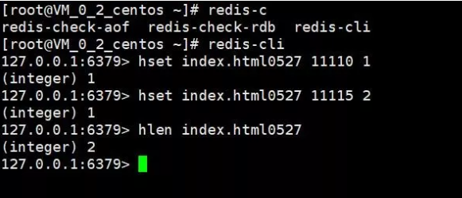
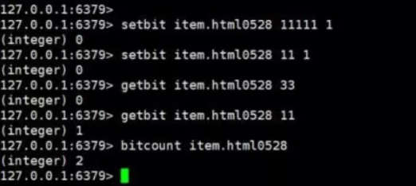

# 如何用 Redis 统计用户访问量？
<!--page header-->

拼多多有数亿的用户，那么对于某个网页，怎么使用Redis来统计一个网站的用户访问数呢？

1、**Hash**

哈希是Redis的一种基础数据结构，Redis底层维护的是一个开散列，会把不同的key映射到哈希表上，如果是遇到关键字冲突，那么就会拉出一个链表出来。

当一个用户访问的时候，如果用户登陆过，那么我们就使用用户的id，如果用户没有登陆过，那么我们也能够前端页面随机生成一个key用来标识用户

当用户访问的时候，我们可以使用HSET命令，key可以选择URI与对应的日期进行拼凑，field可以使用用户的id或者随机标识，value可以简单设置为1。

当我们要统计某一个网站某一天的访问量的时候，就可以直接使用HLEN来得到最终的结果了。

**优点**：简单，容易实现，查询也是非常方便，数据准确性非常高。

**缺点**：占用内存过大。随着key的增多，性能也会下降。网站访问量不高还行，拼多多这种数亿PV的网站肯定顶不住。

2、**Bitset**
我们知道，对于一个32位的int，如果我们只用来记录id，那么只能够记录一个用户，但如果我们转成2进制，每位用来表示一个用户，那么我们就能够一口气表示32个用户，空间节省了32倍！
对于有大量数据的场景，如果我们使用bitset，那么可以节省非常多的内存。
对于没有登陆的用户，我们也可以使用哈希算法，把对应的用户标识哈希成一个数字id。bitset非常的节省内存，假设有1亿个用户，也只需要100000000/8/1024/1024约等于12兆内存。

Redis已经为我们提供了SETBIT的方法，使用起来非常的方便，我们可以看看下面的例子。
我们在item页面可以不停地使用SETBIT命令，设置用户已经访问了该页面，也可以使用GETBIT的方法查询某个用户是否访问。最后我们通过BITCOUNT可以统计该网页每天的访问数量。

**优点**： 占用内存更小，查询方便，可以指定查询某个用户，数据可能略有瑕疵，对于非登陆的用户，可能不同的key映射到同一个id，否则需要维护一个非登陆用户的映射，有额外的开销。

**缺点**： 如果用户非常的稀疏，那么占用的内存可能比方法一更大。

3、**概率算法**

对于拼多多这种多个页面都可能非常多访问量的网站，如果所需要的数量不用那么准确，可以使用概率算法。

事实上，我们对一个网站的UV的统计，1亿跟1亿零30万其实是差不多的。

在Redis中，已经封装了HyperLogLog算法，他是一种基数评估算法。这种算法的特征，一般都是数据不存具体的值，而是存用来计算概率的一些相关数据。

当用户访问网站的时候，我们可以使用PFADD命令，设置对应的命令，最后我们只要通过PFCOUNT就能顺利计算出最终的结果，因为这个只是一个概率算法，所以可能存在0.81%的误差。

**优点**： 占用内存极小，对于一个key，只需要12kb。对于拼多多这种超多用户的特别适用。

**缺点**： 查询指定用户的时候，可能会出错，毕竟存的不是具体的数据。总数也存在一定的误差。

上面就是常见的3种适用Redis统计网站用户访问数的方法了。

<!--page footer-->
- 原文: <https://www.yuque.com/dabin-1eu6s/plc2v4/qkkttrc44n7uqh5a>