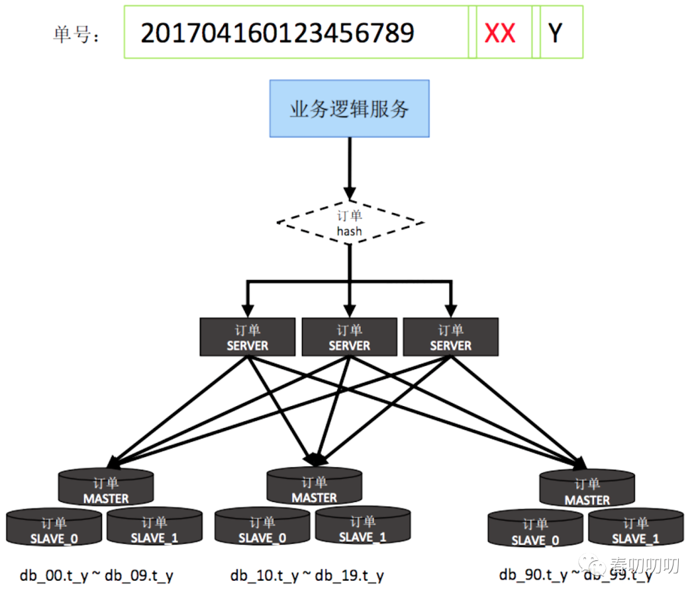
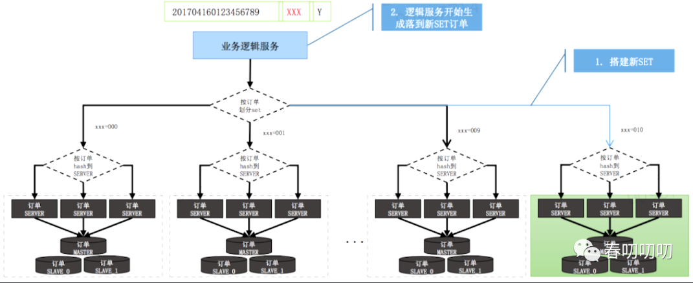

# 微信红包后台系统设计
<!--page header-->

### **背景**

微信作为一款国民应用，已经进入每个互联网用户手中，微信支付作为其杀手级功能，在每一次佳节期间都会产生巨大流量，以2017年除夕为例，峰值QPS在76w左右，整个系统核心功能和金融相关，需要做好高可用。

我们先了解下微信红包支付的流程：

一个发红包的流程经过抽象可以得到如下路径：包 -> 发 -> 抢 -> 拆

微信红包的核心知识如下：

1. 包红包：系统给每个红包分配一个唯一ID，也就是发红包的订单号，然后将红包发送给用户，红包的个数，红包金额写入到存储。
2. 发红包：用户使用微信支付完成付款，微信红包后台收到微信支付成功的通知。红包系统将红包发送订单状态更新，更新为用户已支付，并写入用户发红包记录表，这样用户可以在钱包中找到用户的发红包流水和收发红包的记录，之后微信红包系统调用微信通知，将微信红包信息发送到微信群。
3. 抢红包：微信群中的用户收到红包消息之后，点开红包，开始抢红包，这个过程微信红包系统会检查红包是否已经被抢完，是否已经过期，是否已经抢过等验证逻辑。
4. 拆红包：拆红包是整个发红包流程最复杂的一个操作，需要查询这个红包的红包订单，判断用户是否可以拆包，计算本次可拆到的红包金额。记录抢红包流水。

最后的拆红包过程类似于一个秒杀活动的过程，需要做好库存扣减和秒杀记录的操作。更新库存就是更新红包发送的订单，写入秒杀记录就是写入红包领取的信息流水。还需要以用户为中心记录用户整体的红包领取记录。最后调用支付系统将拆红包后的金额转入用户零钱中，成功之后更新抢红包的订单状态为转账成功。

### **架构**

接下来我们在了解下微信红包的整体架构：

**可用性**

影响系统可用性的指标有哪些呢？

- 计划外逻辑：很多意想不到的因素都可能对我们的系统可用性带来挑战，系统需要可以应对所有可能的故障，有些故障无法避免，那么我们是否可以缩短故障周期进行快速修复或是止损呢？

1. 系统级故障：主机，操作系统，[中间件](https://cloud.tencent.com/product/tdmq?from=10680)，数据库，网络，电源等
2. 数据和中介故障：人员操作，硬盘故障
3. 其他：自然灾害，人为破坏，供电问题

- 计划内逻辑：主要是业务升级或迭代导致，或是[运维](https://cloud.tencent.com/solution/operation?from=10680)的主从操作导致，或是一些定时的备份逻辑等。这一些因素需要做到精细化的方案，可以避免或是降低影响。

1. 日常任务：备份，容量规划，用户和安全管理
2. 运维升级相关：数据库维护升级，应用维护升级，中间件运维升级，网络维护，操作系统维护升级

总结来说做好可用性，对外做好预案降低影响，对内做好容量规划和流程制定。

那么微信红包架构在可用性上做了哪些事情呢？

1. 业务逻辑层：部署方案，异步化，降级与柔性可用
2. 订单存储层：SET化，DB故障自愈能力建设

### **部署方案**

上海深圳两地部署，同城三园区部署，每个园区容量冗余1/3。

在部署上的收益：就近接入，单机，单IDC故障不影响正常业务，避免宏观单点。

弊端：资源，需要做好数据同步。

**异步化方案**

基本思路：简化关键路径，快慢分类

方案：

用户记录，零钱入账等非关键路径可以使用MQ异步执行，增加对账机制兜底保障，实现最终一致性。

思考：

- 需要正确识别业务的核心关键路径
- 异步化MQ需要做好生产消费只有一次
- [分布式事务](https://cloud.tencent.com/product/dtf?from=10680)的一致性

**分库分表 + SET化**

方案一：分库分表

方案特点

- 分为10个物理DB，每个物理DB分10个库，每个库分10个表，总共100张。
- 订单顺序生成，订单后三位分库分表，所有物理DB均匀分库分表，每个订单server与所有物理DB相连

存在的问题：db连接数过高，容量的水平扩容问题

方案二：SET化

方案特点：

垂直stick，分而治之，将同一个红包ID的所有请求stick到同一台server，使得订单DB和订单server垂直stick在一起。

同一个SET中DB接入机器对等，三园区部署

解决DB连接数问题

思考：

1.DB层如何做到自愈？

答：监控单位时间内每个逻辑表的错误数，超过阈值后，通知订单生成系统屏蔽该号段，业务逻辑层重新生成红包id重试，对于已发的红包，没有增量，需要等机器恢复后超时退款。

2.如何解决DB锁竞争？

答：将stick到同一台server上的所有请求接收到进程后，按照红包ID排队，然后串行的进入worker进程进行处理，从而达到排队的效果，为防止server中请求队列过载导致队列被降级，从而所有请求涌进DB，系统增加了server服务器同部署的memcached，用于控制拆同一个红包请求并发数，用于请求队列过载降级。

3.冷热数据如何分离？

答：随着红包数量越来越大，单表数据也逐渐增加，DB性能和单表数据量有一定相关性，当单表数据量达到一定程度后，DB性能大幅度下降，影响系统性能稳定性，采用冷热分离，将历史数据和热数据分开存储。

比如可以按照天纬度分库分表逻辑，按照31天分。

4.如何平衡扩容？

### **总结**

做到系统的高可用，我们需要了解系统的核心流程，需要了解业务的周期性高峰，做好流量异常监控，告警。做好依赖治理，复杂度治理，需要区分核心服务和非核心服务，做拆分部署和容量规划。

> 来源：[https://cloud.tencent.com/developer/article/1637408](https://cloud.tencent.com/developer/article/1637408)

<!--page footer-->
- 原文: <https://www.yuque.com/dabin-1eu6s/plc2v4/xue0rdnib03wuxxw>