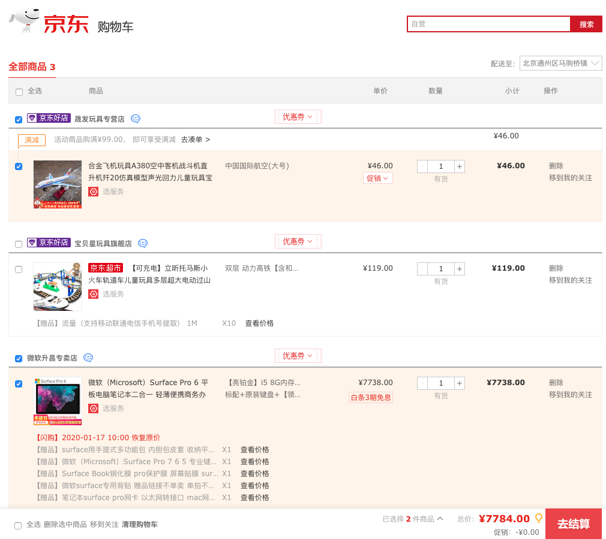

# 购物车系统怎么设计？
<!--page header-->

<a name="bf2774f1"></a>
## 1 主要功能
在用户选购商品时，下单前，暂存用户想购买的商品。
购物车对数据可靠性要求不高，性能也无特别要求，在整个电商系统是相对容易设计和实现的一个子系统。
购物车系统的主要功能：

- 把商品加入购物车（后文称“加购”）
- 购物车列表页
- 发起结算下单
- 在所有界面都要显示的购物车小图标

支撑这些功能，存储模型如何设计？
只要一个“购物车”实体。

<a name="9d8511b6"></a>
## 2 主要属性

打开京东购物车页面：SKUID（商品ID）、数量、加购时间和勾选状态


“勾选状态”属性，即在购物车界面，每件商品前面的那个小对号，表示在结算下单时，是否要包含这件商品。至于商品价格和总价、商品介绍等都能实时从其他系统获取，无需购物车系统保存。
购物车功能简单，但设计购物车系统的存储时，仍有一些问题需考虑。

<a name="8eef4b8f"></a>
## 3 原则
<a name="f7527f8d"></a>
### 3.1 思考
<a name="4b1b631d"></a>
#### 3.1.1 用户未登录，在浏览器中加购，关闭浏览器再打开，刚才加购的商品还在吗？
存在。
若用户未登录，加购的商品也会被保存在用户的电脑。即使关闭浏览器再打开，购物车的商品仍存在。

<a name="2aa3b5f2"></a>
#### 3.1.2 用户未登录，在浏览器中加购，然后登录，刚才加购的商品还在吗？
存在。
若用户先加购，再登录。登录前加购的商品就会被自动合并到用户名下，所以登录后购物车中仍有登录前加购的商品。

<a name="c46bd586"></a>
#### 3.1.3 关闭浏览器再打开，上一步加购的商品还在吗？
不存在。
关闭浏览器再打开，这时又变为未登录状态，但是之前未登录时加购的商品已经被合并到刚刚登录的用户名下了，所以购物车是空的。

<a name="771bca87"></a>
#### 3.1.4 再打开手机，用相同的用户登录，第二步加购的商品还在吗？
存在。使用手机登录相同的用户，看到的就是该用户的购物车，这时无论你在手机App、电脑还是微信中登录，只要相同用户，看到就是同一购物车，所以第2步加购的商品是存在的。
若不仔细把这些问题考虑清楚，用户使用购物车时，就会感觉不好用，不是加购的商品莫名其妙丢了，就是购物车莫名其妙多出一些商品。
要解决上面这些问题，只要在存储设计时，把握如下

<a name="b149787f"></a>
### 3.2 原则

-  若未登录，需临时暂存购物车的商品
- 用户登录时，把暂存购物车的商品合并到用户购物车，并清除暂存购物车
- 用户登录后，购物车中的商品，需在浏览器、手机APP和微信等等这些终端保持同步

购物车系统需保存两类购物车：

- 未登录情况下的“暂存购物车”
- 登录后的“用户购物车”

<a name="845e31b6"></a>
## 4 “暂存购物车”存储设计

<a name="99ffb2a3"></a>
### 4.1 保存在客户端or服务端？
若存在服务端，则每个暂存购物车都得有个全局唯一标识，这不易设计。保存在服务端，还要浪费服务端资源。所以，肯定保存在客户端：

- 节约服务器存储资源
- 无购物车标识问题每个客户端就保存它自己唯一一个购物车即可，无需标识。

客户端存储可选择不多：

- Session不太合适。SESSION保留时间短，且SESSION的数据实际上还是保存在服务端
- Cookie
- LocalStorage浏览器的LocalStorage和App的本地存储类似，都以LocalStorage代表。Cookie、LocalStorage都可用来保存购物车数据。

选择哪种更好？各有优劣。这场景中，使用Cookie和LocalStorage最关键区别：

- 客户端、服务端的每次交互，都会自动带着Cookie数据往返，这样服务端可读写客户端Cookie中的数据
- LocalStorage里的数据，只能由客户端访问

使用Cookie存储，实现简单，加减购物车、合并购物车过程，由于服务端可读写Cookie，这样全部逻辑都可在服务端实现，并且客户端和服务端请求的次数也相对少。

使用LocalStorage存储，实现相对复杂，客户端和服务端都要实现业务逻辑，但LocalStorage好在其存储容量比Cookie的4KB上限大得多，而且不用像Cookie那样，无论用不用，每次请求都要带着，可节省带宽。

所以，选择Cookie或LocalStorage存储“暂存购物车”都行，根据优劣势选型即可：

- 设计的是个小型电商，Cookie存储实现起来更简单
- 你的电商是面那种批发的行业用户，用户需加购大量商品，Cookie可能容量不够用，选择LocalStorage更合适

不管哪种存储，暂存购物车保存的

<a name="009cda10"></a>
### 4.2 数据格式
都一样。参照实体模型设计，JSON表示：
```
{
    "cart": [
        {
            "SKUID": 8888,
            "timestamp": 1578721136,
            "count": 1,
            "selected": true
        },
        {
            "SKUID": 6666,
            "timestamp": 1578721138,
            "count": 2,
            "selected": false
        }
    ]
}
```

<a name="44de43a2"></a>
## 5 用户购物车 存储设计
用户购物车须保证多端数据同步，数据须保存在服务端。常规思路：设计一张购物车表，把数据存在MySQL。表结构同样参照实体模型：

需在user_id建索引，因为查询购物车表，都以user_id作为查询条件。
也可选择更快的Redis保存购物车数据：

- 用户ID=Key
- Redis的HASH=Value，保存购物车中的商品

如：
```
{
    "KEY": 6666,
    "VALUE": [
        {
            "FIELD": 8888,
            "FIELD_VALUE": {
                "timestamp": 1578721136,
                "count": 1,
                "selected": true
            }
        },
        {
            "FIELD": 6666,
            "FIELD_VALUE": {
                "timestamp": 1578721138,
                "count": 2,
                "selected": false
            }
        }
    ]
}
```

为便理解，用JSON表示Redis中HASH的数据结构:

- KEY中的值6666是用户ID
- FIELD存放商品ID
- FIELD_VALUE是个JSON字符串，保存加购时间、商品数量和勾选状态

读写性能，Redis比MySQL快得多，Redis就一定比MySQL好吗？

<a name="5ccaca46"></a>
### 5.1 MySQL V.S Redis 存储

- Redis性能比MySQL高出至少一个量级，响应时间更短，支撑更多并发请求
- MySQL数据可靠性好于Redis，因为Redis异步刷盘，若服务器掉电，Redis有可能丢数据。但考虑到购物车里的数据，对可靠性要求不高，丢少量数据的后果也就是，个别用户的购物车少了几件商品，问题不大。所以，购物车场景，Redis数据可靠性不高这个缺点，不是不能接受
- MySQL另一优势：支持丰富的查询方式和事务机制，但对购物车核心功能无用。但每个电商系统都有它个性化需求，若需以其他方式访问购物车数据，如统计今天加购的商品总数，这时，使用MySQL存储数据，易实现，而使用Redis存储，查询麻烦且低效

综合比较下来，考虑到需求变化，推荐MySQL存储购物车数据。若追求性能或高并发，也可选择使用Redis。

设计存储架构过程就是不断抉择过程。很多情况下，可选择方案不止一套，选择时需考虑实现复杂度、性能、系统可用性、数据可靠性、可扩展性等。这些条件每一个都不是绝对不可以牺牲的，不要让一些“所谓的常识”禁锢思维。

比如，一般认为数据绝不可丢，即不能牺牲数据可靠性。但用户购物车存储，使用Redis替代MySQL，就是牺牲数据可靠性换取高性能。很低概率的丢失少量数据可接受。性能提升带来的收益远大于丢失少量数据而付出的代价，这选择就值得。

如果说不考虑需求变化这个因素，牺牲一点点数据可靠性，换取大幅性能提升，Redis是最优解。

<a name="c544aefe"></a>
## 6 总结

- 购物车系统的主要功能包括：加购、购物车列表页和结算下单
- 核心实体：只有一个“购物车”实体
- 至少包括：SKUID、数量、加购时间和勾选状态属性

在给购物车设计存储时，为确保：

- 购物车内的数据在多端一致
- 用户登录前后购物车内商品能无缝衔接

除了每个用户的“用户购物车”，还要实现一个“暂存购物车”保存用户未登录时加购的商品，并在用户登录后自动合并“暂存购物车”和“用户购物车”。
暂存购物车存储在客户端浏览器或App，可存放到Cookie或LocalStorage。用户购物车保存在服务端，可以选择使用：

- Redis存储会有更高的性能，可以支撑更多的并发请求
- MySQL是更常规通用的方式，便于应对变化，系统扩展性更好

<a name="21d68b2d"></a>
## 思考
既然用户的购物车数据存放在MySQL或Redis各有优劣。那能否把购物车数据存在MySQL，并用Redis缓存？不就兼顾二者优势？若可行，如何保证Redis中的数据和MySQL数据一致性？
用Redis给购物车库做缓存，技术可行。但考虑：

- 值得吗？每个人的购物车都不一样，所以这个缓存它的读写比差距不会很大，缓存命中率不会太高，缓存收益有限，为维护缓存，还会增加系统复杂度。所以我们就要自行权衡一下，是不是值得的问题。除非超大规模系统，否则没必要设置这缓存
- 若非要做这样一个缓存，用什么缓存更新策略？

> 参考：[https://mp.weixin.qq.com/s/3P_f_Vua8rwsGOHrxWubSg](https://mp.weixin.qq.com/s/3P_f_Vua8rwsGOHrxWubSg)


<!--page footer-->
- 原文: <https://www.yuque.com/dabin-1eu6s/plc2v4/gtutwqgyc7nnqn8k>