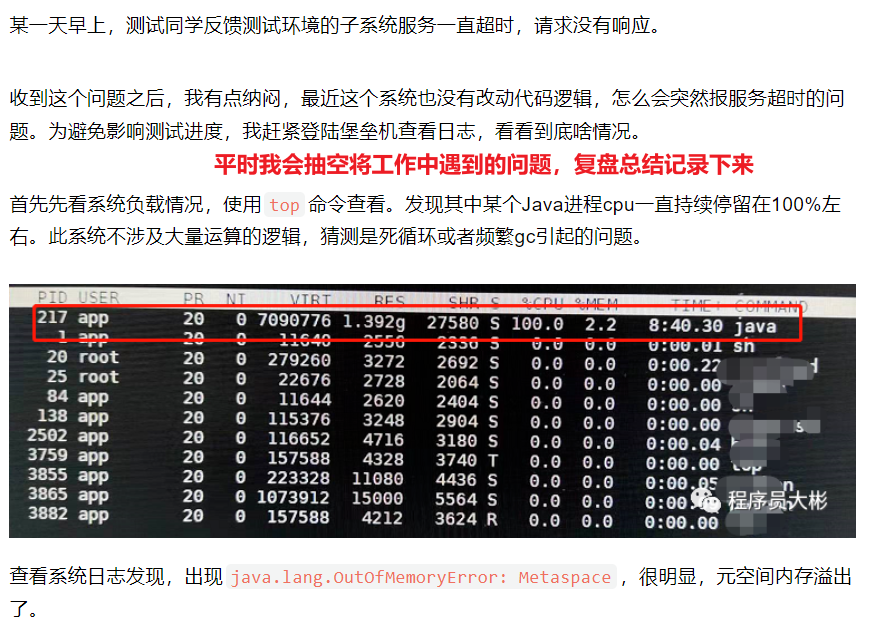

# 你在项目里遇到的最大困难是什么，如何解决的？
<!--page header-->

这是一道面试高频题，但是很多人都没能回答好，或者说没有准备好怎么去回答。

今天跟大家分享我是如何去回答这个问题的。

很多人可能觉得，自己每天都是干着CRUD的工作，难一点，再加个缓存，没有什么困难的地方。就算当时真的觉得有困难，做完了也就不觉得困难了。

其实，大部分人都是这样的状态，没有谁天天能遇到一些框架上的疑难杂症、超乎意外的生产问题，这种疑难问题很少，出现了可能也轮不到你处理。不过如果遇到这种问题的话，不管你是不是主要处理人，我建议你能主动参与进去，去分析问题产生的问题，应该怎么去处理，事后做好**复盘总结**。做好这些之后，面试就有的吹水了。

再者，平时开发过程多多少少也是会遇到一些问题，可以把遇到的这些问题记录下来，多去思考、网上搜索，或者跟别人请教，无论是怎样解决，解决以后，需要对问题进行**复盘总结**。比如下面就是我工作中遇到的OOM问题复盘总结，建议大家也养成记录的习惯。

另外，关于“你在项目里遇到的最大困难是什么，如何解决的？”这个问题，可以使用 star 法则去回答：

- Situation（背景信息）：事情是在什么情况下发生，比如在生产环境遇到xxx问题
- Target（目标任务）：你的目标任务是什么，比如保证线上服务稳定、分析问题产生原因等
- Action（采取的行动）：针对这样的情况分析，你采用了什么行动方式，比如先重启保证服务正常，之后再进行分析等
- Result（取得的成果）：结果怎样，在这样的情况下你学习到了什么

最后总结一下，最重要是平时要多复盘总结，积累面试素材。不管是多小的问题，只要你认真对待，总能学到一些知识。大部分面试官也不会期待你有处理过多大的问题，毕竟大部分人都是普通人。只要能从你的回答中看出你的思考，解决问题的方式，那么面试官的问这个问题的目的也就达到了。

<!--page footer-->
- 原文: <https://www.yuque.com/dabin-1eu6s/plc2v4/evc96o99efqqxu6h>