# 有哪些有梯度的刷题网站或app推荐？
<!--page header-->

话不多说，直接上干货！
首先推荐几个学习数据结构和算法的网站和**可视化**工具。

## Data Structure Visualizations
这是一个在线数据可视化工具，可以手动创建各种数据结构，包括队列、栈、堆、树等等，并且支持递归、排序、搜索等算法的动态演示。该工具由旧金山大学开发，地址：[https://www.cs.usfca.edu/~galles/visualization/Algorithms.html](https://www.cs.usfca.edu/~galles/visualization/Algorithms.html)
这个工具通过可视化的方式展现了数据结构和算法，方便我们理解其中的原理。网站容易操作、内容丰富且容易理解，非常nice~虽然网站是英文的，不过都是些容易理解的术语，英文不好的小伙伴也不会有很大的阅读障碍。
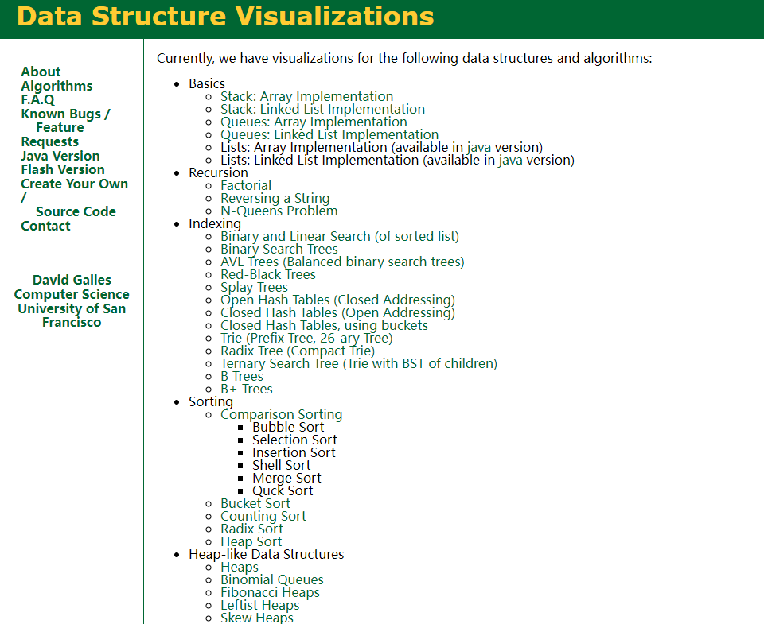

下图演示红黑树插入节点的操作，非常直观！

## visualgo

该网站由 Steven Halim 博士开发，对于理解数据结构与算法非常有帮助。网站里面包含了排序、链表、哈希表、二叉搜索树、递归树、循环查找等常见算法动画。

地址：[https://visualgo.net/zh](https://visualgo.net/zh)

在动画执行的过程中，还会在网站右下角高亮展示动画的代码逻辑。非常适合初学者学习巩固自己的算法知识。

## BinaryTreeVisualiser

一款二叉树可视化的工具，可以用来学习二叉树，超级好用。地址：[http://btv.melezinek.cz/home.html](http://btv.melezinek.cz/home.html)

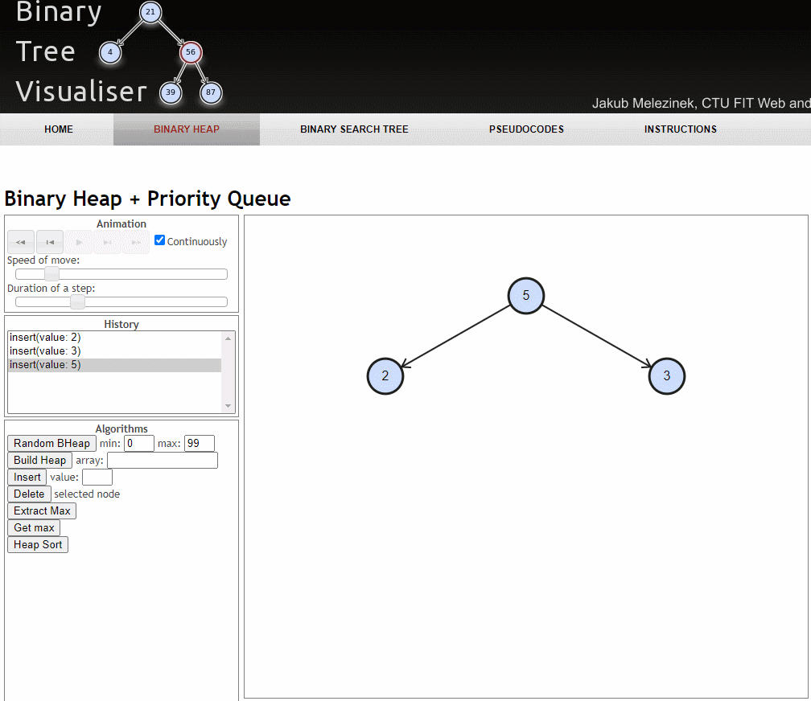

## btree-js

这是一个专门演示B树的工具，可以在上面插入节点模拟B树的构建过程，对于理解B树这种数据结构非常有帮助。

地址：[https://yangez.github.io/btree-js/](https://yangez.github.io/btree-js/)

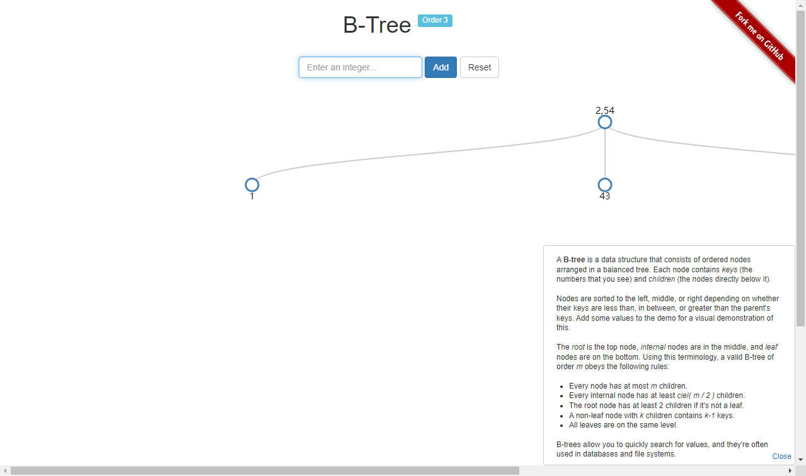

## Algorithm Visualizer

Algorithm Visualizer 是一个可视化代码算法的交互式平台，内含多种算法（回溯、动态规划、贪心等）并进行了可视化动画呈现，让学习算法和数据结构更加直观。

地址：[https://algorithm-visualizer.org/](https://algorithm-visualizer.org/)

目前支持的算法包括回溯法、动态规划、贪婪算法、排序算法、搜索算法等。

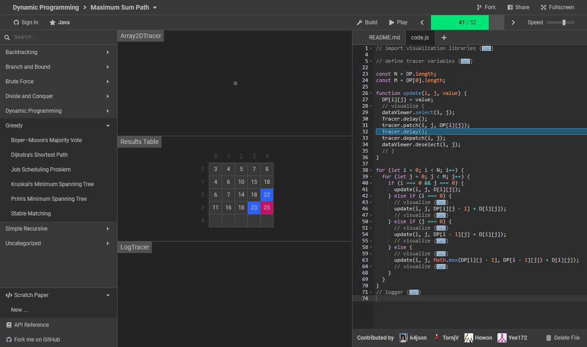

Algorithm Visualizer支持js/C++/Java语言，运行会有动态图演示代码运行过程，日志输出区记录每次搜索的过程。

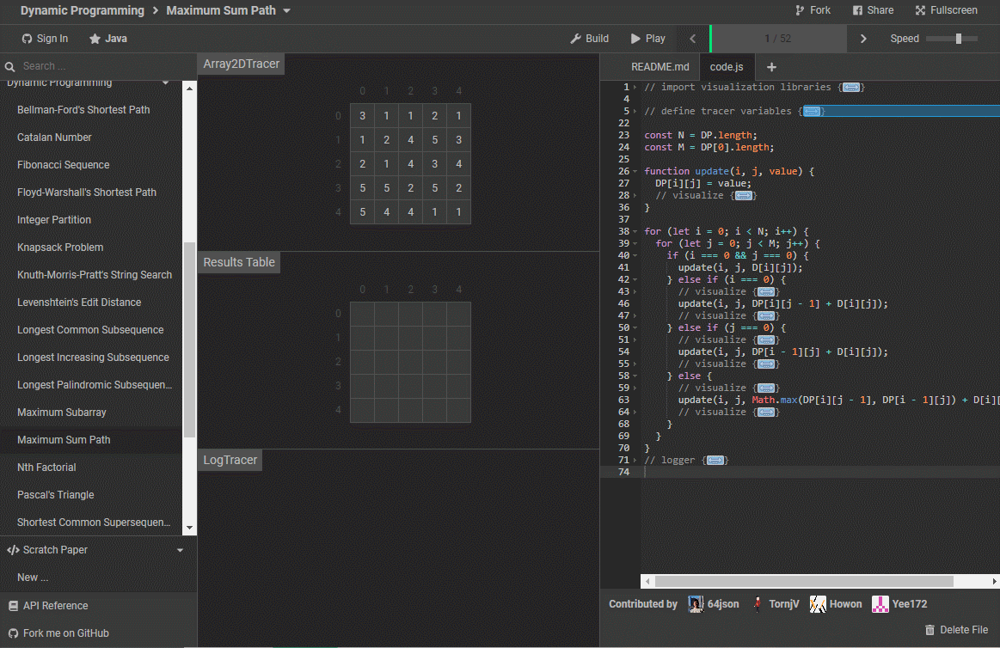

## bigocheatsheet

这个网站总结了常用算法的时空Big-O复杂性，常见数据结构操作的时间复杂度。

链接直达：[https://www.bigocheatsheet.com/](https://www.bigocheatsheet.com/)

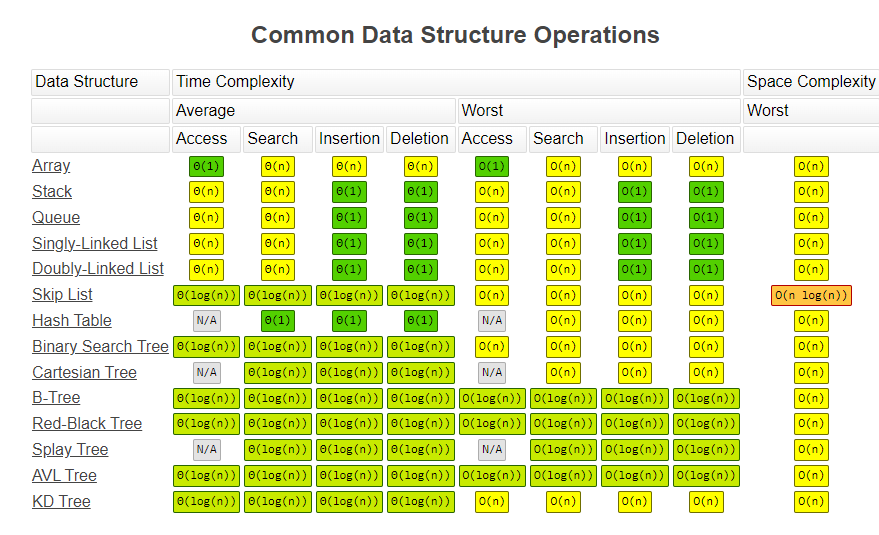

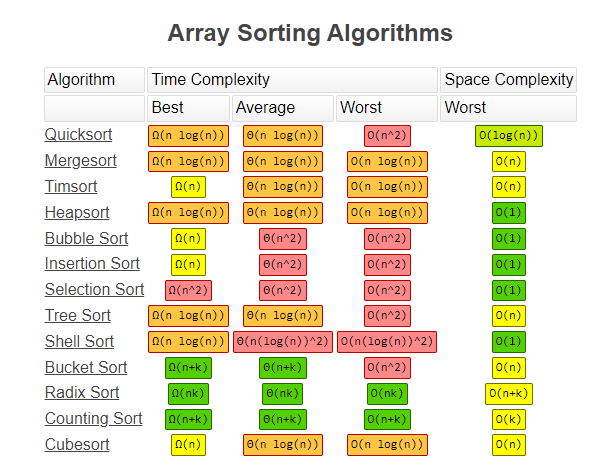

## Algorithms-DataStructures-BigONotation

这也是一个可以查看算法分析的网站工具，功能相比bigocheatsheet，更丰富一些。

地址：[http://cooervo.github.io/Algorithms-DataStructures-BigONotation/index.html](http://cooervo.github.io/Algorithms-DataStructures-BigONotation/index.html)

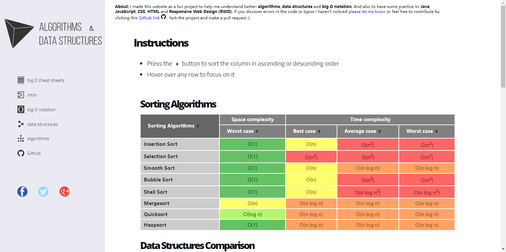

在看了上面这些网站之后，想必你的算法水平已经有了非常大的进步[狗头]，接下来就可以刷题实践。

下面推荐几个比较好用的刷题网站。难度从易到难。

## Programming by Doing

网站的宗旨就是：“学习的最好方法就是去做”。

地址：[http://www.programmingbydoing.com/](http://www.programmingbydoing.com/)

以作业的形式整理的编程基础题，题目相对还是比较简单的，适合刚入门的初学者。

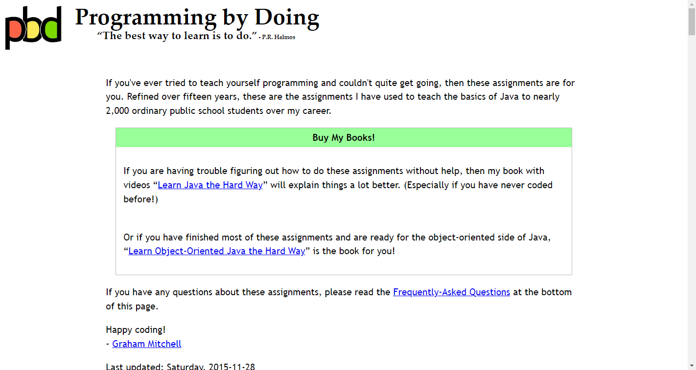

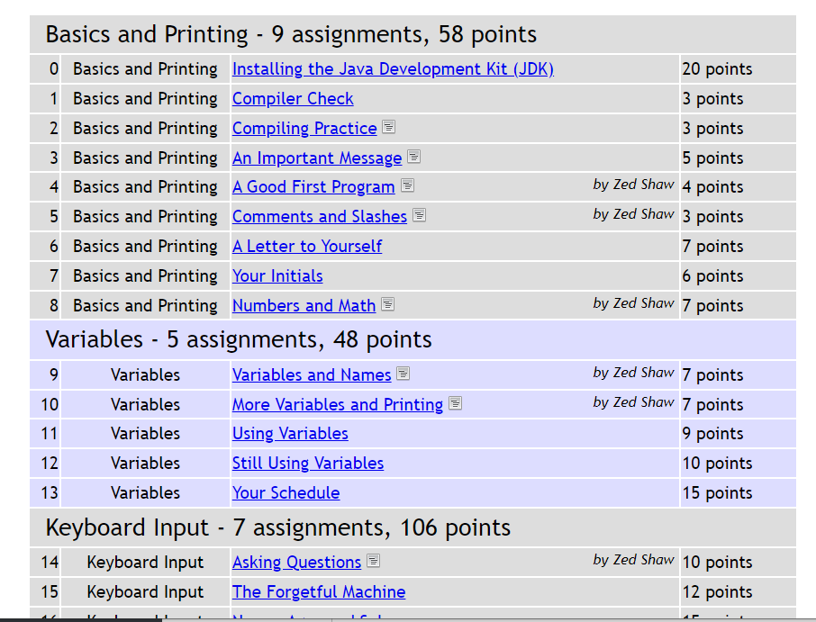

## 洛谷

地址：[https://www.luogu.com.cn/](https://www.luogu.com.cn/)

洛谷上的题目很多，还有很多的基础题，使用体验良好。

缺点是没有相应的阶梯训练，筛选方式比较少。

## [牛客网](https://www.nowcoder.com/)

作为牛客红名大佬，来给牛客宣传一波！（牛客打钱！）

牛客网拥有超级丰富的 IT 题库，题库+面试+学习+求职+讨论，基本涵盖所有面试笔试题型，堪称"互联网求职神器"。在这里不仅可以刷题，还可以跟其他牛友讨论交流，一起成长。牛客上还会各种的内推机会，对于求职的同学也是极其不错的。

## [LeetCode](https://leetcode.cn/)

**力扣，强推**！力扣虐我千百遍，我待力扣如初恋！

从现在开始，每天一道力扣算法题，坚持几个月的时间，你会感谢我的（傲娇脸）

我刚开始刷算法题的时候，就选择在力扣上刷。最初刷easy级别题目的时候，都感觉有点吃力，坚持半年之后，遇到中等题目甚至hard级别的题目都不慌了。

## [LintCode](https://www.lintcode.com/)

与Leetcode类似的刷题网站。

LeetCode/LintCode的题目量差不多。LeetCode的**test case比较完备**，并且LeetCode有**讨论区**，看别人的代码还是比较有意义的。

LintCode的UI、tagging、filter更加灵活，更有优点，大家选择其中一个进行刷题即可。

## UVa Online Judge

西班牙Valladolid大学的Online Judge，最古老也是全世界最知名的Online Judge，题库有详细的分类，题目类型非常广泛。最重要的是，题目类型属于中等，适合有一定基础的刷题选手。

地址：[https://onlinejudge.org/](https://onlinejudge.org/)

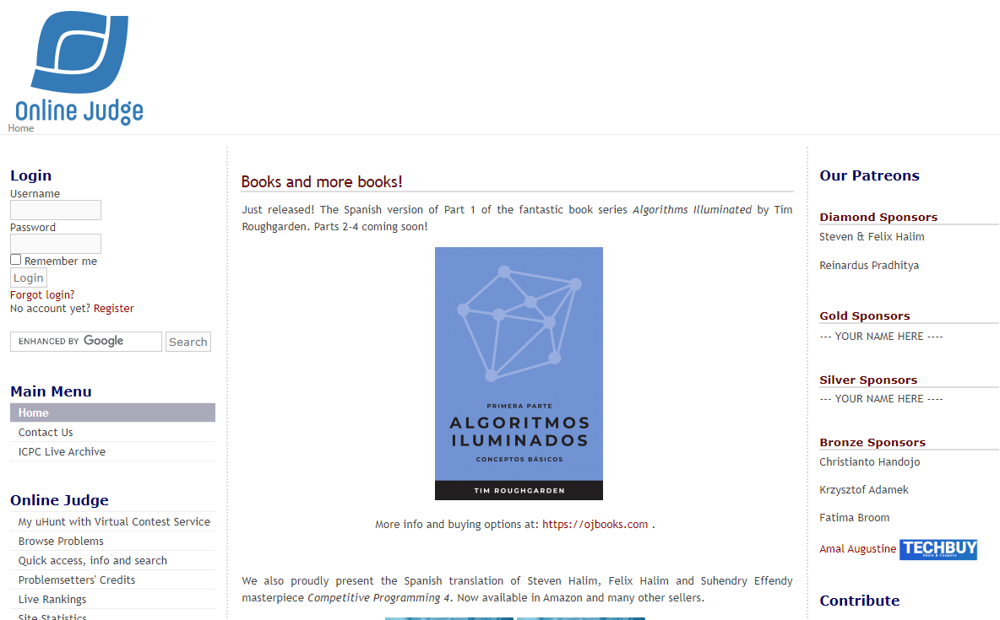

## Codeforces

地址：[https://codeforces.com](https://codeforces.com)

Codeforce是一个位于俄罗斯的编程比赛网站，它会定期举办竞赛，会有全球顶尖的程序员们参赛。在这个网站，可以练习从初级到高级的题目。

Codeforce每周会有2-3场比赛，感兴趣的小伙伴可以去挑战下~

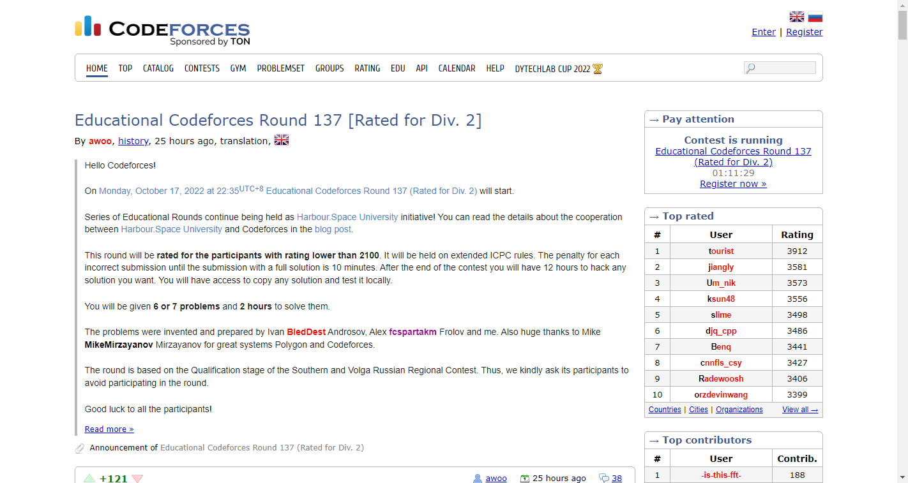

<!--page footer-->
- 原文: <https://www.yuque.com/dabin-1eu6s/plc2v4/zc0i6qdlgcytoeur>