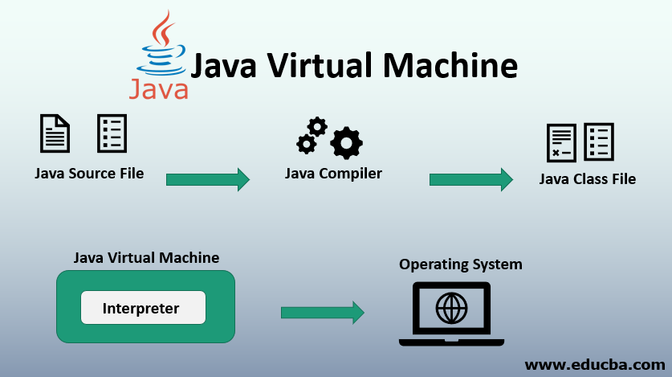
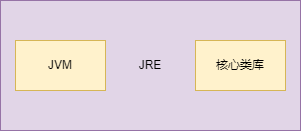
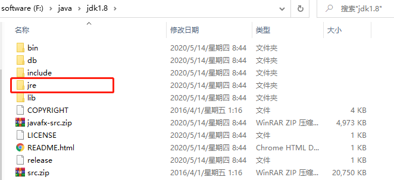
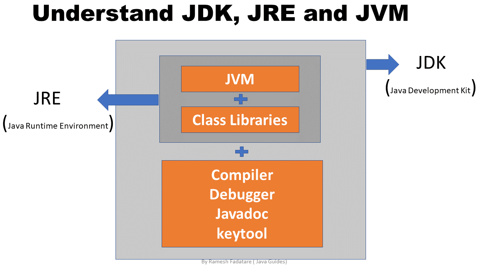
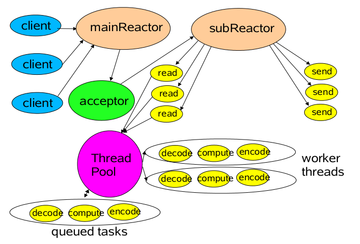

# Java基础高频面试题
<!--page header-->

<a name="taysr"></a>
## Java的特点

**Java是一门面向对象的编程语言**。面向对象和面向过程的区别参考下一个问题。

**Java具有平台独立性和移植性**。

- Java有一句口号：`Write once, run anywhere`，一次编写、到处运行。这也是Java的魅力所在。而实现这种特性的正是Java虚拟机JVM。已编译的Java程序可以在任何带有JVM的平台上运行。你可以在windows平台编写代码，然后拿到linux上运行。只要你在编写完代码后，将代码编译成.class文件，再把class文件打成Java包，这个jar包就可以在不同的平台上运行了。

**Java具有稳健性**。

- Java是一个强类型语言，它允许扩展编译时检查潜在类型不匹配问题的功能。Java要求显式的方法声明，它不支持C风格的隐式声明。这些严格的要求保证编译程序能捕捉调用错误，这就导致更可靠的程序。
- 异常处理是Java中使得程序更稳健的另一个特征。异常是某种类似于错误的异常条件出现的信号。使用`try/catch/finally`语句，程序员可以找到出错的处理代码，这就简化了出错处理和恢复的任务。

<a name="d7d7ee04"></a>
## Java是如何实现跨平台的？

Java是通过JVM（Java虚拟机）实现跨平台的。

JVM可以理解成一个软件，不同的平台有不同的版本。我们编写的Java代码，编译后会生成.class 文件（字节码文件）。Java虚拟机就是负责将字节码文件翻译成特定平台下的机器码，通过JVM翻译成机器码之后才能运行。不同平台下编译生成的字节码是一样的，但是由JVM翻译成的机器码却不一样。

只要在不同平台上安装对应的JVM，就可以运行字节码文件，运行我们编写的Java程序。

因此，运行Java程序必须有JVM的支持，因为编译的结果不是机器码，必须要经过JVM的翻译才能执行。

<a name="89fb7e7f"></a>
## Java 与 C++ 的区别

- Java 是纯粹的面向对象语言，所有的对象都继承自 java.lang.Object，C++ 兼容 C ，不但支持面向对象也支持面向过程。
- Java 通过虚拟机从而实现跨平台特性， C++ 依赖于特定的平台。
- Java 没有指针，它的引用可以理解为安全指针，而 C++ 具有和 C 一样的指针。
- Java 支持自动垃圾回收，而 C++ 需要手动回收。
- Java 不支持多重继承，只能通过实现多个接口来达到相同目的，而 C++ 支持多重继承。

<a name="38a209f7"></a>
## JDK/JRE/JVM三者的关系

**JVM**

英文名称（Java Virtual Machine），就是我们耳熟能详的 Java 虚拟机。Java 能够跨平台运行的核心在于 JVM 。



所有的java程序会首先被编译为.class的类文件，这种类文件可以在虚拟机上执行。也就是说class文件并不直接与机器的操作系统交互，而是经过虚拟机间接与操作系统交互，由虚拟机将程序解释给本地系统执行。

针对不同的系统有不同的 jvm 实现，有 Linux 版本的 jvm 实现，也有Windows 版本的 jvm 实现，但是同一段代码在编译后的字节码是一样的。这就是Java能够跨平台，实现一次编写，多处运行的原因所在。

**JRE**

英文名称（Java Runtime Environment），就是Java 运行时环境。我们编写的Java程序必须要在JRE才能运行。它主要包含两个部分，JVM 和 Java 核心类库。



JRE是Java的运行环境，并不是一个开发环境，所以没有包含任何开发工具，如编译器和调试器等。

如果你只是想运行Java程序，而不是开发Java程序的话，那么你只需要安装JRE即可。

**JDK**

英文名称（Java Development Kit），就是 Java 开发工具包

学过Java的同学，都应该安装过JDK。当我们安装完JDK之后，目录结构是这样的



可以看到，JDK目录下有个JRE，也就是JDK中已经集成了 JRE，不用单独安装JRE。

另外，JDK中还有一些好用的工具，如jinfo，jps，jstack等。


最后，总结一下JDK/JRE/JVM，他们三者的关系

**JRE = JVM + Java 核心类库**

**JDK = JRE + Java工具 + 编译器 + 调试器**



<a name="ef4e9d5a"></a>
## Java程序是编译执行还是解释执行？

先看看什么是编译型语言和解释型语言。

**编译型语言**

在程序运行之前，通过编译器将源程序编译成机器码可运行的二进制，以后执行这个程序时，就不用再进行编译了。

优点：编译器一般会有预编译的过程对代码进行优化。因为编译只做一次，运行时不需要编译，所以编译型语言的程序执行效率高，可以脱离语言环境独立运行。

缺点：编译之后如果需要修改就需要整个模块重新编译。编译的时候根据对应的运行环境生成机器码，不同的操作系统之间移植就会有问题，需要根据运行的操作系统环境编译不同的可执行文件。

**总结**：执行速度快、效率高；依靠编译器、跨平台性差些。

**代表语言**：C、C++、Pascal、Object-C以及Swift。

**解释型语言**

定义：解释型语言的源代码不是直接翻译成机器码，而是先翻译成中间代码，再由解释器对中间代码进行解释运行。在运行的时候才将源程序翻译成机器码，翻译一句，然后执行一句，直至结束。

优点：

1. 有良好的平台兼容性，在任何环境中都可以运行，前提是安装了解释器（如虚拟机）。
2. 灵活，修改代码的时候直接修改就可以，可以快速部署，不用停机维护。

缺点：每次运行的时候都要解释一遍，性能上不如编译型语言。

总结：解释型语言执行速度慢、效率低；依靠解释器、跨平台性好。

代表语言：JavaScript、Python、Erlang、PHP、Perl、Ruby。

对于Java这种语言，它的**源代码**会先通过javac编译成**字节码**，再通过jvm将字节码转换成**机器码**执行，即解释运行 和编译运行配合使用，所以可以称为混合型或者半编译型。

<a name="00c901e4"></a>
## 面向对象和面向过程的区别？

面向对象和面向过程是一种软件开发思想。

-  面向过程就是分析出解决问题所需要的步骤，然后用函数按这些步骤实现，使用的时候依次调用就可以了。 
-  面向对象是把构成问题事务分解成各个对象，分别设计这些对象，然后将他们组装成有完整功能的系统。面向过程只用函数实现，面向对象是用类实现各个功能模块。 

以五子棋为例，面向过程的设计思路就是首先分析问题的步骤：

1、开始游戏，2、黑子先走，3、绘制画面，4、判断输赢，5、轮到白子，6、绘制画面，7、判断输赢，8、返回步骤2，9、输出最后结果。
把上面每个步骤用分别的函数来实现，问题就解决了。

而面向对象的设计则是从另外的思路来解决问题。整个五子棋可以分为：

1. 黑白双方
2. 棋盘系统，负责绘制画面
3. 规则系统，负责判定诸如犯规、输赢等。

黑白双方负责接受用户的输入，并告知棋盘系统棋子布局发生变化，棋盘系统接收到了棋子的变化的信息就负责在屏幕上面显示出这种变化，同时利用规则系统来对棋局进行判定。

<a name="c537fee2"></a>
## 面向对象有哪些特性？

面向对象四大特性：封装，继承，多态，抽象

1、封装就是将类的信息隐藏在类内部，不允许外部程序直接访问，而是通过该类的方法实现对隐藏信息的操作和访问。 良好的封装能够减少耦合。

2、继承是从已有的类中派生出新的类，新的类继承父类的属性和行为，并能扩展新的能力，大大增加程序的重用性和易维护性。在Java中是单继承的，也就是说一个子类只有一个父类。

3、多态是同一个行为具有多个不同表现形式的能力。在不修改程序代码的情况下改变程序运行时绑定的代码。实现多态的三要素：继承、重写、父类引用指向子类对象。

- 静态多态性：通过重载实现，相同的方法有不同的參数列表，可以根据参数的不同，做出不同的处理。
- 动态多态性：在子类中重写父类的方法。运行期间判断所引用对象的实际类型，根据其实际类型调用相应的方法。

4、抽象。把客观事物用代码抽象出来。

<a name="dbc32a32"></a>
## 面向对象编程的六大原则?

- **对象单一职责**：我们设计创建的对象，必须职责明确，比如商品类，里面相关的属性和方法都必须跟商品相关，不能出现订单等不相关的内容。这里的类可以是模块、类库、程序集，而不单单指类。
- **里式替换原则**：子类能够完全替代父类，反之则不行。通常用于实现接口时运用。因为子类能够完全替代基（父）类，那么这样父类就拥有很多子类，在后续的程序扩展中就很容易进行扩展，程序完全不需要进行修改即可进行扩展。比如IA的实现为A，因为项目需求变更，现在需要新的实现，直接在容器注入处更换接口即可.
- **迪米特法则**，也叫最小原则，或者说最小耦合。通常在设计程序或开发程序的时候，尽量要高内聚，低耦合。当两个类进行交互的时候，会产生依赖。而迪米特法则就是建议这种依赖越少越好。就像构造函数注入父类对象时一样，当需要依赖某个对象时，并不在意其内部是怎么实现的，而是在容器中注入相应的实现，既符合里式替换原则，又起到了解耦的作用。
- 开闭原则：开放扩展，封闭修改。当项目需求发生变更时，要尽可能的不去对原有的代码进行修改，而在原有的基础上进行扩展。
- **依赖倒置原则**：高层模块不应该直接依赖于底层模块的具体实现，而应该依赖于底层的抽象。接口和抽象类不应该依赖于实现类，而实现类依赖接口或抽象类。
- **接口隔离原则**：一个对象和另外一个对象交互的过程中，依赖的内容最小。也就是说在接口设计的时候，在遵循对象单一职责的情况下，尽量减少接口的内容。

**简洁版**：

- 单一职责：对象设计要求独立，不能设计万能对象。
- 开闭原则：对象修改最小化。
- 里式替换：程序扩展中抽象被具体可以替换（接口、父类、可以被实现类对象、子类替换对象）
- 迪米特：高内聚，低耦合。尽量不要依赖细节。
- 依赖倒置：面向抽象编程。也就是参数传递，或者返回值，可以使用父类类型或者接口类型。从广义上讲：基于接口编程，提前设计好接口框架。
- 接口隔离：接口设计大小要适中。过大导致污染，过小，导致调用麻烦。

<a name="b27460b5"></a>
## 数组到底是不是对象？

先说说对象的概念。对象是根据某个类创建出来的一个实例，表示某类事物中一个具体的个体。

对象具有各种属性，并且具有一些特定的行为。站在计算机的角度，对象就是内存中的一个内存块，在这个内存块封装了一些数据，也就是类中定义的各个属性。

所以，对象是用来封装数据的。

java中的数组具有java中其他对象的一些基本特点。比如封装了一些数据，可以访问属性，也可以调用方法。

因此，可以说，数组是对象。

也可以通过代码验证数组是对象的事实。比如以下的代码，输出结果为java.lang.Object。

```java
Class clz = int[].class;
System.out.println(clz.getSuperclass().getName());
```

由此，可以看出，数组类的父类就是Object类，那么可以推断出数组就是对象。

<a name="4a32e97a"></a>
## Java的基本数据类型有哪些？

- byte，8bit
- char，16bit
- short，16bit
- int，32bit
- float，32bit
- long，64bit
- double，64bit
- boolean，只有两个值：true、false，可以使⽤用 1 bit 来存储
| 简单类型 | boolean | byte | char | short | Int | long | float | double |
| --- | --- | --- | --- | --- | --- | --- | --- | --- |
| 二进制位数 | 1 | 8 | 16 | 16 | 32 | 64 | 32 | 64 |
| 包装类 | Boolean | Byte | Character | Short | Integer | Long | Float | Double |


在Java规范中，没有明确指出boolean的大小。在《Java虚拟机规范》给出了单个boolean占4个字节，和boolean数组1个字节的定义，具体 **还要看虚拟机实现是否按照规范来**，因此boolean占用1个字节或者4个字节都是有可能的。

<a name="18ae5516"></a>
## 为什么不能用浮点型表示金额？

由于计算机中保存的小数其实是十进制的小数的近似值，并不是准确值，所以，千万不要在代码中使用浮点数来表示金额等重要的指标。

建议使用BigDecimal或者Long来表示金额。

<a name="d6615ac4"></a>
## 什么是值传递和引用传递？

- 值传递是对基本型变量而言的，传递的是该变量的一个副本，改变副本不影响原变量。
- 引用传递一般是对于对象型变量而言的，传递的是该对象地址的一个副本，并不是原对象本身，两者指向同一片内存空间。所以对引用对象进行操作会同时改变原对象。

**java中不存在引用传递，只有值传递**。即不存在变量a指向变量b，变量b指向对象的这种情况。

<a name="667b5e3b"></a>
## 了解Java的包装类型吗？为什么需要包装类？

Java 是一种面向对象语言，很多地方都需要使用对象而不是基本数据类型。比如，在集合类中，我们是无法将 int 、double 等类型放进去的。因为集合的容器要求元素是 Object 类型。

为了让基本类型也具有对象的特征，就出现了包装类型。相当于将基本类型包装起来，使得它具有了对象的性质，并且为其添加了属性和方法，丰富了基本类型的操作。

<a name="059c6145"></a>
## 自动装箱和拆箱

Java中基础数据类型与它们对应的包装类见下表：

| 原始类型 | 包装类型 |
| --- | --- |
| boolean | Boolean |
| byte | Byte |
| char | Character |
| float | Float |
| int | Integer |
| long | Long |
| short | Short |
| double | Double |


装箱：将基础类型转化为包装类型。

拆箱：将包装类型转化为基础类型。

当基础类型与它们的包装类有如下几种情况时，编译器会**自动**帮我们进行装箱或拆箱：

- 赋值操作（装箱或拆箱）
- 进行加减乘除混合运算 （拆箱）
- 进行>,<,==比较运算（拆箱）
- 调用equals进行比较（装箱）
- ArrayList、HashMap等集合类添加基础类型数据时（装箱）

示例代码：

```java
Integer x = 1; // 装箱 调⽤ Integer.valueOf(1)
int y = x; // 拆箱 调⽤了 X.intValue()
```

下面看一道常见的面试题：

```java
Integer a = 100;
Integer b = 100;
System.out.println(a == b);

Integer c = 200;
Integer d = 200;
System.out.println(c == d);
```

输出：

```java
true
false
```

为什么第三个输出是false？看看 Integer 类的源码就知道啦。

```java
public static Integer valueOf(int i) {
    if (i >= IntegerCache.low && i <= IntegerCache.high)
        return IntegerCache.cache[i + (-IntegerCache.low)];
    return new Integer(i);
}
```

`Integer c = 200;` 会调用 调⽤`Integer.valueOf(200)`。而从Integer的valueOf()源码可以看到，这里的实现并不是简单的new Integer，而是用IntegerCache做一个cache。

```java
private static class IntegerCache {
    static final int low = -128;
    static final int high;
    static final Integer cache[];

    static {
        // high value may be configured by property
        int h = 127;
        String integerCacheHighPropValue =
            sun.misc.VM.getSavedProperty("java.lang.Integer.IntegerCache.high");
        if (integerCacheHighPropValue != null) {
            try {
                int i = parseInt(integerCacheHighPropValue);
                i = Math.max(i, 127);
                // Maximum array size is Integer.MAX_VALUE
                h = Math.min(i, Integer.MAX_VALUE - (-low) -1);
            } catch( NumberFormatException nfe) {
                // If the property cannot be parsed into an int, ignore it.
            }
        }
        high = h;
    }
    ...
}
```

这是IntegerCache静态代码块中的一段，默认Integer cache 的下限是-128，上限默认127。当赋值100给Integer时，刚好在这个范围内，所以从cache中取对应的Integer并返回，所以a和b返回的是同一个对象，所以`==`比较是相等的，当赋值200给Integer时，不在cache 的范围内，所以会new Integer并返回，当然`==`比较的结果是不相等的。

<a name="0e33fea3"></a>
## String 为什么不可变？

先看看什么是不可变的对象。

如果一个对象，在它创建完成之后，不能再改变它的状态，那么这个对象就是不可变的。不能改变状态的意思是，不能改变对象内的成员变量，包括基本数据类型的值不能改变，引用类型的变量不能指向其他的对象，引用类型指向的对象的状态也不能改变。

接着来看Java8 String类的源码：

```java
public final class String
    implements java.io.Serializable, Comparable<String>, CharSequence {
    /** The value is used for character storage. */
    private final char value[];

    /** Cache the hash code for the string */
    private int hash; // Default to 0
}
```

从源码可以看出，String对象其实在内部就是一个个字符，存储在这个value数组里面的。

value数组用final修饰，final 修饰的变量，值不能被修改。因此value不可以指向其他对象。

String类内部所有的字段都是私有的，也就是被private修饰。而且String没有对外提供修改内部状态的方法，因此value数组不能改变。

所以，String是不可变的。

那为什么String要设计成不可变的？

主要有以下几点原因：

1. **线程安全**。同一个字符串实例可以被多个线程共享，因为字符串不可变，本身就是线程安全的。
2. **支持hash映射和缓存**。因为String的hash值经常会使用到，比如作为 Map 的键，不可变的特性使得 hash 值也不会变，不需要重新计算。
3. **出于安全考虑**。网络地址URL、文件路径path、密码通常情况下都是以String类型保存，假若String不是固定不变的，将会引起各种安全隐患。比如将密码用String的类型保存，那么它将一直留在内存中，直到垃圾收集器把它清除。假如String类不是固定不变的，那么这个密码可能会被改变，导致出现安全隐患。
4. **字符串常量池优化**。String对象创建之后，会缓存到字符串常量池中，下次需要创建同样的对象时，可以直接返回缓存的引用。

既然我们的String是不可变的，它内部还有很多substring， replace， replaceAll这些操作的方法。这些方法好像会改变String对象？怎么解释呢？

其实不是的，我们每次调用replace等方法，其实会在堆内存中创建了一个新的对象。然后其value数组引用指向不同的对象。

<a name="bab1c37c"></a>
## 为何JDK9要将String的底层实现由char[]改成byte[]?

主要是为了**节约String占用的内存**。

在大部分Java程序的堆内存中，String占用的空间最大，并且绝大多数String只有Latin-1字符，这些Latin-1字符只需要1个字节就够了。

而在JDK9之前，JVM因为String使用char数组存储，每个char占2个字节，所以即使字符串只需要1字节，它也要按照2字节进行分配，浪费了一半的内存空间。

到了JDK9之后，对于每个字符串，会先判断它是不是只有Latin-1字符，如果是，就按照1字节的规格进行分配内存，如果不是，就按照2字节的规格进行分配，这样便提高了内存使用率，同时GC次数也会减少，提升效率。

不过Latin-1编码集支持的字符有限，比如不支持中文字符，因此对于中文字符串，用的是UTF16编码（两个字节），所以用byte[]和char[]实现没什么区别。

<a name="1e47fd27"></a>
## String, StringBuffer 和 StringBuilder区别

**1. 可变性**

- String 不可变
- StringBuffer 和 StringBuilder 可变

**2. 线程安全**

- String 不可变，因此是线程安全的
- StringBuilder 不是线程安全的
- StringBuffer 是线程安全的，内部使用 synchronized 进行同步

<a name="59151928"></a>
## 什么是StringJoiner？

StringJoiner是 Java 8 新增的一个 API，它基于 StringBuilder 实现，用于实现对字符串之间通过分隔符拼接的场景。

StringJoiner 有两个构造方法，第一个构造要求依次传入分隔符、前缀和后缀。第二个构造则只要求传入分隔符即可（前缀和后缀默认为空字符串）。

```java
StringJoiner(CharSequence delimiter, CharSequence prefix, CharSequence suffix)
StringJoiner(CharSequence delimiter)
```

有些字符串拼接场景，使用 StringBuffer 或 StringBuilder 则显得比较繁琐。

比如下面的例子：

```java
List<Integer> values = Arrays.asList(1, 3, 5);
StringBuilder sb = new StringBuilder("(");

for (int i = 0; i < values.size(); i++) {
	sb.append(values.get(i));
	if (i != values.size() -1) {
		sb.append(",");
	}
}

sb.append(")");
```

而通过StringJoiner来实现拼接List的各个元素，代码看起来更加简洁。

```java
List<Integer> values = Arrays.asList(1, 3, 5);
StringJoiner sj = new StringJoiner(",", "(", ")");

for (Integer value : values) {
	sj.add(value.toString());
}
```

另外，像平时经常使用的Collectors.joining(",")，底层就是通过StringJoiner实现的。

源码如下：

```java
public static Collector<CharSequence, ?, String> joining(
    CharSequence delimiter,CharSequence prefix,CharSequence suffix) {
    return new CollectorImpl<>(
            () -> new StringJoiner(delimiter, prefix, suffix),
            StringJoiner::add, StringJoiner::merge,
            StringJoiner::toString, CH_NOID);
}
```

<a name="db137fd7"></a>
## String 类的常用方法有哪些？

- indexOf()：返回指定字符的索引。
- charAt()：返回指定索引处的字符。
- replace()：字符串替换。
- trim()：去除字符串两端空白。
- split()：分割字符串，返回一个分割后的字符串数组。
- getBytes()：返回字符串的 byte 类型数组。
- length()：返回字符串长度。
- toLowerCase()：将字符串转成小写字母。
- toUpperCase()：将字符串转成大写字符。
- substring()：截取字符串。
- equals()：字符串比较。

<a name="f688ad81"></a>
## new String("dabin")会创建几个对象？

使用这种方式会创建两个字符串对象（前提是字符串常量池中没有 "dabin" 这个字符串对象）。

- "dabin" 属于字符串字面量，因此编译时期会在字符串常量池中创建一个字符串对象，指向这个 "dabin" 字符串字面量；
- 使用 new 的方式会在堆中创建一个字符串对象。

<a name="405f77b5"></a>
## 什么是字符串常量池？

字符串常量池（String Pool）保存着所有字符串字面量，这些字面量在编译时期就确定。字符串常量池位于堆内存中，专门用来存储字符串常量。在创建字符串时，JVM首先会检查字符串常量池，如果该字符串已经存在池中，则返回其引用，如果不存在，则创建此字符串并放入池中，并返回其引用。

<a name="1d672e93"></a>
## String最大长度是多少？

String类提供了一个length方法，返回值为int类型，而int的取值上限为2^31 -1。

所以理论上String的最大长度为2^31 -1。

**达到这个长度的话需要多大的内存吗**？

String内部是使用一个char数组来维护字符序列的，一个char占用两个字节。如果说String最大长度是2^31 -1的话，那么最大的字符串占用内存空间约等于4GB。

也就是说，我们需要有大于4GB的JVM运行内存才行。

**那String一般都存储在JVM的哪块区域呢**？

字符串在JVM中的存储分两种情况，一种是String对象，存储在JVM的堆栈中。一种是字符串常量，存储在常量池里面。

**什么情况下字符串会存储在常量池呢**？

当通过字面量进行字符串声明时，比如String s = "程序新大彬";，这个字符串在编译之后会以常量的形式进入到常量池。

**那常量池中的字符串最大长度是2^31-1吗**？

不是的，常量池对String的长度是有另外限制的。。Java中的UTF-8编码的Unicode字符串在常量池中以CONSTANT_Utf8类型表示。

```java
CONSTANT_Utf8_info {
    u1 tag;
    u2 length;
    u1 bytes[length];
}
```

length在这里就是代表字符串的长度，length的类型是u2，u2是无符号的16位整数，也就是说最大长度可以做到2^16-1 即 65535。

不过javac编译器做了限制，需要length < 65535。所以字符串常量在常量池中的最大长度是65535 - 1 = 65534。

最后总结一下：

String在不同的状态下，具有不同的长度限制。

- 字符串常量长度不能超过65534
- 堆内字符串的长度不超过2^31-1

<a name="927d7288"></a>
## Object常用方法有哪些？

Java面试经常会出现的一道题目，Object的常用方法。下面给大家整理一下。

Object常用方法有：`toString()`、`equals()`、`hashCode()`、`clone()`等。

**toString**

默认输出对象地址。

```java
public class Person {
    private int age;
    private String name;

    public Person(int age, String name) {
        this.age = age;
        this.name = name;
    }

    public static void main(String[] args) {
        System.out.println(new Person(18, "程序员大彬").toString());
    }
    //output
    //me.tyson.java.core.Person@4554617c
}
```

可以重写toString方法，按照重写逻辑输出对象值。

```java
public class Person {
    private int age;
    private String name;

    public Person(int age, String name) {
        this.age = age;
        this.name = name;
    }

    @Override
    public String toString() {
        return name + ":" + age;
    }

    public static void main(String[] args) {
        System.out.println(new Person(18, "程序员大彬").toString());
    }
    //output
    //程序员大彬:18
}
```

**equals**

默认比较两个引用变量是否指向同一个对象（内存地址）。

```java
public class Person {
    private int age;
    private String name;

    public Person(int age, String name) {
       this.age = age;
       this.name = name;
    }

    public static void main(String[] args) {
        String name = "程序员大彬";
        Person p1 = new Person(18, name);
        Person p2 = new Person(18, name);

        System.out.println(p1.equals(p2));
    }
    //output
    //false
}
```

可以重写equals方法，按照age和name是否相等来判断：

```java
public class Person {
    private int age;
    private String name;

    public Person(int age, String name) {
        this.age = age;
        this.name = name;
    }

    @Override
    public boolean equals(Object o) {
        if (o instanceof Person) {
            Person p = (Person) o;
            return age == p.age && name.equals(p.name);
        }
        return false;
    }

    public static void main(String[] args) {
        String name = "程序员大彬";
        Person p1 = new Person(18, name);
        Person p2 = new Person(18, name);

        System.out.println(p1.equals(p2));
    }
    //output
    //true
}
```

**hashCode**

将与对象相关的信息映射成一个哈希值，默认的实现hashCode值是根据内存地址换算出来。

```java
public class Cat {
    public static void main(String[] args) {
        System.out.println(new Cat().hashCode());
    }
    //out
    //1349277854
}
```

**clone**

Java赋值是复制对象引用，如果我们想要得到一个对象的副本，使用赋值操作是无法达到目的的。Object对象有个clone()方法，实现了对

象中各个属性的复制，但它的可见范围是protected的。

```java
protected native Object clone() throws CloneNotSupportedException;
```

所以实体类使用克隆的前提是：

- 实现Cloneable接口，这是一个标记接口，自身没有方法，这应该是一种约定。调用clone方法时，会判断有没有实现Cloneable接口，没有实现Cloneable的话会抛异常CloneNotSupportedException。
- 覆盖clone()方法，可见性提升为public。

```java
public class Cat implements Cloneable {
    private String name;

    @Override
    protected Object clone() throws CloneNotSupportedException {
        return super.clone();
    }

    public static void main(String[] args) throws CloneNotSupportedException {
        Cat c = new Cat();
        c.name = "程序员大彬";
        Cat cloneCat = (Cat) c.clone();
        c.name = "大彬";
        System.out.println(cloneCat.name);
    }
    //output
    //程序员大彬
}
```

**getClass**

返回此 Object 的运行时类，常用于java反射机制。

```java
public class Person {
    private String name;

    public Person(String name) {
        this.name = name;
    }

    public static void main(String[] args) {
        Person p = new Person("程序员大彬");
        Class clz = p.getClass();
        System.out.println(clz);
        //获取类名
        System.out.println(clz.getName());
    }
    /**
     * class com.tyson.basic.Person
     * com.tyson.basic.Person
     */
}
```

**wait**

当前线程调用对象的wait()方法之后，当前线程会释放对象锁，进入等待状态。等待其他线程调用此对象的notify()/notifyAll()唤醒或者等待超时时间wait(long timeout)自动唤醒。线程需要获取obj对象锁之后才能调用 obj.wait()。

**notify**

obj.notify()唤醒在此对象上等待的单个线程，选择是任意性的。notifyAll()唤醒在此对象上等待的所有线程。

<a name="58510064"></a>
## 讲讲深拷贝和浅拷贝？

**浅拷贝**：拷⻉对象和原始对象的引⽤类型引用同⼀个对象。

以下例子，Cat对象里面有个Person对象，调用clone之后，克隆对象和原对象的Person引用的是同一个对象，这就是浅拷贝。

```java
public class Cat implements Cloneable {
    private String name;
    private Person owner;

    @Override
    protected Object clone() throws CloneNotSupportedException {
        return super.clone();
    }

    public static void main(String[] args) throws CloneNotSupportedException {
        Cat c = new Cat();
        Person p = new Person(18, "程序员大彬");
        c.owner = p;

        Cat cloneCat = (Cat) c.clone();
        p.setName("大彬");
        System.out.println(cloneCat.owner.getName());
    }
    //output
    //大彬
}
```

**深拷贝**：拷贝对象和原始对象的引用类型引用不同的对象。

以下例子，在clone函数中不仅调用了super.clone，而且调用Person对象的clone方法（Person也要实现Cloneable接口并重写clone方法），从而实现了深拷贝。可以看到，拷贝对象的值不会受到原对象的影响。

```java
public class Cat implements Cloneable {
    private String name;
    private Person owner;

    @Override
    protected Object clone() throws CloneNotSupportedException {
        Cat c = null;
        c = (Cat) super.clone();
        c.owner = (Person) owner.clone();//拷贝Person对象
        return c;
    }

    public static void main(String[] args) throws CloneNotSupportedException {
        Cat c = new Cat();
        Person p = new Person(18, "程序员大彬");
        c.owner = p;

        Cat cloneCat = (Cat) c.clone();
        p.setName("大彬");
        System.out.println(cloneCat.owner.getName());
    }
    //output
    //程序员大彬
}
```

<a name="cf80225b"></a>
## 两个对象的hashCode()相同，则 equals()是否也一定为 true？

equals与hashcode的关系：

1. 如果两个对象调用equals比较返回true，那么它们的hashCode值一定要相同；
2. 如果两个对象的hashCode相同，它们并不一定相同。

hashcode方法主要是用来**提升对象比较的效率**，先进行hashcode()的比较，如果不相同，那就不必在进行equals的比较，这样就大大减少了equals比较的次数，当比较对象的数量很大的时候能提升效率。

<a name="affbda97"></a>
## 为什么重写 equals 时一定要重写 hashCode？

之所以重写`equals()`要重写`hashcode()`，是为了保证`equals()`方法返回true的情况下hashcode值也要一致，如果重写了`equals()`没有重写`hashcode()`，就会出现两个对象相等但`hashcode()`不相等的情况。这样，当用其中的一个对象作为键保存到hashMap、hashTable或hashSet中，再以另一个对象作为键值去查找他们的时候，则会查找不到。

<a name="86ade95a"></a>
## Java创建对象有几种方式？

Java创建对象有以下几种方式：

- 用new语句创建对象。
- 使用反射，使用Class.newInstance()创建对象。
- 调用对象的clone()方法。
- 运用反序列化手段，调用java.io.ObjectInputStream对象的readObject()方法。

<a name="92a30e38"></a>
## 说说类实例化的顺序

Java中类实例化顺序：

1. 静态属性，静态代码块。
2. 普通属性，普通代码块。
3. 构造方法。

```java
public class LifeCycle {
    // 静态属性
    private static String staticField = getStaticField();

    // 静态代码块
    static {
        System.out.println(staticField);
        System.out.println("静态代码块初始化");
    }

    // 普通属性
    private String field = getField();

    // 普通代码块
    {
        System.out.println(field);
        System.out.println("普通代码块初始化");
    }

    // 构造方法
    public LifeCycle() {
        System.out.println("构造方法初始化");
    }

    // 静态方法
    public static String getStaticField() {
        String statiFiled = "静态属性初始化";
        return statiFiled;
    }

    // 普通方法
    public String getField() {
        String filed = "普通属性初始化";
        return filed;
    }

    public static void main(String[] argc) {
        new LifeCycle();
    }

    /**
     *      静态属性初始化
     *      静态代码块初始化
     *      普通属性初始化
     *      普通代码块初始化
     *      构造方法初始化
     */
}
```

<a name="02c4d8c9"></a>
## equals和==有什么区别？

-  对于基本数据类型，==比较的是他们的值。基本数据类型没有equal方法； 
-  对于复合数据类型，==比较的是它们的存放地址(是否是同一个对象)。`equals()`默认比较地址值，重写的话按照重写逻辑去比较。 

<a name="6dd9f151"></a>
## 常见的关键字有哪些？

**static**

static可以用来修饰类的成员方法、类的成员变量。

static变量也称作**静态变量**，静态变量和非静态变量的区别是：静态变量被所有的对象所共享，在内存中只有一个副本，它当且仅当在类初次加载时会被初始化。而非静态变量是对象所拥有的，在创建对象的时候被初始化，存在多个副本，各个对象拥有的副本互不影响。

以下例子，age为非静态变量，则p1打印结果是：`Name:zhangsan, Age:10`；若age使用static修饰，则p1打印结果是：`Name:zhangsan, Age:12`，因为static变量在内存只有一个副本。

```java
public class Person {
    String name;
    int age;
    
    public String toString() {
        return "Name:" + name + ", Age:" + age;
    }
    
    public static void main(String[] args) {
        Person p1 = new Person();
        p1.name = "zhangsan";
        p1.age = 10;
        Person p2 = new Person();
        p2.name = "lisi";
        p2.age = 12;
        System.out.println(p1);
        System.out.println(p2);
    }
    /**Output
     * Name:zhangsan, Age:10
     * Name:lisi, Age:12
     *///~
}
```

static方法一般称作**静态方法**。静态方法不依赖于任何对象就可以进行访问，通过类名即可调用静态方法。

```java
public class Utils {
    public static void print(String s) {
        System.out.println("hello world: " + s);
    }

    public static void main(String[] args) {
        Utils.print("程序员大彬");
    }
}
```

**静态代码块**只会在类加载的时候执行一次。以下例子，startDate和endDate在类加载的时候进行赋值。

```java
class Person  {
    private Date birthDate;
    private static Date startDate, endDate;
    static{
        startDate = Date.valueOf("2008");
        endDate = Date.valueOf("2021");
    }

    public Person(Date birthDate) {
        this.birthDate = birthDate;
    }
}
```

**静态内部类**

**在静态方法里**，使用⾮静态内部类依赖于外部类的实例，也就是说需要先创建外部类实例，才能用这个实例去创建非静态内部类。⽽静态内部类不需要。

```java
public class OuterClass {
    class InnerClass {
    }
    static class StaticInnerClass {
    }
    public static void main(String[] args) {
        // 在静态方法里，不能直接使用OuterClass.this去创建InnerClass的实例
        // 需要先创建OuterClass的实例o，然后通过o创建InnerClass的实例
        // InnerClass innerClass = new InnerClass();
        OuterClass outerClass = new OuterClass();
        InnerClass innerClass = outerClass.new InnerClass();
        StaticInnerClass staticInnerClass = new StaticInnerClass();

        outerClass.test();
    }
    
    public void nonStaticMethod() {
        InnerClass innerClass = new InnerClass();
        System.out.println("nonStaticMethod...");
    }
}
```

**final**

1.  **基本数据**类型用final修饰，则不能修改，是常量；**对象引用**用final修饰，则引用只能指向该对象，不能指向别的对象，但是对象本身可以修改。 
2.  final修饰的方法不能被子类重写 
3.  final修饰的类不能被继承。 

**this**

`this.属性名称`指访问类中的成员变量，可以用来区分成员变量和局部变量。如下代码所示，`this.name`访问类Person当前实例的变量。

```java
/**
 * @description:
 * @author: 程序员大彬
 * @time: 2021-08-17 00:29
 */
public class Person {
    String name;
    int age;

    public Person(String name, int age) {
        this.name = name;
        this.age = age;
    }
}
```

`this.方法名称`用来访问本类的方法。以下代码中，`this.born()`调用类 Person 的当前实例的方法。

```java
/**
 * @description:
 * @author: 程序员大彬
 * @time: 2021-08-17 00:29
 */
public class Person {
    String name;
    int age;

    public Person(String name, int age) {
        this.born();
        this.name = name;
        this.age = age;
    }

    void born() {
    }
}
```

**super**

super 关键字用于在子类中访问父类的变量和方法。

```java
class A {
    protected String name = "大彬";

    public void getName() {
        System.out.println("父类:" + name);
    }
}

public class B extends A {
    @Override
    public void getName() {
        System.out.println(super.name);
        super.getName();
    }

    public static void main(String[] args) {
        B b = new B();
        b.getName();
    }
    /**
     * 大彬
     * 父类:大彬
     */
}
```

在子类B中，我们重写了父类的`getName()`方法，如果在重写的`getName()`方法中我们要调用父类的相同方法，必须要通过super关键字显式指出。

<a name="ffd28b2c"></a>
## final, finally, finalize 的区别

- final 用于修饰属性、方法和类, 分别表示属性不能被重新赋值，方法不可被覆盖，类不可被继承。
- finally 是异常处理语句结构的一部分，一般以`try-catch-finally`出现，`finally`代码块表示总是被执行。
- finalize 是Object类的一个方法，该方法一般由垃圾回收器来调用，当我们调用`System.gc()`方法的时候，由垃圾回收器调用`finalize()`方法，回收垃圾，JVM并不保证此方法总被调用。

<a name="449c45ac"></a>
## final关键字的作用？

- final 修饰的类不能被继承。
- final 修饰的方法不能被重写。
- final 修饰的变量叫常量，常量必须初始化，初始化之后值就不能被修改。

<a name="73c4bf09"></a>
## 方法重载和重写的区别？

**同个类中的多个方法可以有相同的方法名称，但是有不同的参数列表，这就称为方法重载**。参数列表又叫参数签名，包括参数的类型、参数的个数、参数的顺序，只要有一个不同就叫做参数列表不同。

重载是面向对象的一个基本特性。

```java
public class OverrideTest {
    void setPerson() { }
    
    void setPerson(String name) {
        //set name
    }
    
    void setPerson(String name, int age) {
        //set name and age
    }
}
```

**方法的重写描述的是父类和子类之间的。当父类的功能无法满足子类的需求，可以在子类对方法进行重写**。方法重写时， 方法名与形参列表必须一致。

如下代码，Person为父类，Student为子类，在Student中重写了dailyTask方法。

```java
public class Person {
    private String name;
    
    public void dailyTask() {
        System.out.println("work eat sleep");
    }
}


public class Student extends Person {
    @Override
    public void dailyTask() {
        System.out.println("study eat sleep");
    }
}
```

<a name="c2fe1d67"></a>
## 接口与抽象类区别？

1、**语法层面**上的区别

- 抽象类可以有方法实现，而接口的方法中只能是抽象方法（Java 8 之后接口方法可以有默认实现）；
- 抽象类中的成员变量可以是各种类型的，接口中的成员变量只能是public static final类型；
- 接口中不能含有静态代码块以及静态方法，而抽象类可以有静态代码块和静态方法（Java 8之后接口可以有静态方法）；
- 一个类只能继承一个抽象类，而一个类却可以实现多个接口。

2、**设计层面**上的区别

- 抽象层次不同。抽象类是对整个类整体进行抽象，包括属性、行为，但是接口只是对类行为进行抽象。继承抽象类是一种"是不是"的关系，而接口实现则是 "有没有"的关系。如果一个类继承了某个抽象类，则子类必定是抽象类的种类，而接口实现则是具备不具备的关系，比如鸟是否能飞。
- 继承抽象类的是具有相似特点的类，而实现接口的却可以不同的类。

门和警报的例子：

```java
class AlarmDoor extends Door implements Alarm {
    //code
}

class BMWCar extends Car implements Alarm {
    //code
}
```

<a name="ff7833ee"></a>
## 常见的Exception有哪些？

常见的RuntimeException：

1. `ClassCastException` //类型转换异常
2. `IndexOutOfBoundsException` //数组越界异常
3. `NullPointerException` //空指针
4. `ArrayStoreException` //数组存储异常
5. `NumberFormatException` //数字格式化异常
6. `ArithmeticException` //数学运算异常

checked Exception：

1. `NoSuchFieldException` //反射异常，没有对应的字段
2. `ClassNotFoundException` //类没有找到异常
3. `IllegalAccessException` //安全权限异常，可能是反射时调用了private方法

<a name="b29e7b7f"></a>
## Error和Exception的区别？

**Error**：JVM 无法解决的严重问题，如栈溢出`StackOverflowError`、内存溢出`OOM`等。程序无法处理的错误。

**Exception**：其它因编程错误或偶然的外在因素导致的一般性问题。可以在代码中进行处理。如：空指针异常、数组下标越界等。

<a name="1210e37e"></a>
## 运行时异常和非运行时异常（checked）的区别？

`unchecked exception`包括`RuntimeException`和`Error`类，其他所有异常称为检查（checked）异常。

1. `RuntimeException`由程序错误导致，应该修正程序避免这类异常发生。
2. `checked Exception`由具体的环境（读取的文件不存在或文件为空或sql异常）导致的异常。必须进行处理，不然编译不通过，可以catch或者throws。

<a name="f9703350"></a>
## throw和throws的区别？

-  **throw**：用于抛出一个具体的异常对象。 
-  **throws**：用在方法签名中，用于声明该方法可能抛出的异常。子类方法抛出的异常范围更加小，或者根本不抛异常。 

<a name="0b06415a"></a>
## 通过故事讲清楚NIO

下面通过一个例子来讲解下。

假设某银行只有10个职员。该银行的业务流程分为以下4个步骤：

1） 顾客填申请表（5分钟）；

2） 职员审核（1分钟）；

3） 职员叫保安去金库取钱（3分钟）；

4） 职员打印票据，并将钱和票据返回给顾客（1分钟）。

下面我们看看银行不同的工作方式对其工作效率到底有何影响。

首先是BIO方式。

每来一个顾客，马上由一位职员来接待处理，并且这个职员需要负责以上4个完整流程。当超过10个顾客时，剩余的顾客需要排队等候。

一个职员处理一个顾客需要10分钟（5+1+3+1）时间。一个小时（60分钟）能处理6个顾客，一共10个职员，那就是只能处理60个顾客。

可以看到银行职员的工作状态并不饱和，比如在第1步，其实是处于等待中。

这种工作其实就是BIO，每次来一个请求（顾客），就分配到线程池中由一个线程（职员）处理，如果超出了线程池的最大上限（10个），就扔到队列等待 。

那么如何提高银行的吞吐量呢？

思路就是：**分而治之**，将任务拆分开来，由专门的人负责专门的任务。

具体来讲，银行专门指派一名职员A，A的工作就是每当有顾客到银行，他就递上表格让顾客填写。每当有顾客填好表后，A就将其随机指派给剩余的9名职员完成后续步骤。

这种方式下，假设顾客非常多，职员A的工作处于饱和中，他不断的将填好表的顾客带到柜台处理。

柜台一个职员5分钟能处理完一个顾客，一个小时9名职员能处理：9*（60/5）=108。

可见工作方式的转变能带来效率的极大提升。

这种工作方式其实就NIO的思路。

下图是非常经典的NIO说明图，`mainReactor`线程负责监听server socket，接收新连接，并将建立的socket分派给`subReactor`

`subReactor`可以是一个线程，也可以是线程池，负责多路分离已连接的socket，读写网络数据。这里的读写网络数据可类比顾客填表这一耗时动作，对具体的业务处理功能，其扔给worker线程池完成

可以看到典型NIO有三类线程，分别是`mainReactor`线程、`subReactor`线程、`work`线程。

不同的线程干专业的事情，最终每个线程都没空着，系统的吞吐量自然就上去了。



**那这个流程还有没有什么可以提高的地方呢？**

可以看到，在这个业务流程里边第3个步骤，职员叫保安去金库取钱（3分钟）。这3分钟柜台职员是在等待中度过的，可以把这3分钟利用起来。

还是分而治之的思路，指派1个职员B来专门负责第3步骤。

每当柜台员工完成第2步时，就通知职员B来负责与保安沟通取钱。这时候柜台员工可以继续处理下一个顾客。

当职员B拿到钱之后，通知顾客钱已经到柜台了，让顾客重新排队处理，当柜台职员再次服务该顾客时，发现该顾客前3步已经完成，直接执行第4步即可。

在当今web服务中，经常需要通过RPC或者Http等方式调用第三方服务，这里对应的就是第3步，如果这步耗时较长，通过异步方式将能极大降低资源使用率。

NIO+异步的方式能让少量的线程做大量的事情。这适用于很多应用场景，比如代理服务、api服务、长连接服务等等。这些应用如果用同步方式将耗费大量机器资源。

不过虽然NIO+异步能提高系统吞吐量，但其并不能让一个请求的等待时间下降，相反可能会增加等待时间。

最后，NIO基本思想总结起来就是：**分而治之，将任务拆分开来，由专门的人负责专门的任务**

<a name="ac60a0af"></a>
## BIO/NIO/AIO区别的区别？

**同步阻塞IO** : 用户进程发起一个IO操作以后，必须等待IO操作的真正完成后，才能继续运行。

**同步非阻塞IO**: 客户端与服务器通过Channel连接，采用多路复用器轮询注册的`Channel`。提高吞吐量和可靠性。用户进程发起一个IO操作以后，可做其它事情，但用户进程需要轮询IO操作是否完成，这样造成不必要的CPU资源浪费。

**异步非阻塞IO**: 非阻塞异步通信模式，NIO的升级版，采用异步通道实现异步通信，其read和write方法均是异步方法。用户进程发起一个IO操作，然后立即返回，等IO操作真正的完成以后，应用程序会得到IO操作完成的通知。类似Future模式。

<a name="a2dcaa37"></a>
## 守护线程是什么？

- 守护线程是运行在后台的一种特殊进程。
- 它独立于控制终端并且周期性地执行某种任务或等待处理某些发生的事件。
- 在 Java 中垃圾回收线程就是特殊的守护线程。

<a name="4a281614"></a>
## Java支持多继承吗？

java中，**类不支持**多继承。**接口才支持**多继承。接口的作用是拓展对象功能。当一个子接口继承了多个父接口时，说明子接口拓展了多个功能。当一个类实现该接口时，就拓展了多个的功能。

Java不支持多继承的原因：

- 出于安全性的考虑，如果子类继承的多个父类里面有相同的方法或者属性，子类将不知道具体要继承哪个。
- Java提供了接口和内部类以达到实现多继承功能，弥补单继承的缺陷。

<a name="313904bc"></a>
## 如何实现对象克隆？

- 实现`Cloneable`接口，重写 `clone()` 方法。这种方式是浅拷贝，即如果类中属性有自定义引用类型，只拷贝引用，不拷贝引用指向的对象。如果对象的属性的Class也实现 `Cloneable` 接口，那么在克隆对象时也会克隆属性，即深拷贝。
- 结合序列化，深拷贝。
- 通过`org.apache.commons`中的工具类`BeanUtils`和`PropertyUtils`进行对象复制。

<a name="c18ad239"></a>
## 同步和异步的区别？

同步：发出一个调用时，在没有得到结果之前，该调用就不返回。

异步：在调用发出后，被调用者返回结果之后会通知调用者，或通过回调函数处理这个调用。

<a name="4bededca"></a>
## 阻塞和非阻塞的区别？

阻塞和非阻塞关注的是线程的状态。

阻塞调用是指调用结果返回之前，当前线程会被挂起。调用线程只有在得到结果之后才会恢复运行。

非阻塞调用指在不能立刻得到结果之前，该调用不会阻塞当前线程。

> 举个例子，理解下同步、阻塞、异步、非阻塞的区别：
>  
> 同步就是烧开水，要自己来看开没开；异步就是水开了，然后水壶响了通知你水开了（回调通知）。阻塞是烧开水的过程中，你不能干其他事情，必须在旁边等着；非阻塞是烧开水的过程里可以干其他事情。


<a name="459f11ce"></a>
## Java8的新特性有哪些？

- Lambda 表达式：Lambda允许把函数作为一个方法的参数
- Stream API ：新添加的Stream API（java.util.stream） 把真正的函数式编程风格引入到Java中
- 默认方法：默认方法就是一个在接口里面有了一个实现的方法。
- Optional 类 ：Optional 类已经成为 Java 8 类库的一部分，用来解决空指针异常。
- Date Time API ：加强对日期与时间的处理。

> [Java8 新特性总结](https://github.com/Tyson0314/Java-learning/blob/master/Java/Java8%E6%96%B0%E7%89%B9%E6%80%A7.md)


<a name="cf983302"></a>
## 序列化和反序列化

- 序列化：把对象转换为字节序列的过程称为对象的序列化.
- 反序列化：把字节序列恢复为对象的过程称为对象的反序列化.

<a name="bee6def2"></a>
## 什么时候需要用到序列化和反序列化呢?

当我们只在本地 JVM 里运行下 Java 实例，这个时候是不需要什么序列化和反序列化的，但当我们需要将内存中的对象持久化到磁盘，数据库中时，当我们需要与浏览器进行交互时，当我们需要实现 RPC 时，这个时候就需要序列化和反序列化了.

前两个需要用到序列化和反序列化的场景，是不是让我们有一个很大的疑问? 我们在与浏览器交互时，还有将内存中的对象持久化到数据库中时，好像都没有去进行序列化和反序列化，因为我们都没有实现 Serializable 接口，但一直正常运行.

下面先给出结论:

**只要我们对内存中的对象进行持久化或网络传输，这个时候都需要序列化和反序列化.**

理由:

服务器与浏览器交互时真的没有用到 Serializable 接口吗? JSON 格式实际上就是将一个对象转化为字符串，所以服务器与浏览器交互时的数据格式其实是字符串，我们来看来 String 类型的源码:

```
public final class String
    implements java.io.Serializable，Comparable<String>，CharSequence {
    /\*\* The value is used for character storage. \*/
    private final char value\[\];

    /\*\* Cache the hash code for the string \*/
    private int hash; // Default to 0

    /\*\* use serialVersionUID from JDK 1.0.2 for interoperability \*/
    private static final long serialVersionUID = -6849794470754667710L;

    ......
}
```

String 类型实现了 Serializable 接口，并显示指定 serialVersionUID 的值.

然后我们再来看对象持久化到数据库中时的情况，Mybatis 数据库映射文件里的 insert 代码:

```
<insert id="insertUser" parameterType="org.tyshawn.bean.User">
    INSERT INTO t\_user(name，age) VALUES (#{name}，#{age})
</insert>
```

实际上我们并不是将整个对象持久化到数据库中，而是将对象中的属性持久化到数据库中，而这些属性（如Date/String）都实现了 Serializable 接口。

<a name="1b867a2c"></a>
## 实现序列化和反序列化为什么要实现 Serializable 接口?

在 Java 中实现了 Serializable 接口后， JVM 在类加载的时候就会发现我们实现了这个接口，然后在初始化实例对象的时候就会在底层帮我们实现序列化和反序列化。

如果被写对象类型不是String、数组、Enum，并且没有实现Serializable接口，那么在进行序列化的时候，将抛出NotSerializableException。源码如下：

```java
// remaining cases
if (obj instanceof String) {
    writeString((String) obj, unshared);
} else if (cl.isArray()) {
    writeArray(obj, desc, unshared);
} else if (obj instanceof Enum) {
    writeEnum((Enum<?>) obj, desc, unshared);
} else if (obj instanceof Serializable) {
    writeOrdinaryObject(obj, desc, unshared);
} else {
    if (extendedDebugInfo) {
        throw new NotSerializableException(
            cl.getName() + "\n" + debugInfoStack.toString());
    } else {
        throw new NotSerializableException(cl.getName());
    }
}
```

<a name="8e38aa4b"></a>
## 实现 Serializable 接口之后，为什么还要显示指定 serialVersionUID 的值?

如果不显示指定 serialVersionUID，JVM 在序列化时会根据属性自动生成一个 serialVersionUID，然后与属性一起序列化，再进行持久化或网络传输. 在反序列化时，JVM 会再根据属性自动生成一个新版 serialVersionUID，然后将这个新版 serialVersionUID 与序列化时生成的旧版 serialVersionUID 进行比较，如果相同则反序列化成功，否则报错.

如果显示指定了 serialVersionUID，JVM 在序列化和反序列化时仍然都会生成一个 serialVersionUID，但值为我们显示指定的值，这样在反序列化时新旧版本的 serialVersionUID 就一致了.

如果我们的类写完后不再修改，那么不指定serialVersionUID，不会有问题，但这在实际开发中是不可能的，我们的类会不断迭代，一旦类被修改了，那旧对象反序列化就会报错。 所以在实际开发中，我们都会显示指定一个 serialVersionUID。

<a name="f146c825"></a>
## static 属性为什么不会被序列化?

因为序列化是针对对象而言的，而 static 属性优先于对象存在，随着类的加载而加载，所以不会被序列化.

看到这个结论，是不是有人会问，serialVersionUID 也被 static 修饰，为什么 serialVersionUID 会被序列化? 其实 serialVersionUID 属性并没有被序列化，JVM 在序列化对象时会自动生成一个 serialVersionUID，然后将我们显示指定的 serialVersionUID 属性值赋给自动生成的 serialVersionUID.

<a name="f435ae3e"></a>
## transient关键字的作用？

Java语言的关键字，变量修饰符，如果用transient声明一个实例变量，当对象存储时，它的值不需要维持。

也就是说被transient修饰的成员变量，在序列化的时候其值会被忽略，在被反序列化后， transient 变量的值被设为初始值， 如 int 型的是 0，对象型的是 null。

<a name="57804214"></a>
## 什么是反射？

动态获取的信息以及动态调用对象的方法的功能称为Java语言的反射机制。

在运行状态中，对于任意一个类，能够知道这个类的所有属性和方法。对于任意一个对象，能够调用它的任意一个方法和属性。

<a name="8ea3ae14"></a>
## 反射有哪些应用场景呢？

1. JDBC连接数据库时使用`Class.forName()`通过反射加载数据库的驱动程序
2. Eclispe、IDEA等开发工具利用反射动态解析对象的类型与结构，动态提示对象的属性和方法
3. Web服务器中利用反射调用了Sevlet的`service`方法
4. JDK动态代理底层依赖反射实现

<a name="7bc310a8"></a>
## 讲讲什么是泛型？

Java泛型是JDK 5中引⼊的⼀个新特性， 允许在定义类和接口的时候使⽤类型参数。声明的类型参数在使⽤时⽤具体的类型来替换。

泛型最⼤的好处是可以提⾼代码的复⽤性。以List接口为例，我们可以将String、 Integer等类型放⼊List中， 如不⽤泛型， 存放String类型要写⼀个List接口， 存放Integer要写另外⼀个List接口， 泛型可以很好的解决这个问题。

<a name="bed25d62"></a>
## 如何停止一个正在运行的线程？

有几种方式。

1、**使用线程的stop方法**。

使用stop()方法可以强制终止线程。不过stop是一个被废弃掉的方法，不推荐使用。

使用Stop方法，会一直向上传播ThreadDeath异常，从而使得目标线程解锁所有锁住的监视器，即释放掉所有的对象锁。使得之前被锁住的对象得不到同步的处理，因此可能会造成数据不一致的问题。

2、**使用interrupt方法中断线程**，该方法只是告诉线程要终止，但最终何时终止取决于计算机。调用interrupt方法仅仅是在当前线程中打了一个停止的标记，并不是真的停止线程。

接着调用 Thread.currentThread().isInterrupted()方法，可以用来判断当前线程是否被终止，通过这个判断我们可以做一些业务逻辑处理，通常如果isInterrupted返回true的话，会抛一个中断异常，然后通过try-catch捕获。

3、**设置标志位**

设置标志位，当标识位为某个值时，使线程正常退出。设置标志位是用到了共享变量的方式，为了保证共享变量在内存中的可见性，可以使用volatile修饰它，这样的话，变量取值始终会从主存中获取最新值。

但是这种volatile标记共享变量的方式，在线程发生阻塞时是无法完成响应的。比如调用Thread.sleep() 方法之后，线程处于不可运行状态，即便是主线程修改了共享变量的值，该线程此时根本无法检查循环标志，所以也就无法实现线程中断。

因此，interrupt() 加上手动抛异常的方式是目前中断一个正在运行的线程**最为正确**的方式了。

<a name="4e7eb27f"></a>
## 什么是跨域？

简单来讲，跨域是指从一个域名的网页去请求另一个域名的资源。由于有**同源策略**的关系，一般是不允许这么直接访问的。但是，很多场景经常会有跨域访问的需求，比如，在前后端分离的模式下，前后端的域名是不一致的，此时就会发生跨域问题。

**那什么是同源策略呢**？

所谓同源是指"协议+域名+端口"三者相同，即便两个不同的域名指向同一个ip地址，也非同源。

同源策略限制以下几种行为：

```
1. Cookie、LocalStorage 和 IndexDB 无法读取
2. DOM 和 Js对象无法获得
3. AJAX 请求不能发送
```

**为什么要有同源策略**？

举个例子，假如你刚刚在网银输入账号密码，查看了自己的余额，然后再去访问其他带颜色的网站，这个网站可以访问刚刚的网银站点，并且获取账号密码，那后果可想而知。因此，从安全的角度来讲，同源策略是有利于保护网站信息的。

<a name="5cec3fe0"></a>
## 跨域问题怎么解决呢？

嗯，有以下几种方法：

**CORS**，跨域资源共享

CORS（Cross-origin resource sharing），跨域资源共享。CORS 其实是浏览器制定的一个规范，浏览器会自动进行 CORS 通信，它的实现主要在服务端，通过一些 HTTP Header 来限制可以访问的域，例如页面 A 需要访问 B 服务器上的数据，如果 B 服务器 上声明了允许 A 的域名访问，那么从 A 到 B 的跨域请求就可以完成。

**@CrossOrigin注解**

如果项目使用的是Springboot，可以在Controller类上添加一个 [@CrossOrigin(origins ](/CrossOrigin(origins ) ="*") 注解就可以实现对当前controller 的跨域访问了，当然这个标签也可以加到方法上，或者直接加到入口类上对所有接口进行跨域处理。注意SpringMVC的版本要在4.2或以上版本才支持@CrossOrigin。 

**nginx反向代理接口跨域**

nginx反向代理跨域原理如下： 首先同源策略是浏览器的安全策略，不是HTTP协议的一部分。服务器端调用HTTP接口只是使用HTTP协议，不会执行JS脚本，不需要同源策略，也就不存在跨越问题。

nginx反向代理接口跨域实现思路如下：通过nginx配置一个代理服务器（域名与domain1相同，端口不同）做跳板机，反向代理访问domain2接口，并且可以顺便修改cookie中domain信息，方便当前域cookie写入，实现跨域登录。

```javascript
// proxy服务器
server {
    listen       81;
    server_name  www.domain1.com;
    location / {
        proxy_pass   http://www.domain2.com:8080;  #反向代理
        proxy_cookie_domain www.domain2.com www.domain1.com; #修改cookie里域名
        index  index.html index.htm;
        
        add_header Access-Control-Allow-Origin http://www.domain1.com;
    }
}
```

这样我们的前端代理只要访问 http:www.domain1.com:81/*就可以了。

**通过jsonp跨域**

通常为了减轻web服务器的负载，我们把js、css，img等静态资源分离到另一台独立域名的服务器上，在html页面中再通过相应的标签从不同域名下加载静态资源，这是浏览器允许的操作，基于此原理，我们可以通过动态创建script，再请求一个带参网址实现跨域通信。

<a name="b4e0994d"></a>
## 设计接口要注意什么?

1. **接口参数校验**。接口必须校验参数，比如入参是否允许为空，入参长度是否符合预期。
2. 设计接口时，充分考虑接口的**可扩展性**。思考接口是否可以复用，怎样保持接口的可扩展性。
3. **串行调用考虑改并行调用**。比如设计一个商城首页接口，需要查商品信息、营销信息、用户信息等等。如果是串行一个一个查，那耗时就比较大了。这种场景是可以改为并行调用的，降低接口耗时。
4. 接口是否需要**防重**处理。涉及到数据库修改的，要考虑防重处理，可以使用数据库防重表，以唯一流水号作为唯一索引。
5. **日志打印全面**，入参出参，接口耗时，记录好日志，方便甩锅。
6. 修改旧接口时，注意**兼容性设计**。
7. **异常处理得当**。使用finally关闭流资源、使用log打印而不是e.printStackTrace()、不要吞异常等等
8. 是否需要考虑**限流**。限流为了保护系统，防止流量洪峰超过系统的承载能力。

<a name="1f3e9238"></a>
## 过滤器和拦截器有什么区别？

1、**实现原理不同**。

过滤器和拦截器底层实现不同。过滤器是基于函数回调的，拦截器是基于Java的反射机制（动态代理）实现的。一般自定义的过滤器中都会实现一个doFilter()方法，这个方法有一个FilterChain参数，而实际上它是一个回调接口。

2、**使用范围不同**。

过滤器实现的是 javax.servlet.Filter 接口，而这个接口是在Servlet规范中定义的，也就是说过滤器Filter的使用要依赖于Tomcat等容器，导致它只能在web程序中使用。而拦截器是一个Spring组件，并由Spring容器管理，并不依赖Tomcat等容器，是可以单独使用的。拦截器不仅能应用在web程序中，也可以用于Application、Swing等程序中。

3、**使用的场景不同**。

因为拦截器更接近业务系统，所以拦截器主要用来实现项目中的业务判断的，比如：日志记录、权限判断等业务。而过滤器通常是用来实现通用功能过滤的，比如：敏感词过滤、响应数据压缩等功能。

4、**触发时机不同**。

过滤器Filter是在请求进入容器后，但在进入servlet之前进行预处理，请求结束是在servlet处理完以后。

拦截器 Interceptor 是在请求进入servlet后，在进入Controller之前进行预处理的，Controller 中渲染了对应的视图之后请求结束。

5、**拦截的请求范围不同**。

请求的执行顺序是：请求进入容器 -> 进入过滤器 -> 进入 Servlet -> 进入拦截器 -> 执行控制器。可以看到过滤器和拦截器的执行时机也是不同的，过滤器会先执行，然后才会执行拦截器，最后才会进入真正的要调用的方法。

> 参考链接：[https://segmentfault.com/a/1190000022833940](https://segmentfault.com/a/1190000022833940)


<a name="0952af85"></a>
## 对接第三方接口要考虑什么？

嗯，需要考虑以下几点：

1. 确认接口对接的**网络协议**，是https/http或者自定义的私有协议等。
2. 约定好**数据传参、响应格式**（如application/json），弱类型对接强类型语言时要特别注意
3. **接口安全**方面，要确定身份校验方式，使用token、证书校验等
4. 确认是否需要接口调用失败后的**重试**机制，保证数据传输的最终一致性。
5. **日志记录要全面**。接口出入参数，以及解析之后的参数值，都要用日志记录下来，方便定位问题（甩锅）。

参考：[https://blog.csdn.net/gzt19881123/article/details/108791034](https://blog.csdn.net/gzt19881123/article/details/108791034)

<a name="f9ca6bf4"></a>
## 后端接口性能优化有哪些方法？

有以下这些方法：

1、**优化索引**。给where条件的关键字段，或者`order by`后面的排序字段，加索引。

2、**优化sql语句**。比如避免使用select *、批量操作、避免深分页、提升group by的效率等

3、**避免大事务**。使用@Transactional注解这种声明式事务的方式提供事务功能，容易造成大事务，引发其他的问题。应该避免在事务中一次性处理太多数据，将一些跟事务无关的逻辑放到事务外面执行。

4、**异步处理**。剥离主逻辑和副逻辑，副逻辑可以异步执行，异步写库。比如用户购买的商品发货了，需要发短信通知，短信通知是副流程，可以异步执行，以免影响主流程的执行。

5、**降低锁粒度**。在并发场景下，多个线程同时修改数据，造成数据不一致的情况。这种情况下，一般会加锁解决。但如果锁加得不好，导致锁的粒度太粗，也会非常影响接口性能。

6、**加缓存**。如果表数据量非常大的话，直接从数据库查询数据，性能会非常差。可以使用Redis`和`memcached提升查询性能，从而提高接口性能。

7、**分库分表**。当系统发展到一定的阶段，用户并发量大，会有大量的数据库请求，需要占用大量的数据库连接，同时会带来磁盘IO的性能瓶颈问题。或者数据库表数据非常大，SQL查询即使走了索引，也很耗时。这时，可以通过分库分表解决。分库用于解决数据库连接资源不足问题，和磁盘IO的性能瓶颈问题。分表用于解决单表数据量太大，sql语句查询数据时，即使走了索引也非常耗时问题。

8、**避免在循环中查询数据库**。循环查询数据库，非常耗时，最好能在一次查询中获取所有需要的数据。

<a name="14996e3c"></a>
## 为什么在阿里巴巴Java开发手册中强制要求使用包装类型定义属性呢？

嗯，以布尔字段为例，当我们没有设置对象的字段的值的时候，Boolean类型的变量会设置默认值为`null`，而boolean类型的变量会设置默认值为`false`。

也就是说，包装类型的默认值都是null，而基本数据类型的默认值是一个固定值，如boolean是false，byte、short、int、long是0，float是0.0f等。

举一个例子，比如有一个扣费系统，扣费时需要从外部的定价系统中读取一个费率的值，我们预期该接口的返回值中会包含一个浮点型的费率字段。当我们取到这个值得时候就使用公式：金额*费率=费用 进行计算，计算结果进行划扣。

如果由于计费系统异常，他可能会返回个默认值，如果这个字段是Double类型的话，该默认值为null，如果该字段是double类型的话，该默认值为0.0。

如果扣费系统对于该费率返回值没做特殊处理的话，拿到null值进行计算会直接报错，阻断程序。拿到0.0可能就直接进行计算，得出接口为0后进行扣费了。这种异常情况就无法被感知。

**那我可以对0.0做特殊判断，如果是0就阻断报错，这样是否可以呢？**

不对，这时候就会产生一个问题，如果允许费率是0的场景又怎么处理呢？

使用基本数据类型只会让方案越来越复杂，坑越来越多。

这种使用包装类型定义变量的方式，通过异常来阻断程序，进而可以被识别到这种线上问题。如果使用基本数据类型的话，系统可能不会报错，进而认为无异常。

因此，建议在POJO和RPC的返回值中使用包装类型。

> 参考链接：[https://mp.weixin.qq.com/s/O_jCxZWtTTkFZ9FlaZgOCg](https://mp.weixin.qq.com/s/O_jCxZWtTTkFZ9FlaZgOCg)


<a name="5f5be3ad"></a>
## 8招让接口性能提升100倍

**池化思想**

如果你每次需要用到线程，都去创建，就会有增加一定的耗时，而线程池可以重复利用线程，避免不必要的耗时。

比如`TCP`三次握手，它为了减少性能损耗，引入了`Keep-Alive长连接`，避免频繁的创建和销毁连接。

**拒绝阻塞等待**

如果你调用一个系统`B`的接口，但是它处理业务逻辑，耗时需要`10s`甚至更多。然后你是一直**阻塞等待，直到系统B的下游接口返回**，再继续你的下一步操作吗？这样**显然不合理**。

参考**IO多路复用模型**。即我们不用阻塞等待系统`B`的接口，而是先去做别的操作。等系统`B`的接口处理完，通过**事件回调**通知，我们接口收到通知再进行对应的业务操作即可。

**远程调用由串行改为并行**

比如设计一个商城首页接口，需要查商品信息、营销信息、用户信息等等。如果是串行一个一个查，那耗时就比较大了。这种场景是可以改为并行调用的，降低接口耗时。

**锁粒度避免过粗**

在高并发场景，为了防止**超卖等情况**，我们经常需要**加锁来保护共享资源**。但是，如果加锁的粒度过粗，是很影响接口性能的。

不管你是`synchronized`加锁还是`redis`分布式锁，只需要在共享临界资源加锁即可，不涉及共享资源的，就不必要加锁。

**耗时操作，考虑放到异步执行**

耗时操作，考虑用**异步处理**，这样可以降低接口耗时。比如用户注册成功后，短信邮件通知，是可以异步处理的。

**使用缓存**

把要查的数据，提前放好到缓存里面，需要时，**直接查缓存，而避免去查数据库或者计算的过程**。

**提前初始化到缓存**

预取思想很容易理解，就是**提前把要计算查询的数据，初始化到缓存**。如果你在未来某个时间需要用到某个经过复杂计算的数据，**才实时去计算的话，可能耗时比较大**。这时候，我们可以采取预取思想，**提前把将来可能需要的数据计算好，放到缓存中**，等需要的时候，去缓存取就行。这将大幅度提高接口性能。

**压缩传输内容**

压缩传输内容，传输报文变得更小，因此传输会更快。

> 参考：[https://juejin.cn/post/7167153109158854687](https://juejin.cn/post/7167153109158854687)


<!--page footer-->
- 原文: <https://www.yuque.com/dabin-1eu6s/plc2v4/leni6k6qfqwmo2hc>