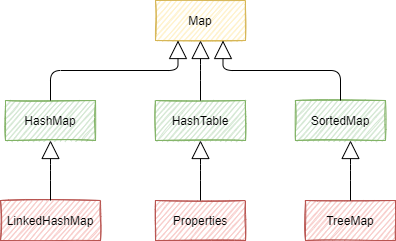
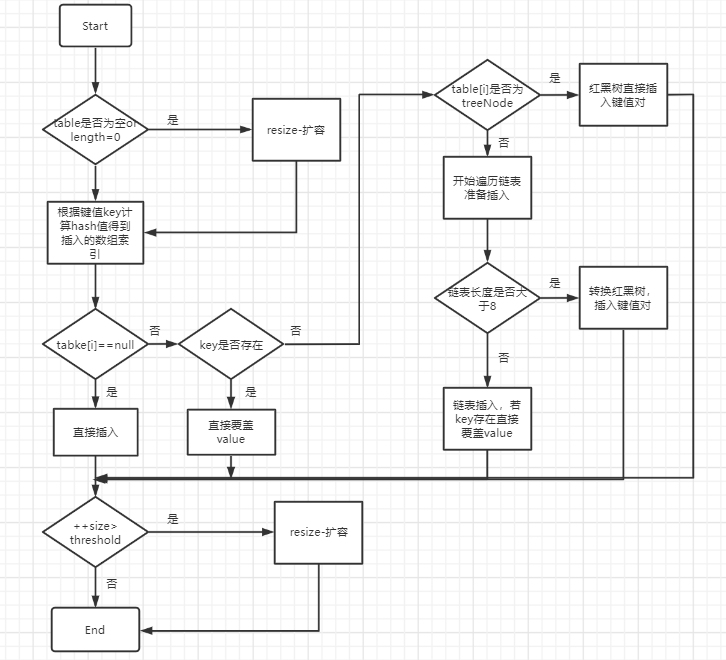

# Java集合高频面试题
<!--page header-->

<a name="11d2d200"></a>
## 常见的集合有哪些？

Java集合类主要由两个接口**Collection**和**Map**派生出来的，Collection有三个子接口：List、Set、Queue。

Java集合框架图如下：




List代表了有序可重复集合，可直接根据元素的索引来访问；Set代表无序不可重复集合，只能根据元素本身来访问；Queue是队列集合。Map代表的是存储key-value对的集合，可根据元素的key来访问value。

集合体系中常用的实现类有`ArrayList、LinkedList、HashSet、TreeSet、HashMap、TreeMap`等实现类。

<a name="565ed9f0"></a>
## List 、Set和Map 的区别

- List 以索引来存取元素，有序的，元素是允许重复的，可以插入多个null；
- Set 不能存放重复元素，无序的，只允许一个null；
- Map 保存键值对映射；
- List 底层实现有数组、链表两种方式；Set、Map 容器有基于哈希存储和红黑树两种方式实现；
- Set 基于 Map 实现，Set 里的元素值就是 Map的键值。

<a name="500ac64b"></a>
## ArrayList 了解吗？

`ArrayList` 的底层是动态数组，它的容量能动态增长。在添加大量元素前，应用可以使用`ensureCapacity`操作增加 `ArrayList` 实例的容量。ArrayList 继承了 AbstractList ，并实现了 List 接口。

<a name="3ce32805"></a>
## ArrayList 的扩容机制？

ArrayList扩容的本质就是计算出新的扩容数组的size后实例化，并将原有数组内容复制到新数组中去。**默认情况下，新的容量会是原容量的1.5倍**。以JDK1.8为例说明:

```java
public boolean add(E e) {
    //判断是否可以容纳e，若能，则直接添加在末尾；若不能，则进行扩容，然后再把e添加在末尾
    ensureCapacityInternal(size + 1);  // Increments modCount!!
    //将e添加到数组末尾
    elementData[size++] = e;
    return true;
    }

// 每次在add()一个元素时，arraylist都需要对这个list的容量进行一个判断。通过ensureCapacityInternal()方法确保当前ArrayList维护的数组具有存储新元素的能力，经过处理之后将元素存储在数组elementData的尾部

private void ensureCapacityInternal(int minCapacity) {
      ensureExplicitCapacity(calculateCapacity(elementData, minCapacity));
}

private static int calculateCapacity(Object[] elementData, int minCapacity) {
        //如果传入的是个空数组则最小容量取默认容量与minCapacity之间的最大值
        if (elementData == DEFAULTCAPACITY_EMPTY_ELEMENTDATA) {
            return Math.max(DEFAULT_CAPACITY, minCapacity);
        }
        return minCapacity;
    }
    
  private void ensureExplicitCapacity(int minCapacity) {
        modCount++;
        // 若ArrayList已有的存储能力满足最低存储要求，则返回add直接添加元素；如果最低要求的存储能力>ArrayList已有的存储能力，这就表示ArrayList的存储能力不足，因此需要调用 grow();方法进行扩容
        if (minCapacity - elementData.length > 0)
            grow(minCapacity);
    }


private void grow(int minCapacity) {
        // 获取elementData数组的内存空间长度
        int oldCapacity = elementData.length;
        // 扩容至原来的1.5倍
        int newCapacity = oldCapacity + (oldCapacity >> 1);
        //校验容量是否够
        if (newCapacity - minCapacity < 0)
            newCapacity = minCapacity;
        //若预设值大于默认的最大值，检查是否溢出
        if (newCapacity - MAX_ARRAY_SIZE > 0)
            newCapacity = hugeCapacity(minCapacity);
        // 调用Arrays.copyOf方法将elementData数组指向新的内存空间
         //并将elementData的数据复制到新的内存空间
        elementData = Arrays.copyOf(elementData, newCapacity);
    }
```

<a name="419f70b1"></a>
## 怎么在遍历 ArrayList 时移除一个元素？

foreach删除会导致快速失败问题，可以使用迭代器的 remove() 方法。

```
Iterator itr = list.iterator();
while(itr.hasNext()) {
      if(itr.next().equals("jay") {
        itr.remove();
      }
}
```

<a name="58ebacd9"></a>
## Arraylist 和 Vector 的区别

1. ArrayList在内存不够时扩容为原来的1.5倍，Vector是扩容为原来的2倍。
2. Vector属于线程安全级别的，但是大多数情况下不使用Vector，因为操作Vector效率比较低。

<a name="5f70a408"></a>
## Arraylist 与 LinkedList的区别

1. ArrayList基于动态数组实现；LinkedList基于链表实现。
2. 对于随机index访问的get和set方法，ArrayList的速度要优于LinkedList。因为ArrayList直接通过数组下标直接找到元素；LinkedList要移动指针遍历每个元素直到找到为止。
3. 新增和删除元素，LinkedList的速度要优于ArrayList。因为ArrayList在新增和删除元素时，可能扩容和复制数组；LinkedList实例化对象需要时间外，只需要修改指针即可。

<a name="HashMap"></a>
## HashMap

HashMap 使用数组+链表+红黑树（JDK1.8增加了红黑树部分）实现的， 链表长度大于8（`TREEIFY_THRESHOLD`）时，会把链表转换为红黑树，红黑树节点个数小于6（`UNTREEIFY_THRESHOLD`）时才转化为链表，防止频繁的转化。

<a name="15909095"></a>
### 解决hash冲突的办法有哪些？HashMap用的哪种？

解决Hash冲突方法有：开放定址法、再哈希法、链地址法。HashMap中采用的是 链地址法 。

- 开放定址法基本思想就是，如果`p=H(key)`出现冲突时，则以`p`为基础，再次hash，`p1=H(p)`,如果p1再次出现冲突，则以p1为基础，以此类推，直到找到一个不冲突的哈希地址`pi`。 因此开放定址法所需要的hash表的长度要大于等于所需要存放的元素，而且因为存在再次hash，所以`只能在删除的节点上做标记，而不能真正删除节点。`
- 再哈希法提供多个不同的hash函数，当`R1=H1(key1)`发生冲突时，再计算`R2=H2(key1)`，直到没有冲突为止。 这样做虽然不易产生堆集，但增加了计算的时间。
- 链地址法将哈希值相同的元素构成一个同义词的单链表,并将单链表的头指针存放在哈希表的第i个单元中，查找、插入和删除主要在同义词链表中进行。链表法适用于经常进行插入和删除的情况。

<a name="5e0fddbd"></a>
### 使用的hash算法？

Hash算法：取key的hashCode值、高位运算、取模运算。

```
h=key.hashCode() //第一步 取hashCode值
h^(h>>>16)  //第二步 高位参与运算，减少冲突
return h&(length-1);  //第三步 取模运算
```

在JDK1.8的实现中，优化了高位运算的算法，通过`hashCode()`的高16位异或低16位实现的：这么做可以在数组比较小的时候，也能保证考虑到高低位都参与到Hash的计算中，可以减少冲突，同时不会有太大的开销。

<a name="d4f637dd"></a>
### 为什么建议设置HashMap的容量？

HashMap有扩容机制，就是当达到扩容条件时会进行扩容。扩容条件就是当HashMap中的元素个数超过临界值时就会自动扩容（threshold = loadFactor * capacity）。

如果我们没有设置初始容量大小，随着元素的不断增加，HashMap会发生多次扩容。而HashMap每次扩容都需要重建hash表，非常影响性能。所以建议开发者在创建HashMap的时候指定初始化容量。

<a name="6e60453b"></a>
### 扩容过程？

1.8扩容机制：当元素个数大于`threshold`时，会进行扩容，使用2倍容量的数组代替原有数组。采用尾插入的方式将原数组元素拷贝到新数组。1.8扩容之后链表元素相对位置没有变化，而1.7扩容之后链表元素会倒置。

1.7链表新节点采用的是头插法，这样在线程一扩容迁移元素时，会将元素顺序改变，导致两个线程中出现元素的相互指向而形成循环链表，1.8采用了尾插法，避免了这种情况的发生。

原数组的元素在重新计算hash之后，因为数组容量n变为2倍，那么n-1的mask范围在高位多1bit。在元素拷贝过程不需要重新计算元素在数组中的位置，只需要看看原来的hash值新增的那个bit是1还是0，是0的话索引没变，是1的话索引变成“原索引+oldCap”（根据`e.hash & oldCap == 0`判断） 。这样可以省去重新计算hash值的时间，而且由于新增的1bit是0还是1可以认为是随机的，因此resize的过程会均匀的把之前的冲突的节点分散到新的bucket。

<a name="e6855c8f"></a>
### put方法流程？

1. 如果table没有初始化就先进行初始化过程
2. 使用hash算法计算key的索引
3. 判断索引处有没有存在元素，没有就直接插入
4. 如果索引处存在元素，则遍历插入，有两种情况，一种是链表形式就直接遍历到尾端插入，一种是红黑树就按照红黑树结构插入
5. 链表的数量大于阈值8，就要转换成红黑树的结构
6. 添加成功后会检查是否需要扩容



<a name="23ca9f90"></a>
### 红黑树的特点？

- 每个节点或者是黑色，或者是红色。
- 根节点和叶子节点（`NIL`）是黑色的。
- 如果一个节点是红色的，则它的子节点必须是黑色的。
- 从一个节点到该节点的子孙节点的所有路径上包含相同数目的黑节点。

<a name="8b5344e7"></a>
### 在解决 hash 冲突的时候，为什么选择先用链表，再转红黑树?

因为红黑树需要进行左旋，右旋，变色这些操作来保持平衡，而单链表不需要。所以，当元素个数小于8个的时候，采用链表结构可以保证查询性能。而当元素个数大于8个的时候并且数组容量大于等于64，会采用红黑树结构。因为红黑树搜索时间复杂度是 `O(logn)`，而链表是 `O(n)`，在n比较大的时候，使用红黑树可以加快查询速度。

<a name="e0e1aa38"></a>
### HashMap 的长度为什么是 2 的幂次方？

Hash 值的范围值比较大，使用之前需要先对数组的长度取模运算，得到的余数才是元素存放的位置也就是对应的数组下标。这个数组下标的计算方法是`(n - 1) & hash`。将HashMap的长度定为2 的幂次方，这样就可以使用`(n - 1)&hash`位运算代替%取余的操作，提高性能。

<a name="a4ee12cf"></a>
### HashMap默认加载因子是多少？为什么是 0.75？

先看下HashMap的默认构造函数：

```java
int threshold;             // 容纳键值对的最大值
final float loadFactor;    // 负载因子
int modCount;  
int size;
```

Node[] table的初始化长度length为16，默认的loadFactor是0.75，0.75是对空间和时间效率的一个平衡选择，根据泊松分布，loadFactor 取0.75碰撞最小。一般不会修改，除非在时间和空间比较特殊的情况下 ：

-  如果内存空间很多而又对时间效率要求很高，可以降低负载因子Load factor的值 。 
-  如果内存空间紧张而对时间效率要求不高，可以增加负载因子loadFactor的值，这个值可以大于1。 

<a name="58243476"></a>
### 一般用什么作为HashMap的key?

一般用`Integer`、`String`这种不可变类当 HashMap 当 key。String类比较常用。

- 因为 String 是不可变的，所以在它创建的时候`hashcode``就被缓存了，不需要重新计算。这就是 HashMap 中的key经常使用字符串的原因。
- 获取对象的时候要用到 `equals()` 和 `hashCode()` 方法，而Integer、String这些类都已经重写了 `hashCode()` 以及 `equals()` 方法，不需要自己去重写这两个方法。

<a name="6fac6418"></a>
### HashMap为什么线程不安全？

- 多线程下扩容死循环。JDK1.7中的 HashMap 使用头插法插入元素，在多线程的环境下，扩容的时候有可能导致**环形链表**的出现，形成死循环。
- 在JDK1.8中，在多线程环境下，会发生**数据覆盖**的情况。

<a name="cd027053"></a>
### HashMap和HashTable的区别？

HashMap和Hashtable都实现了Map接口。

1. HashMap可以接受为null的key和value，key为null的键值对放在下标为0的头结点的链表中，而Hashtable则不行。
2. HashMap是非线程安全的，HashTable是线程安全的。Jdk1.5提供了ConcurrentHashMap，它是HashTable的替代。
3. Hashtable很多方法是同步方法，在单线程环境下它比HashMap要慢。
4. 哈希值的使用不同，HashTable直接使用对象的hashCode。而HashMap重新计算hash值。

<a name="9a412744"></a>
## LinkedHashMap底层原理？

HashMap是无序的，迭代HashMap所得到元素的顺序并不是它们最初放到HashMap的顺序，即不能保持它们的插入顺序。

LinkedHashMap继承于HashMap，是HashMap和LinkedList的融合体，具备两者的特性。每次put操作都会将entry插入到双向链表的尾部。

<a name="1347032a"></a>
## 讲一下TreeMap？

TreeMap是一个能比较元素大小的Map集合，会对传入的key进行了大小排序。可以使用元素的自然顺序，也可以使用集合中自定义的比较器来进行排序。

```java
public class TreeMap<K,V>
    extends AbstractMap<K,V>
    implements NavigableMap<K,V>, Cloneable, java.io.Serializable {
}
```

TreeMap 的继承结构：


**TreeMap的特点：**

1. TreeMap是有序的key-value集合，通过红黑树实现。根据键的自然顺序进行排序或根据提供的Comparator进行排序。
2. TreeMap继承了AbstractMap，实现了NavigableMap接口，支持一系列的导航方法，给定具体搜索目标，可以返回最接近的匹配项。如floorEntry()、ceilingEntry()分别返回小于等于、大于等于给定键关联的Map.Entry()对象，不存在则返回null。lowerKey()、floorKey、ceilingKey、higherKey()只返回关联的key。

<a name="88a77924"></a>
## HashSet底层原理？

HashSet 基于 HashMap 实现。放入HashSet中的元素实际上由HashMap的key来保存，而HashMap的value则存储了一个静态的Object对象。

```java
public class HashSet<E>
    extends AbstractSet<E>
    implements Set<E>, Cloneable, java.io.Serializable {
    static final long serialVersionUID = -5024744406713321676L;

    private transient HashMap<E,Object> map; //基于HashMap实现
    //...
}
```

<a name="ff9cfb9c"></a>
## HashSet、LinkedHashSet 和 TreeSet 的区别？

`HashSet` 是 `Set` 接口的主要实现类 ，`HashSet` 的底层是 `HashMap`，线程不安全的，可以存储 null 值；

`LinkedHashSet` 是 `HashSet` 的子类，能够按照添加的顺序遍历；

`TreeSet` 底层使用红黑树，能够按照添加元素的顺序进行遍历，排序的方式可以自定义。

<a name="dbe91355"></a>
## 什么是fail fast？

fast-fail是Java集合的一种错误机制。当多个线程对同一个集合进行操作时，就有可能会产生fast-fail事件。例如：当线程a正通过iterator遍历集合时，另一个线程b修改了集合的内容，此时modCount（记录集合操作过程的修改次数）会加1，不等于expectedModCount，那么线程a访问集合的时候，就会抛出ConcurrentModificationException，产生fast-fail事件。边遍历边修改集合也会产生fast-fail事件。

解决方法：

- 使用Colletions.synchronizedList方法或在修改集合内容的地方加上synchronized。这样的话，增删集合内容的同步锁会阻塞遍历操作，影响性能。
- 使用CopyOnWriteArrayList来替换ArrayList。在对CopyOnWriteArrayList进行修改操作的时候，会拷贝一个新的数组，对新的数组进行操作，操作完成后再把引用移到新的数组。

<a name="7be68950"></a>
## 什么是fail safe？

采用安全失败机制的集合容器，在遍历时不是直接在集合内容上访问的，而是先复制原有集合内容，在拷贝的集合上进行遍历。java.util.concurrent包下的容器都是安全失败，可以在多线程下并发使用，并发修改。

**原理**：由于迭代时是对原集合的拷贝进行遍历，所以在遍历过程中对原集合所作的修改并不能被迭代器检测到，所以不会触发Concurrent Modification Exception。

**缺点**：基于拷贝内容的优点是避免了Concurrent Modification Exception，但同样地，迭代器并不能访问到修改后的内容，即：迭代器遍历的是开始遍历那一刻拿到的集合拷贝，在遍历期间原集合发生的修改迭代器是不知道的。

<a name="ecd90218"></a>
## 讲一下ArrayDeque？

ArrayDeque实现了双端队列，内部使用循环数组实现，默认大小为16。它的特点有：

1.  在两端添加、删除元素的效率较高 
2.  根据元素内容查找和删除的效率比较低。 
3.  没有索引位置的概念，不能根据索引位置进行操作。 

ArrayDeque和LinkedList都实现了Deque接口，如果只需要从两端进行操作，ArrayDeque效率更高一些。如果同时需要根据索引位置进行操作，或者经常需要在中间进行插入和删除（LinkedList有相应的 api，如add(int index, E e)），则应该选LinkedList。

ArrayDeque和LinkedList都是线程不安全的，可以使用Collections工具类中synchronizedXxx()转换成线程同步。

<a name="73382302"></a>
## 哪些集合类是线程安全的？哪些不安全？

线性安全的集合类：

- Vector：比ArrayList多了同步机制。
- Hashtable。
- ConcurrentHashMap：是一种高效并且线程安全的集合。
- Stack：栈，也是线程安全的，继承于Vector。

线性不安全的集合类：

- Hashmap
- Arraylist
- LinkedList
- HashSet
- TreeSet
- TreeMap

<a name="2cc01237"></a>
## 迭代器 Iterator 是什么？

Iterator模式用同一种逻辑来遍历集合。它可以把访问逻辑从不同类型的集合类中抽象出来，不需要了解集合内部实现便可以遍历集合元素，统一使用 Iterator 提供的接口去遍历。它的特点是更加安全，因为它可以保证，在当前遍历的集合元素被更改的时候，就会抛出 ConcurrentModificationException 异常。

```java
public interface Collection<E> extends Iterable<E> {
	Iterator<E> iterator();
}
```

主要有三个方法：hasNext()、next()和remove()。

<a name="6acc8fb0"></a>
## Iterator 和 ListIterator 有什么区别？

ListIterator 是 Iterator的增强版。

- ListIterator遍历可以是逆向的，因为有previous()和hasPrevious()方法，而Iterator不可以。
- ListIterator有add()方法，可以向List添加对象，而Iterator却不能。
- ListIterator可以定位当前的索引位置，因为有nextIndex()和previousIndex()方法，而Iterator不可以。
- ListIterator可以实现对象的修改，set()方法可以实现。Iierator仅能遍历，不能修改。
- ListIterator只能用于遍历List及其子类，Iterator可用来遍历所有集合。

<a name="cb81cef3"></a>
## 如何让一个集合不能被修改？

可以采用Collections包下的unmodifiableMap/unmodifiableList/unmodifiableSet方法，通过这个方法返回的集合，是不可以修改的。如果修改的话，会抛出 java.lang.UnsupportedOperationException异常。

```java
List<String> list = new ArrayList<>();
list.add("x");
Collection<String> clist = Collections.unmodifiableCollection(list);
clist.add("y"); // 运行时此行报错
System.out.println(list. size());
```

对于List/Set/Map集合，Collections包都有相应的支持。

**那使用final关键字进行修饰可以实现吗？**

答案是不可以。

final关键字修饰的成员变量如果是是引用类型的话，则表示这个引用的地址值是不能改变的，但是这个引用所指向的对象里面的内容还是可以改变的。

而集合类都是引用类型，用final修饰的话，集合里面的内容还是可以修改的。

<a name="bd96af9f"></a>
## 并发容器

JDK 提供的这些容器大部分在 `java.util.concurrent` 包中。

- **ConcurrentHashMap:** 线程安全的 HashMap
- **CopyOnWriteArrayList:** 线程安全的 List，在读多写少的场合性能非常好，远远好于 Vector.
- **ConcurrentLinkedQueue:** 高效的并发队列，使用链表实现。可以看做一个线程安全的 LinkedList，这是一个非阻塞队列。
- **BlockingQueue:** 阻塞队列接口，JDK 内部通过链表、数组等方式实现了这个接口。非常适合用于作为数据共享的通道。
- **ConcurrentSkipListMap:** 跳表的实现。使用跳表的数据结构进行快速查找。

<a name="ConcurrentHashMap"></a>
### ConcurrentHashMap

多线程环境下，使用Hashmap进行put操作会引起死循环，应该使用支持多线程的 ConcurrentHashMap。

JDK1.8 ConcurrentHashMap取消了segment分段锁，而采用CAS和synchronized来保证并发安全。数据结构采用数组+链表/红黑二叉树。synchronized只锁定当前链表或红黑二叉树的首节点，相比1.7锁定HashEntry数组，锁粒度更小，支持更高的并发量。当链表长度过长时，Node会转换成TreeNode，提高查找速度。

<a name="8cd8d3a2"></a>
#### put执行流程？

在put的时候需要锁住Segment，保证并发安全。调用get的时候不加锁，因为node数组成员val和指针next是用volatile修饰的，更改后的值会立刻刷新到主存中，保证了可见性，node数组table也用volatile修饰，保证在运行过程对其他线程具有可见性。

```java
transient volatile Node<K,V>[] table;

static class Node<K,V> implements Map.Entry<K,V> {
    volatile V val;
    volatile Node<K,V> next;
}
```

put 操作流程：

1. 如果table没有初始化就先进行初始化过程
2. 使用hash算法计算key的位置
3. 如果这个位置为空则直接CAS插入，如果不为空的话，则取出这个节点来
4. 如果取出来的节点的hash值是MOVED(-1)的话，则表示当前正在对这个数组进行扩容，复制到新的数组，则当前线程也去帮助复制
5. 如果这个节点，不为空，也不在扩容，则通过synchronized来加锁，进行添加操作，这里有两种情况，一种是链表形式就直接遍历到尾端插入或者覆盖掉相同的key，一种是红黑树就按照红黑树结构插入
6. 链表的数量大于阈值8，就会转换成红黑树的结构或者进行扩容（table长度小于64）
7. 添加成功后会检查是否需要扩容

<a name="d5f1f9f3"></a>
#### 怎么扩容？

数组扩容transfer方法中会设置一个步长，表示一个线程处理的数组长度，最小值是16。在一个步长范围内只有一个线程会对其进行复制移动操作。

<a name="55f536d5"></a>
#### ConcurrentHashMap 和 Hashtable 的区别？

1. Hashtable通过使用synchronized修饰方法的方式来实现多线程同步，因此，Hashtable的同步会锁住整个数组。在高并发的情况下，性能会非常差。ConcurrentHashMap采用了更细粒度的锁来提高在并发情况下的效率。注：synchronized容器（同步容器）也是通过synchronized关键字来实现线程安全，在使用的时候会对所有的数据加锁。
2. Hashtable默认的大小为11，当达到阈值后，每次按照下面的公式对容量进行扩充：newCapacity = oldCapacity * 2 + 1。ConcurrentHashMap默认大小是16，扩容时容量扩大为原来的2倍。

<a name="CopyOnWrite"></a>
### CopyOnWrite

Copy-On-Write，写时复制。当我们往容器添加元素时，不直接往容器添加，而是先将当前容器进行复制，复制出一个新的容器，然后往新的容器添加元素，添加完元素之后，再将原容器的引用指向新容器。这样做的好处就是可以对`CopyOnWrite`容器进行并发的读而不需要加锁，因为当前容器不会被修改。

```java
    public boolean add(E e) {
        final ReentrantLock lock = this.lock;
        lock.lock(); //add方法需要加锁
        try {
            Object[] elements = getArray();
            int len = elements.length;
            Object[] newElements = Arrays.copyOf(elements, len + 1); //复制新数组
            newElements[len] = e;
            setArray(newElements); //原容器的引用指向新容器
            return true;
        } finally {
            lock.unlock();
        }
    }
```

从JDK1.5开始Java并发包里提供了两个使用CopyOnWrite机制实现的并发容器，它们是`CopyOnWriteArrayList`和`CopyOnWriteArraySet`。

**缺点：**

- 内存占用问题。由于CopyOnWrite的写时复制机制，在进行写操作的时候，内存里会同时驻扎两个对象的内存。
- CopyOnWrite容器不能保证数据的实时一致性，可能读取到旧数据。

<a name="CopyOnWriteArrayList"></a>
### CopyOnWriteArrayList

**CopyOnWriteArrayList**是Java并发包中提供的一个并发容器。CopyOnWriteArrayList相当于线程安全的ArrayList，CopyOnWriteArrayList使用了一种叫写时复制的方法，当有新元素add到CopyOnWriteArrayList时，先从原有的数组中拷贝一份出来，然后在新的数组做写操作，写完之后，再将原来的数组引用指向到新数组。

`CopyOnWriteArrayList`中add方法添加的时候是需要加锁的，保证同步，避免了多线程写的时候复制出多个副本。读的时候不需要加锁，如果读的时候有其他线程正在向`CopyOnWriteArrayList`添加数据，还是可以读到旧的数据。

CopyOnWrite并发容器用于读多写少的并发场景。

**优点**：

读操作性能很高，因为无需任何同步措施，比较适用于**读多写少**的并发场景。Java的list在遍历时，若中途有别的线程对list容器进行修改，则会抛出**ConcurrentModificationException**异常。而CopyOnWriteArrayList由于其"读写分离"的思想，遍历和修改操作分别作用在不同的list容器，所以在使用迭代器进行遍历时候，也就不会抛出ConcurrentModificationException异常了。

**缺点**：

**一是内存占用问题**，毕竟每次执行写操作都要将原容器拷贝一份，数据量大时，对内存压力较大，可能会引起频繁GC；

**二是无法保证实时性**，Vector对于读写操作均加锁同步，可以保证读和写的强一致性。而CopyOnWriteArrayList由于其实现策略的原因，写和读分别作用在新老不同容器上，在写操作执行过程中，读不会阻塞但读取到的却是老容器的数据。

<a name="ConcurrentLinkedQueue"></a>
### ConcurrentLinkedQueue

非阻塞队列。高效的并发队列，使用链表实现。可以看做一个线程安全的 `LinkedList`，通过 CAS 操作实现。

如果对队列加锁的成本较高则适合使用无锁的 `ConcurrentLinkedQueue` 来替代。适合在对性能要求相对较高，同时有多个线程对队列进行读写的场景。

**非阻塞队列中的几种主要方法：**
`add(E e)`: 将元素e插入到队列末尾，如果插入成功，则返回true；如果插入失败（即队列已满），则会抛出异常；
`remove()`：移除队首元素，若移除成功，则返回true；如果移除失败（队列为空），则会抛出异常；
`offer(E e)`：将元素e插入到队列末尾，如果插入成功，则返回true；如果插入失败（即队列已满），则返回false；
`poll()`：移除并获取队首元素，若成功，则返回队首元素；否则返回null；
`peek()`：获取队首元素，若成功，则返回队首元素；否则返回null

对于非阻塞队列，一般情况下建议使用offer、poll和peek三个方法，不建议使用add和remove方法。因为使用offer、poll和peek三个方法可以通过返回值判断操作成功与否，而使用add和remove方法却不能达到这样的效果。

<a name="15ec8cc5"></a>
### 阻塞队列

阻塞队列是`java.util.concurrent`包下重要的数据结构，`BlockingQueue`提供了线程安全的队列访问方式：当阻塞队列进行插入数据时，如果队列已满，线程将会阻塞等待直到队列非满；从阻塞队列取数据时，如果队列已空，线程将会阻塞等待直到队列非空。并发包下很多高级同步类的实现都是基于`BlockingQueue`实现的。`BlockingQueue` 适合用于作为数据共享的通道。

使用阻塞算法的队列可以用一个锁（入队和出队用同一把锁）或两个锁（入队和出队用不同的锁）等方式来实现。

阻塞队列和一般的队列的区别就在于：

1. 多线程支持，多个线程可以安全的访问队列
2. 阻塞操作，当队列为空的时候，消费线程会阻塞等待队列不为空；当队列满了的时候，生产线程就会阻塞直到队列不满

**方法**

| 方法\\处理方式 | 抛出异常 | 返回特殊值 | 一直阻塞 | 超时退出 |
| --- | --- | --- | --- | --- |
| 插入方法 | add(e) | offer(e) | put(e) | offer(e,time,unit) |
| 移除方法 | remove() | poll() | take() | poll(time,unit) |
| 检查方法 | element() | peek() | 不可用 | 不可用 |


<a name="e108a6fa"></a>
#### JDK提供的阻塞队列

JDK 7 提供了7个阻塞队列，如下

1、**ArrayBlockingQueue**

有界阻塞队列，底层采用数组实现。`ArrayBlockingQueue` 一旦创建，容量不能改变。其并发控制采用可重入锁来控制，不管是插入操作还是读取操作，都需要获取到锁才能进行操作。此队列按照先进先出（FIFO）的原则对元素进行排序。默认情况下不能保证线程访问队列的公平性，参数`fair`可用于设置线程是否公平访问队列。为了保证公平性，通常会降低吞吐量。

```java
private static ArrayBlockingQueue<Integer> blockingQueue = new ArrayBlockingQueue<Integer>(10,true);//fair
```

2、**LinkedBlockingQueue**

`LinkedBlockingQueue`是一个用单向链表实现的有界阻塞队列，可以当做无界队列也可以当做有界队列来使用。通常在创建 `LinkedBlockingQueue` 对象时，会指定队列最大的容量。此队列的默认和最大长度为`Integer.MAX_VALUE`。此队列按照先进先出的原则对元素进行排序。与 `ArrayBlockingQueue` 相比起来具有更高的吞吐量。

3、**PriorityBlockingQueue**

支持优先级的**无界**阻塞队列。默认情况下元素采取自然顺序升序排列。也可以自定义类实现`compareTo()`方法来指定元素排序规则，或者初始化`PriorityBlockingQueue`时，指定构造参数`Comparator`来进行排序。

`PriorityBlockingQueue` 只能指定初始的队列大小，后面插入元素的时候，如果空间不够的话会**自动扩容**。

`PriorityQueue` 的线程安全版本。不可以插入 null 值，同时，插入队列的对象必须是可比较大小的（comparable），否则报 ClassCastException 异常。它的插入操作 put 方法不会 block，因为它是无界队列（take 方法在队列为空的时候会阻塞）。

4、**DelayQueue**

支持延时获取元素的无界阻塞队列。队列使用`PriorityBlockingQueue`来实现。队列中的元素必须实现Delayed接口，在创建元素时可以指定多久才能从队列中获取当前元素。只有在延迟期满时才能从队列中提取元素。

5、**SynchronousQueue**

不存储元素的阻塞队列，每一个put必须等待一个take操作，否则不能继续添加元素。支持公平访问队列。

`SynchronousQueue`可以看成是一个传球手，负责把生产者线程处理的数据直接传递给消费者线程。队列本身不存储任何元素，非常适合传递性场景。`SynchronousQueue`的吞吐量高于`LinkedBlockingQueue`和`ArrayBlockingQueue`。

6、**LinkedTransferQueue**

由链表结构组成的无界阻塞TransferQueue队列。相对于其他阻塞队列，多了`tryTransfer`和`transfer`方法。

transfer方法：如果当前有消费者正在等待接收元素（take或者待时间限制的poll方法），transfer可以把生产者传入的元素立刻传给消费者。如果没有消费者等待接收元素，则将元素放在队列的tail节点，并等到该元素被消费者消费了才返回。

tryTransfer方法：用来试探生产者传入的元素能否直接传给消费者。如果没有消费者在等待，则返回false。和上述方法的区别是该方法无论消费者是否接收，方法立即返回。而transfer方法是必须等到消费者消费了才返回。

<a name="b6724cff"></a>
#### 原理

JDK使用通知模式实现阻塞队列。所谓通知模式，就是当生产者往满的队列里添加元素时会阻塞生产者，当消费者消费了一个队列中的元素后，会通知生产者当前队列可用。

ArrayBlockingQueue使用Condition来实现：

```java
private final Condition notEmpty;
private final Condition notFull;

public ArrayBlockingQueue(int capacity, boolean fair) {
    if (capacity <= 0)
        throw new IllegalArgumentException();
    this.items = new Object[capacity];
    lock = new ReentrantLock(fair);
    notEmpty = lock.newCondition();
    notFull =  lock.newCondition();
}

public E take() throws InterruptedException {
    final ReentrantLock lock = this.lock;
    lock.lockInterruptibly();
    try {
        while (count == 0) // 队列为空时，阻塞当前消费者
            notEmpty.await();
        return dequeue();
    } finally {
        lock.unlock();
    }
}

public void put(E e) throws InterruptedException {
    checkNotNull(e);
    final ReentrantLock lock = this.lock;
    lock.lockInterruptibly();
    try {
        while (count == items.length)
            notFull.await();
        enqueue(e);
    } finally {
        lock.unlock();
    }
}

private void enqueue(E x) {
    final Object[] items = this.items;
    items[putIndex] = x;
    if (++putIndex == items.length)
          putIndex = 0;
     count++;
     notEmpty.signal(); // 队列不为空时，通知消费者获取元素
}
```

<a name="ea6f3b87"></a>
## 参考链接

[http://www.importnew.com/20386.html](http://www.importnew.com/20386.html)

[https://www.cnblogs.com/yangming1996/p/7997468.html](https://www.cnblogs.com/yangming1996/p/7997468.html)

https://coolshell.cn/articles/9606.htm（HashMap 死循环）


<!--page footer-->
- 原文: <https://www.yuque.com/dabin-1eu6s/plc2v4/in73twqqyuwa4t7n>