# Tomcat基础知识总结
<!--page header-->

<a name="0eaa6af9"></a>
## 架构

首先，看一下整个架构图


接下来简单解释一下。

**Server**：服务器。Tomcat 就是一个 Server 服务器。

**Service**：在服务器中可以有多个 Service，只不过在我们常用的这套 Catalina 容器的Tomcat 中只包含一个 Service，在 Service 中包含连接器和容器。一个完整的 Service 才能完成对请求的接收和处理。

**连接器**：Coyote 是连接器具体的实现。用于与新来的请求建立连接并解析数据。因为 Tomcat 支持的 IO 模型有 NIO、NIO2、APR，而支持的应用层协议有 HTTP1.1、HTTP2、AJP。所以针对不同的 IO 模型和应用层协议请求，在一个 Service 中可以有多个连接器来适用不同的协议的IO请求。

EndPoint ：Coyote 通信端点，即通信监听的接口，是具体 Socket 接收和发送处理器，是用来实现 TCP/IP 传输协议的。

Acceptor：用于接收请求的 socket。

Executor：线程池，在接收到请求的 socket 后会从线程池中分配一条来执行后面的操作。

Processor ：Coyote 协议处理接口，是用来实现 HTTP 应用层协议的，接收 EndPoint 、容器传来的 Socket 字节流，解析成 request 或 response 对象。

ProtocolHandler：Coyote 协议接口，通过 EndPoint 和 Processor，实现针对具体协议的处理能力。

Adapter：容器只负责处理数据，对于请求协议不同的数据，容器会无法处理，所以在 ProtocolHandler 处理生成的 request 对象后，还需要将其转成 Tomcat 定义好的统一格式的 ServletRequest 对象，Adapter 就是用来进行这样的操作的。

**容器**： Tomcat 的核心组件， 用于处理请求并返回数据。Catalina 是其具体的实现。

Engine：表示整个 Catalina 的 Servlet 引擎，用来管理多个虚拟站点，一个 Service 最多只能有一个 Engine。但是一个 Engine 可以包含多个 Host。

Host：表示一个主机地址，或者说一个站点，一个 Host 下有可以配置多个 Context。

Context：表示一个 web 应用，一个 Web 应用可以包含多个 Wrapper

Wrapper：表示一个 Servlet，是容器中的最底层组件。

各组件的比例关系

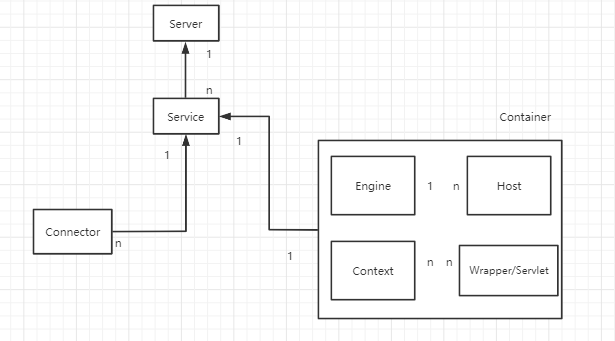

<a name="95e973b1"></a>
## 各组件的实现与执行

<a name="77daf5db"></a>
### 组件实现

前面提到的各个组件名都是接口或者抽象方法，在实际处理请求时执行的都是其子类或者实现类。

Server、Service、Engine、Host、Context都是接口， 下图中罗列了这些接口的默认 实现类。

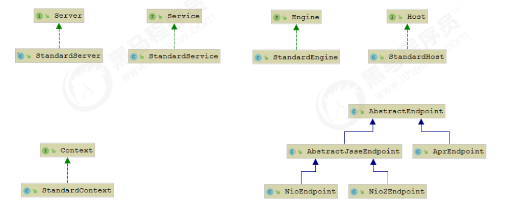

Adapter 的实现是 CoyoteAdapter

对于 Endpoint组件来说，在Tomcat中没有对应的Endpoint接口， 但是有一个抽象类AbstractEndpoint ，其下有三个实现类： NioEndpoint、Nio2Endpoint、AprEndpoint ， 这三个实现类，分别对应于前面讲解链接器 Coyote 时， 提到的链接器支持的三种IO模型：NIO，NIO2，APR ，tomcat8.5版本中，默认采用的是 NioEndpoint。

ProtocolHandler ： Coyote协议接口，通过封装Endpoint和Processor ， 实现针对具体协议的处理功能。Tomcat按照协议和IO提供了6个实现类。

AJP协议：

1） AjpNioProtocol ：采用NIO的IO模型。

2） AjpNio2Protocol：采用NIO2的IO模型。

3） AjpAprProtocol ：采用APR的IO模型，需要依赖于APR库。

HTTP协议：

1） Http11NioProtocol ：采用NIO的IO模型，默认使用的协议（如果服务器没有安装APR）。

2） Http11Nio2Protocol：采用NIO2的IO模型。

3） Http11AprProtocol ：采用APR的IO模型，需要依赖于APR库。


这些组件均存在初始化、启动、停止等周期方法，所以 Tomcat 设计了一个 LifeCycle 接口，用于定义这些组件生命周期中需要执行的共同方法，这些组件实现类都实现了这个接口。

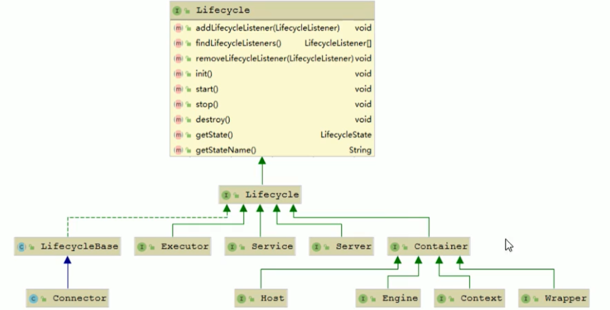

<a name="0aa66e80"></a>
### 启动流程

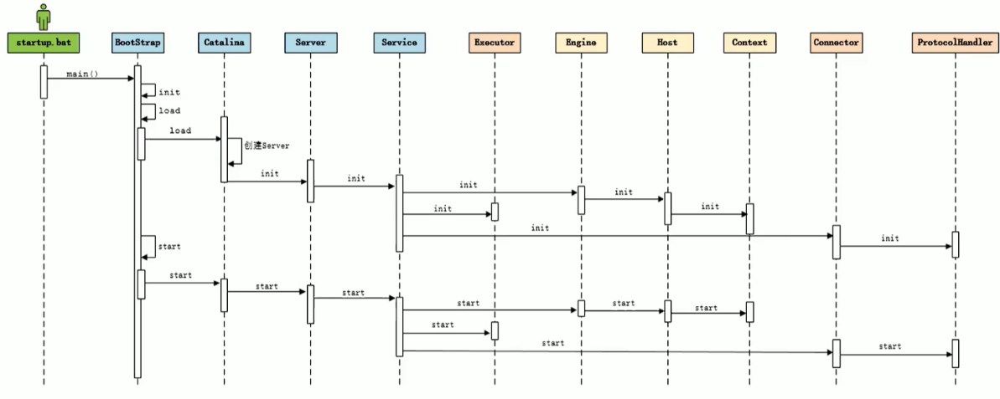

1） 启动tomcat ， 需要调用 bin/startup.bat (在linux 目录下 , 需要调用 bin/startup.sh) ， 在

startup.bat 脚本中, 调用了catalina.bat。

2） 在catalina.bat 脚本文件中，调用了BootStrap 中的main方法。

3）在BootStrap 的main 方法中调用了 init 方法 ， 来创建Catalina 及 初始化类加载器。

4）在BootStrap 的main 方法中调用了 load 方法 ， 在其中又调用了Catalina的load方法。

5）在Catalina 的load 方法中 , 需要进行一些初始化的工作, 并需要构造Digester 对象, 用于解析 XML。

6） 然后在调用后续组件的初始化操作 。。。

加载Tomcat的配置文件，初始化容器组件 ，监听对应的端口号， 准备接受客户端请求 。

简而言之就是进行各组件逐级执行 init() 和 start() 方法。

<a name="a94b229e"></a>
### 执行流程

当一个请求进入 Tomcat 时，执行情况如下( 因为 Tomcat 只有一个 Service，所以下面就将 Service 和 Engine 写在同一个框中）：

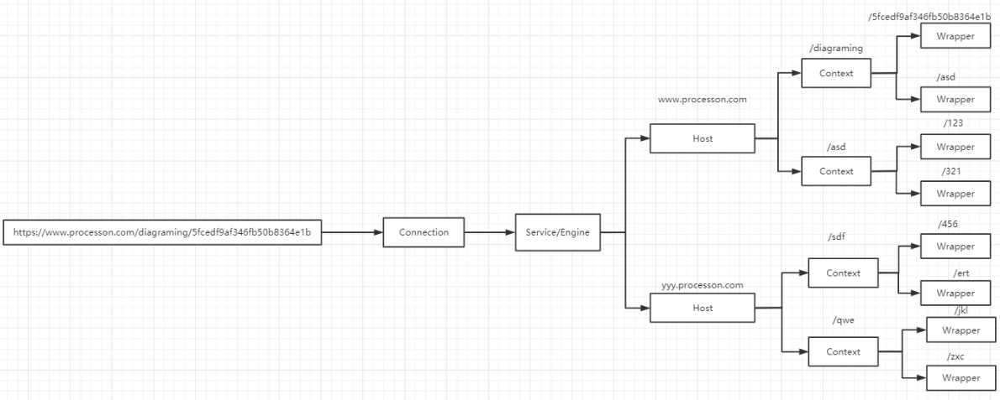

定位主要通过 Mapper 组件来实现，其本质就是一个 K、V键值对，在解析时首先会将请求网址进行解析，将其中的 Host 部分在 Mapper 类中的 hosts属性（MappedHost数组，保存所有的 Host 信息）中进行查找，找到后再解析 Context 部分，在该 MapperHost 中又有 contextList 属性（保存所有的 context 信息），然后再向下找，最终得到对应的 Servlet，执行。


除此之外，为了增强各组件之间的拓展性，Tomcat 中定义了 Pipeline 和 Valve 两个接口，Pipeline 用于构建责任链， 后者代表责任链上的每个处理器。Pipeline 中维护了一个基础的 Valve，它始终位于Pipeline的末端（最后执行），封装了具体的请求处理和输出响应的过程。当然，我们也可以调用addValve()方法， 为Pipeline 添加其他的Valve，后添加的Valve 位于基础的Valve之前，并按照添加顺序执行。Pipiline通过获得首个Valve来启动整合链条的执行 。

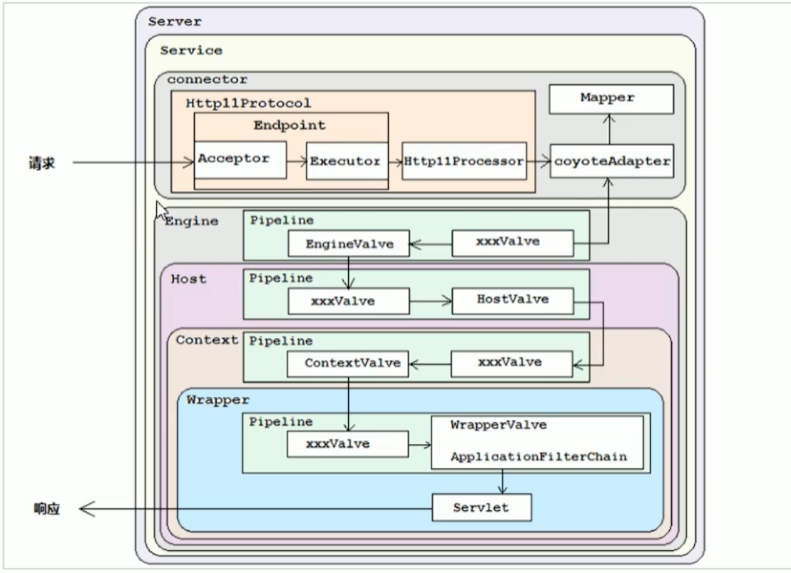

所以最终的执行如下：

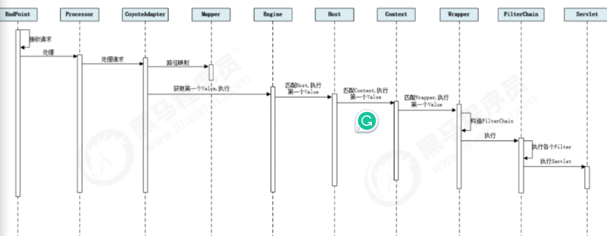

步骤如下:

1）Connector组件Endpoint中的Acceptor监听客户端套接字连接并接收Socket。

2）将连接交给线程池Executor处理，开始执行请求响应任务。

3）Processor组件读取消息报文，解析请求行、请求体、请求头，封装成Request对象。

4）Mapper组件根据请求行的URL值和请求头的Host值匹配由哪个Host容器、Context容器、Wrapper容器处理请求。

5）CoyoteAdaptor组件负责将Connector组件和Engine容器关联起来，把生成的Request对象和响应对象Response传递到Engine容器中，调用 Pipeline。

6）Engine容器的管道开始处理，管道中包含若干个Valve、每个Valve负责部分处理逻辑。执行完Valve后会执行基础的 Valve--StandardEngineValve，负责调用Host容器的Pipeline。

7）Host容器的管道开始处理，流程类似，最后执行 Context容器的Pipeline。

8）Context容器的管道开始处理，流程类似，最后执行 Wrapper容器的Pipeline。

9）Wrapper容器的管道开始处理，流程类似，最后执行 Wrapper容器对应的Servlet对象的处理方法。

<a name="15c64aa0"></a>
## 配置文件

首先看一下 tomcat 的目录结构

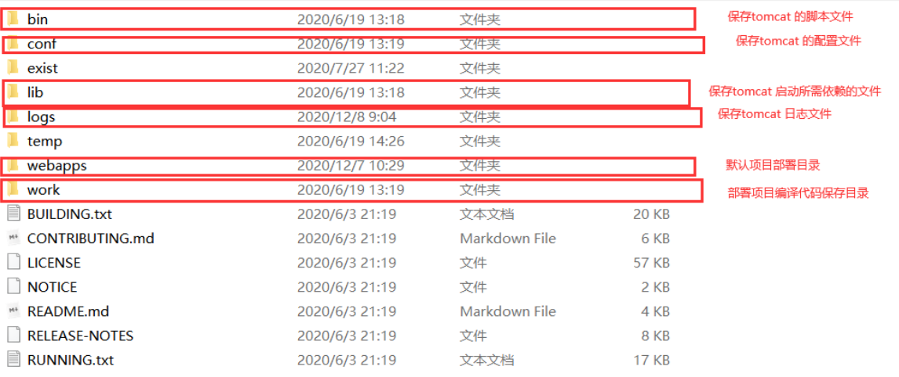

核心配置文件在 conf 目录下

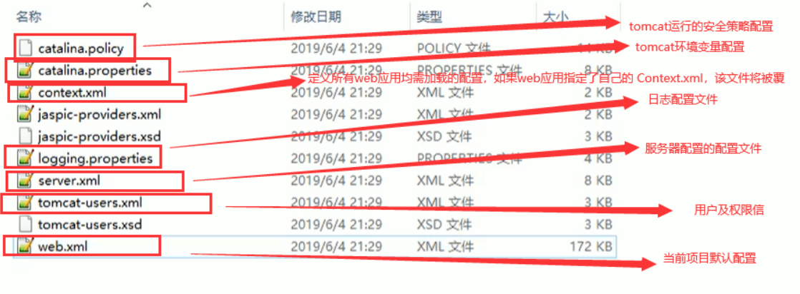

<a name="9e386f1f"></a>
### Server.xml(重点)

其中最重要的就是 server.xml，主要配置了 tomcat 容器的所有配置。下面来看一下其中有哪些配置。

<a name="740b105b"></a>
#### **Server**

是 server.xml 的根元素，用于创建一个 Server 实例，默认的实现是

```javascript
<Server port="8005" shutdown="SHUTDOWN"> 
... 
</Server>
```

port：Tomcat监听的关闭服务器的端口

shutdown：关闭服务器的指令字符串。

**Server 内嵌的子元素为 Listener、GlobalNamingResources、Service。**

配置的5个Listener 的含义：

```javascript
<!-- 用于以日志形式输出服务器 、操作系统、JVM的版本信息 --> 
<Listener className="org.apache.catalina.startup.VersionLoggerListener" /> 

<!-- 用于加载（服务器启动） 和 销毁 （服务器停止） APR。 如果找不到APR库， 则会输出日志， 并 不影响Tomcat启动 --> 
<Listener className="org.apache.catalina.core.AprLifecycleListener" SSLEngine="on" /> 

<!-- 用于避免JRE内存泄漏问题 -->
 <Listener className="org.apache.catalina.core.JreMemoryLeakPreventionListener" />

<!-- 用户加载（服务器启动） 和 销毁（服务器停止） 全局命名服务 --> 
<Listener className="org.apache.catalina.mbeans.GlobalResourcesLifecycleListener" /> 

<!-- 用于在Context停止时重建Executor 池中的线程， 以避免ThreadLocal 相关的内存泄漏 -->
<Listener className="org.apache.catalina.core.ThreadLocalLeakPreventionListener" />
```

GlobalNamingResources 中定义了全局命名服务

<a name="Service"></a>
#### Service

用于创建 Service 实例，**内嵌的元素为：Listener、Executor、Connector、Engine**，其中 ： Listener 用于为Service添加生命周期监听器， Executor 用于配置Service 共享线程池，Connector 用于配置Service 包含的链接器， Engine 用于配置Service中链接器对应的Servlet 容器引擎。默认 Service 就叫 Catalina。

<a name="Executor"></a>
#### Executor

默认情况，Service 并未配置共享线程池，各个连接器使用的都是各自的线程池（默认size为10）。如果我们想添加一个线程池，可以在 Service 标签中添加如下配置

```javascript
<Executor name="tomcatThreadPool" 
    namePrefix="catalina-exec-" 
    maxThreads="200" 
    minSpareThreads="100" 
    maxIdleTime="60000" 
    maxQueueSize="Integer.MAX_VALUE"                 
　　 prestartminSpareThreads="false" threadPriority="5" 
　　className="org.apache.catalina.core.StandardThreadExecutor"/>
```

相关属性说明：

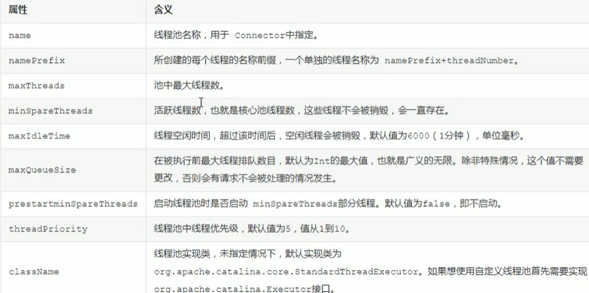

<a name="Connector"></a>
#### Connector

用于创建连接器实例，默认情况下，server.xml 配置了两个连接器，一个支持 HTTP 协议，一个支持 AJP 协议。

```javascript
<Connector port="8080" protocol="HTTP/1.1" connectionTimeout="20000" redirectPort="8443" />

<Connector port="8009" protocol="AJP/1.3" redirectPort="8443" />
```

1） port： 端口号，Connector 用于创建服务端Socket 并进行监听， 以等待客户端请求链接。如果该属性设置为0，Tomcat将会随机选择一个可用的端口号给当前Connector 使用。

2） protocol ： 当前Connector 支持的访问协议。 默认为 HTTP/1.1 ， 并采用自动切换机制选择一个基于 JAVA NIO 的链接器或者基于本地APR的链接器（根据本地是否含有Tomcat的本地库判定）。如果不希望采用上述自动切换的机制， 而是明确指定协议， 可以使用以下值。

Http协议：

org.apache.coyote.http11.Http11NioProtocol ， 非阻塞式 Java NIO 链接器

org.apache.coyote.http11.Http11Nio2Protocol ， 非阻塞式 JAVA NIO2 链接器

org.apache.coyote.http11.Http11AprProtocol ， APR 链接器

AJP协议：

org.apache.coyote.ajp.AjpNioProtocol ， 非阻塞式 Java NIO 链接器

org.apache.coyote.ajp.AjpNio2Protocol ，非阻塞式 JAVA NIO2 链接器

org.apache.coyote.ajp.AjpAprProtocol ， APR 链接器

3） connectionTimeOut : Connector 接收链接后的等待超时时间， 单位为 毫秒。 -1 表示不超时。

4） redirectPort：当前Connector 不支持SSL请求， 接收到了一个请求， 并且也符合securityconstraint 约束， 需要SSL传输，Catalina自动将请求重定向到指定的端口。

5） executor ： 指定共享线程池的名称， 也可以通过maxThreads、minSpareThreads 等属性配置内部线程池。

6） URIEncoding : 用于指定编码URI的字符编码， Tomcat8.x版本默认的编码为 UTF-8 , Tomcat7.x版本默认为ISO-8859-1。

<a name="Engine"></a>
#### Engine

Engine 作为Servlet 引擎的顶级元素，内部可以嵌入： Cluster、Listener、Realm、Valve和 Host。

```javascript
<Engine name="Catalina" defaultHost="localhost"> 
...
</Engine>
```

1） name： 用于指定Engine 的名称， 默认为Catalina 。该名称会影响一部分Tomcat的存储路径（如临时文件）。

2） defaultHost ： 默认使用的虚拟主机名称， 当客户端请求指向的主机无效时， 将交由默认的虚拟主机处理， 默认为localhost。 **在 ip 地址解析时首先根据defaultHost 设置的 Host从 Host 列表中找对用的 Host 跳转，如果没有再从 Host 列表中查找对应的，如果列表中没有，那么就会访问不到。**

除此之外，在默认的配置文件中还包含 Realn 标签，如下：

```javascript
<Realm className="org.apache.catalina.realm.LockOutRealm">
        <!-- This Realm uses the UserDatabase configured in the global JNDI
             resources under the key "UserDatabase".  Any edits
             that are performed against this UserDatabase are immediately
             available for use by the Realm.  -->
        <Realm className="org.apache.catalina.realm.UserDatabaseRealm" resourceName="UserDatabase"/>
</Realm>

<GlobalNamingResources>
    <!-- Editable user database that can also be used by
         UserDatabaseRealm to authenticate users
    -->
    <Resource auth="Container" description="User database that can be updated and saved" factory="org.apache.catalina.users.MemoryUserDatabaseFactory" name="UserDatabase" pathname="conf/tomcat-users.xml" type="org.apache.catalina.UserDatabase"/>
 </GlobalNamingResources>
```

`<Realm>` 标签是用来配置用户权限的。

首先说一下 tomcat 的权限管理。因为在 tomcat 中可以配置多个 web 项目，而 tomcat 为这些项目的管理创建了管理页面，也就是默认 webapps 下 host-manager 与 manager 文件夹的项目页面，为了保证安全性，访问这两个项目需要设置权限，但是如果对每个新用户都单独的设置权限比较繁琐麻烦，所以在 tomcat 中定义了几种不同的权限，我们可以自己配置 "角色"(可以看作是特定权限的集合) 和 "用户"(设置登录名、密码，与角色相关联)，然后就可以通过自定义的 "用户" 去访问管理页面。"角色" 和 "用户" 的配置默认可以在 tomcat-users.xml 中配置。当 tomcat 启动后，就会通过 conf 目录下的 server.xml 中的 Realm 标签来检查权限。

`<Realm>` 支持多种 Realm 管理方式：

1 JDBCRealm 用户授权信息存储于某个关系型数据库中，通过JDBC驱动获取信息验证

2 DataSourceRealm 用户授权信息存储于关于型数据中，通过JNDI配置JDBC数据源的方式获取信息验证

3 JNDIRealm  用户授权信息存储在基于LDAP的目录服务的服务器中，通过JNDI驱动获取并验证

**4 UserDatabaseRealm 默认的配置方式，信息存储于XML文档中 conf/tomcat-users.xml**

5 MemoryRealm 用户信息存储于内存的集合中，对象集合的数据来源于xml文档 conf/tomcat-users.xml

6 JAASRealm 通过JAAS框架访问授权信息

上面代码块中可以看出Realm就是使用默认的 UserDatabaseRealm 方式配置。而它的 resourceName 就对应之前 `<GlobalNamingResources>` 中配置的 conf 目录下的 tomcat-users.xml 文件。

**如果在Engine下配置Realm， 那么此配置将在当前Engine下的所有Host中共享。 同样，如果在Host中配置Realm ， 则在当前Host下的所有Context中共享。底层会覆盖掉上层对同一个资源的配置。**

<a name="d3737cfa"></a>
#### **Host**

用于配置一个虚拟主机， 它支持以下嵌入元素：Alias、Cluster、Listener、Valve、Realm、Context。一个 Engine 标签下可以配置多个 Host。

```javascript
<Host appBase="webapps" autoDeploy="true" name="localhost" unpackWARs="true">
...
</Host>
```

属性说明：

1） name: 当前Host通用的网络名称， 必须与DNS服务器上的注册信息一致。 Engine中包含的Host必须存在一个名称与Engine的defaultHost设置一致。

2） appBase： 当前Host的应用基础目录， 当前Host上部署的Web应用均在该目录下（可以是绝对目录，相对路径）。默认为webapps。

3） unpackWARs： 设置为true， Host在启动时会将appBase目录下war包解压为目录。设置为 false， Host将直接从war文件启动。

4） autoDeploy： 控制tomcat是否在运行时定期检测并自动部署新增或变更的web应用。

<a name="Context"></a>
#### Context

用于配置一个 Web 应用。

```javascript
<Context docBase="myApp" path="/myApp"> 
.... 
</Context>
```

属性描述：

1） docBase：Web应用目录或者War包的部署路径。可以是绝对路径，也可以是相对于 Host appBase的相对路径。

2） path：Web应用的Context 路径。如果我们Host名为localhost， 则该web应用访问的根路径为：http://localhost:8080/myApp。它支持的内嵌元素为：CookieProcessor， Loader， Manager，Realm，Resources，WatchedResource，JarScanner，Valve。

<a name="75450ea8"></a>
### tomcat-user.xml(权限管理)

上面的 realm 标签说到这个文件是配合 realm 标签来设置用户权限的，所以就来看一下具体是如何设置的。

首先看一下默认配置

```javascript
<?xml version="1.0" encoding="UTF-8"?>
<!--
  Licensed to the Apache Software Foundation (ASF) under one or more
  contributor license agreements.  See the NOTICE file distributed with
  this work for additional information regarding copyright ownership.
  The ASF licenses this file to You under the Apache License, Version 2.0
  (the "License"); you may not use this file except in compliance with
  the License.  You may obtain a copy of the License at

      http://www.apache.org/licenses/LICENSE-2.0

  Unless required by applicable law or agreed to in writing, software
  distributed under the License is distributed on an "AS IS" BASIS,
  WITHOUT WARRANTIES OR CONDITIONS OF ANY KIND, either express or implied.
  See the License for the specific language governing permissions and
  limitations under the License.
-->
<tomcat-users xmlns="http://tomcat.apache.org/xml"
              xmlns:xsi="http://www.w3.org/2001/XMLSchema-instance"
              xsi:schemaLocation="http://tomcat.apache.org/xml tomcat-users.xsd"
              version="1.0">
<!--
  NOTE:  By default, no user is included in the "manager-gui" role required
  to operate the "/manager/html" web application.  If you wish to use this app,
  you must define such a user - the username and password are arbitrary. It is
  strongly recommended that you do NOT use one of the users in the commented out
  section below since they are intended for use with the examples web
  application.
-->
<!--
  NOTE:  The sample user and role entries below are intended for use with the
  examples web application. They are wrapped in a comment and thus are ignored
  when reading this file. If you wish to configure these users for use with the
  examples web application, do not forget to remove the <!.. ..> that surrounds
  them. You will also need to set the passwords to something appropriate.
-->
<!--
  <role rolename="tomcat"/>
  <role rolename="role1"/>
  <user username="tomcat" password="<must-be-changed>" roles="tomcat"/>
  <user username="both" password="<must-be-changed>" roles="tomcat,role1"/>
  <user username="role1" password="<must-be-changed>" roles="role1"/>
-->
</tomcat-users>
```

`<tomcat-users>` 标签内有两个子标签，`<role>` 和 `<user>`，role 是用来设置 "角色"，而 user 是用来设置登陆 "用户" 的。管理页面是 webapps 下的 host-manager 与 manager 目录，分别来管理所有主机以及所有的 web项目。如果我们只将注释的部分打开，还是不能访问管理页面，因为 tomcat 设置了特定的权限名，首先是 manager：

manager-gui 允许访问html接口(即URL路径为/manager/html/*)

manager-script 允许访问纯文本接口(即URL路径为/manager/text/*)

manager-jmx 允许访问JMX代理接口(即URL路径为/manager/jmxproxy/*)

manager-status 允许访问Tomcat只读状态页面(即URL路径为/manager/status/*)

对于 host-manager：

admin-gui 允许访问html接口(即URL路径为/host-manager/html/*)

admin-script 允许访问纯文本接口(即URL路径为/host-manager/text/*)

admin-jmx 允许访问JMX代理接口(即URL路径为/host-manager/jmxproxy/*)

admin-status 允许访问Tomcat只读状态页面(即URL路径为/host-manager/status/*)

如果我们想让某个角色直接能访问这两个项目页面，可以将 roles 配置成下面的设置，然后就可以访问 manager 和 host-manager 页面了。

```javascript
<user username="tomcat" password="tomcat" roles="admin-script,admin-gui,manager-gui,manager-script"/>
```

<a name="a8e24cf3"></a>
### Web.xml(不常用)

web.xml 目前已经很少再用了，所以这部分内容简单了解下即可。web.xml 文件分为 tomcat 安装目录的 conf 下的以及各个项目的 WEB-INF 目录下的。conf 下的是全局配置，所有 web 项目都会受到影响，而 WEB-INF 下的只会作用于当前项目，但是如果与 conf 下的 web.xml 配置冲突，那么就会覆盖掉 conf的。

<a name="e9104186"></a>
#### ServletContext 初始化全局参数

K、V键值对。可以在应用程序中使用 javax.servlet.ServletContext.getInitParameter()方法获取参数值。

```javascript
<context-param> 
　　<param-name>contextConfigLocation</param-name>　
　　<param-value>classpath:applicationContext-*.xml</param-value> 
　　<description>Spring Config File Location</description> <
</context-param>
```

<a name="a81e6c0e"></a>
#### 会话设置

用于配置Web应用会话，包括 超时时间、Cookie配置以及会话追踪模式。它将覆盖server.xml 和 context.xml 中的配置。

```javascript
<session-config>
　　<session-timeout>30</session-timeout> 
　　<cookie-config> 
　　　　<name>JESSIONID</name> 
　　　　<domain>www.itcast.cn</domain> 
　　　　<path>/</path> 
　　　　<comment>Session Cookie</comment> 
　　　　<http-only>true</http-only> 
　　　　<secure>false</secure> 
　　　　<max-age>3600</max-age> 
　　</cookie-config> 
　　<tracking-mode>COOKIE</tracking-mode> 
</session-config>
```

1） session-timeout ： 会话超时时间，单位：分钟

2） cookie-config： 用于配置会话追踪Cookie

name：Cookie的名称

domain：Cookie的域名

path：Cookie的路径

comment：注释

http-only：cookie只能通过HTTP方式进行访问，JS无法读取或修改，此项可以增加网站访问的安全性。

secure：此cookie只能通过HTTPS连接传递到服务器，而HTTP 连接则不会传递该信息。注意是从浏览器传递到服务器，服务器端的Cookie对象不受此项影响。

max-age：以秒为单位表示cookie的生存期，默认为-1表示是会话Cookie，浏览器关闭时就会消失。

3） tracking-mode ：用于配置会话追踪模式，Servlet3.0版本中支持的追踪模式：COOKIE、URL、SSL

A. COOKIE : 通过HTTP Cookie 追踪会话是最常用的会话追踪机制， 而且Servlet规范也要求所有的Servlet规范都需要支持Cookie追踪。

B. URL : URL重写是最基本的会话追踪机制。当客户端不支持Cookie时，可以采用URL重写的方式。当采用URL追踪模式时，请求路径需要包含会话标识信息，Servlet容器会根据路径中的会话标识设置请求的会话信息。如： http：[//www.myserver.com/user/index.html;jessionid=1234567890。](//www.myserver.com/user/index.html;jessionid=1234567890%E3%80%82)

C. SSL : 对于SSL请求， 通过SSL会话标识确定请求会话标识。

<a name="150f4549"></a>
#### Servlet 配置

Servlet 的配置主要是两部分， servlet 和 servlet-mapping ：

```javascript
<servlet> 
    <servlet-name>myServlet</servlet-name> 
    <servlet-class>cn.itcast.web.MyServlet</servlet-class> 
    <init-param> 
        <param-name>fileName</param-name> 
        <param-value>init.conf</param-value> 
    </init-param> 
    <load-on-startup>1</load-on-startup> 
    <enabled>true</enabled> 
</servlet> 
<servlet-mapping> 
    <servlet-name>myServlet</servlet-name> 
    <url-pattern>*.do</url-pattern> 
    <url-pattern>/myservet/*</url-pattern> 
</servlet-mapping>
```

1）servlet-name : 指定servlet的名称， 该属性在web.xml中唯一。

2）servlet-class : 用于指定servlet类名

3）init-param： 用于指定servlet的初始化参数， 在应用中可以通过HttpServlet.getInitParameter 获取。

4） load-on-startup： 用于控制在Web应用启动时，Servlet的加载顺序。 值小于0，web应用启动时，不加载该servlet, 第一次访问时加载。

5） enabled： true ， false 。 若为false ，表示Servlet不处理任何请求。

6） url-pattern： 用于指定URL表达式，一个 servlet-mapping可以同时配置多个 url-pattern。

Servlet 中文件上传配置：

```javascript
<servlet> 
    <servlet-name>uploadServlet</servlet-name> 
    <servlet-class>cn.itcast.web.UploadServlet</servlet-class>                     
    <multipart-config> 
        <location>C://path</location> 
        <max-file-size>10485760</max-file-size> 
        <max-request-size>10485760</max-request-size> 
        <file-size-threshold>0</file-size-threshold> 
    </multipart-config> 
</servlet>
```

1） location：存放生成的文件地址。

2） max-file-size：允许上传的文件最大值。 默认值为-1， 表示没有限制。

3） max-request-size：针对该 multi/form-data 请求的最大数量，默认值为-1， 表示无限制。

4） file-size-threshold：当数量量大于该值时， 内容会被写入文件。

<a name="d26b1f9a"></a>
#### Listener 配置

Listener用于监听servlet中的事件，例如context、request、session对象的创建、修改、删除，并触发响应事件。Listener是观察者模式的实现，在servlet中主要用于对context、request、session对象的生命周期进行监控。在servlet2.5规范中共定义了8中Listener。在启动时，ServletContextListener的执行顺序与web.xml 中的配置顺序一致， 停止时执行顺序相反。

```javascript
<listener> 
    <listener- class>org.springframework.web.context.ContextLoaderListener</listener-class> 
</listener>
```

<a name="fd3993d0"></a>
#### Filter 配置

fifilter 用于配置web应用过滤器， 用来过滤资源请求及响应。 经常用于认证、日志、加密、数据转换等操作， 配置如下：

```javascript
<filter> 
    <filter-name>myFilter</filter-name> 
    <filter-class>cn.itcast.web.MyFilter</filter-class> 
    <async-supported>true</async-supported> 
    <init-param> 
        <param-name>language</param-name> 
        <param-value>CN</param-value> 
    </init-param> 
</filter> 
<filter-mapping> 
    <filter-name>myFilter</filter-name> 
    <url-pattern>/*</url-pattern> 
</filter-mapping>
```

1） filter-name： 用于指定过滤器名称，在web.xml中，过滤器名称必须唯一。

2） filter-class ： 过滤器的全限定类名， 该类必须实现Filter接口。

3） async-supported： 该过滤器是否支持异步

4） init-param ：用于配置Filter的初始化参数， 可以配置多个， 可以通过 FilterConfig.getInitParameter获取

5） url-pattern： 指定该过滤器需要拦截的URL。

<a name="ad333567"></a>
#### 欢迎页面配置

```javascript
<welcome-file-list> 
    <welcome-file>index.html</welcome-file> 
    <welcome-file>index.htm</welcome-file> 
    <welcome-file>index.jsp</welcome-file> 
</welcome-file-list>
```

尝试请求的顺序，从上到下。

<a name="096402e6"></a>
#### 错误页面配置

error-page 用于配置Web应用访问异常时定向到的页面，支持HTTP响应码和异常类两种形式。

```javascript
<error-page> 
    <error-code>404</error-code> 
    <location>/404.html</location> 
</error-page> 
<error-page> 
    <error-code>500</error-code> 
    <location>/500.html</location> 
</error-page> 
<error-page> 
    <exception-type>java.lang.Exception</exception-type>                 
    <location>/error.jsp</location> 
</error-page>
```

<a name="8406f878"></a>
## 安全与优化

<a name="fdbc77bd"></a>
### 安全

<a name="2553fc44"></a>
#### 配置安全

1） 删除webapps目录下的所有文件，禁用tomcat管理界面；

2） 注释或删除tomcat-users.xml文件内的所有用户权限；

3） 更改关闭tomcat指令或禁用；tomcat的server.xml中定义了可以直接关闭 Tomcat 实例的管理端口（默认8005）。可以通过 telnet连接上该端口之后，输入 SHUTDOWN （此为默认关闭指令）即可关闭 Tomcat 实例（注意，此时虽然实例关闭了，但是进程还是存在的）。由于默认关闭Tomcat 的端口和指令都很简单。默认端口为8005，指令为SHUTDOWN 。

方案一：更改端口号

```javascript
<Server port="8456" shutdown="itcast_shut">
```

方案二：禁用8005 端口，设为-1。

```javascript
<Server port="-1" shutdown="SHUTDOWN">
```

4） 定义错误页面，如果不定义在发生异常后会显示代码类名以及位置，会泄漏目录结构。在webapps/ROOT目录下定义错误页面 404.html，500.html；然后在tomcat/conf/web.xml中进行配置 ， 配置错误页面：

```javascript
<error-page> 
    <error-code>404</error-code> 
    <location>/404.html</location> 
</error-page> 
<error-page> 
    <error-code>500</error-code> 
    <location>/500.html</location> 
</error-page>
```

<a name="cafc5f50"></a>
#### 应用安全

应用安全是指在某些隐私页面应该是登陆用户或者管理员用户才能访问的，而对于这些页面在权限不够时应该被拦截，可以使用拦截器或者一些安全框架，比如 SpringSecurity、Shiro 等。

<a name="08123015"></a>
#### 传输安全

传统的网络应用协议 HTTP 并不安全，此时可以使用 HTTPS 来代替，它在 HTTP 的基础上加入 SSL/TLS 来进行数据加密，保护交换数据不被泄漏、窃取。

HTTPS和HTTP的区别主要为以下四点：

1） HTTPS协议需要到证书颁发机构CA申请SSL证书, 然后与域名进行绑定，HTTP不用申请证书；

2） HTTP是超文本传输协议，属于应用层信息传输，HTTPS 则是具有SSL加密传安全性传输协议，对数据的传输进行加密，相当于HTTP的升级版；

3） HTTP和HTTPS使用的是完全不同的连接方式，用的端口也不一样，前者是8080，后者是8443。

4） HTTP的连接很简单，是无状态的；HTTPS协议是由SSL+HTTP协议构建的可进行加密传输、身份认证的网络协议，比HTTP协议安全。

HTTPS协议优势：

1） 提高网站排名，有利于SEO。谷歌已经公开声明两个网站在搜索结果方面相同，如果一个网站启用了SSL，它可能会获得略高于没有SSL网站的等级，而且百度也表明对安装了SSL的网站表示友好。因此，网站上的内容中启用SSL都有明显的SEO优势。

2） 隐私信息加密，防止流量劫持。特别是涉及到隐私信息的网站，互联网大型的数据泄露的事件频发发生，网站进行信息加密势在必行。北京市昌平区建材城西路金燕龙办公楼一层 电话：400-618-9090

3） 浏览器受信任。 自从各大主流浏览器大力支持HTTPS协议之后，访问HTTP的网站都会提示“不安全”的警告信息。

<a name="c2f42bd2"></a>
### 性能优化

<a name="ddd22119"></a>
#### 性能测试

ApacheBench（ab）是一款ApacheServer基准的测试工具，用户测试Apache Server的服务能力（每秒处理请求数），它不仅可以用户Apache的测试，还可以用于测试Tomcat、Nginx、lighthttp、IIS等服务器。

安装：yum  install  httpd-tools

执行：b -n 1000 -c 100 -p data.json -T application/json  [http://localhost:9000/course/search.do?page=1&pageSize=10](http://localhost:9000/course/search.do?page=1&pageSize=10)

参数说明：

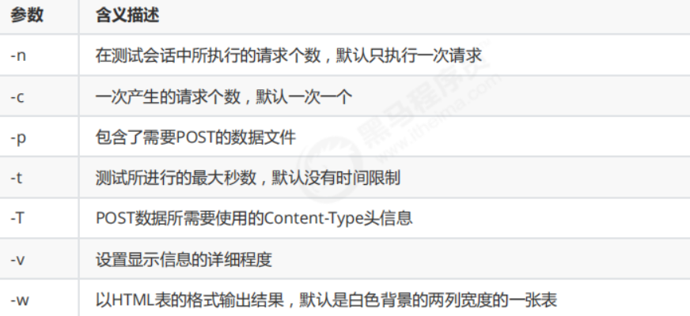

如果此请求需要携带 Post 数据，那么需要自定义一个文件来保存这个数据，一般使用 json 格式来保存传输

执行结果部分：

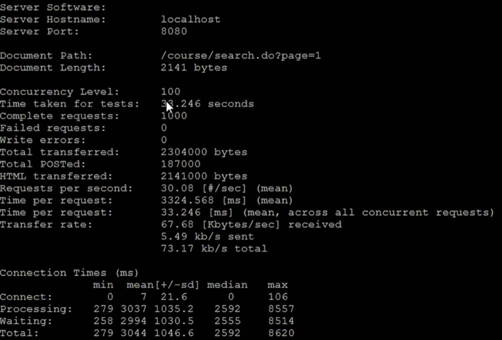

参数说明：

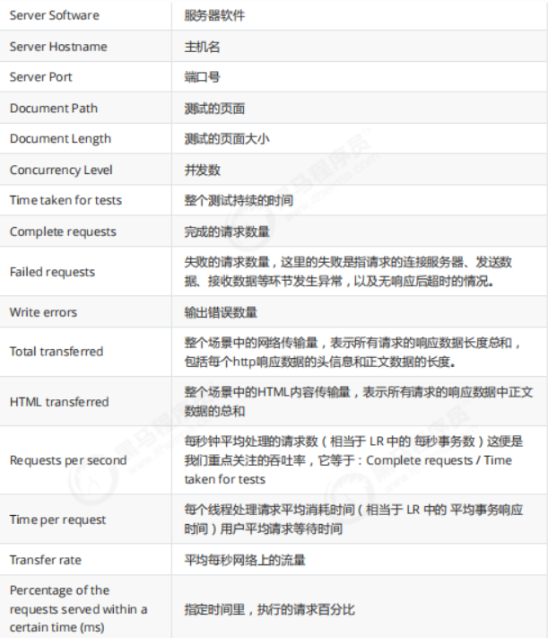

重点需要关注的参数：

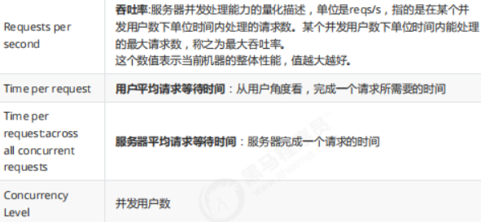

<a name="bc1096a5"></a>
#### JVM 优化

因为 Tomcat 是一台 Java 服务器，所以它的优化就可以归结到 JVM 的优化上，而 Tomcat 在JVM 上的优化可以分为垃圾回收器的选择以及一些参数配置。关于垃圾回收器和相关参数配置这里就不过多阐述了，这里只介绍下如何在 Tomcat 启动时携带我们想要的配置。

windows 下： 修改bin/catalina.bat 文件，在第一行添加 ： set  JAVA_OPTS=-server  -Dfile.encoding=UTF-8    具体配置

linux 下：修改 bin/catalina.sh 文件，在第一行添加： JAVA_OPTS=" -server 具体配置"

<a name="1fae31ed"></a>
#### Tomcat 配置优化

连接器的配置是决定 Tomcat 性能的关键，在一般情况下使用默认的就可以了，但是在程序比较吃力时，就需要手动配置它来提高效率，完整的配置如下：

```javascript
<Connector port="8080" 
    protocol="HTTP/1.1" 
    executor="tomcatThreadPool" 
    maxThreads="1000" 
    minSpareThreads="100" 
    acceptCount="1000" 
    maxConnections="1000" 
    connectionTimeout="20000" 
    compression="on" 
    compressionMinSize="2048" 
    disableUploadTimeout="true" 
    redirectPort="8443" 
    URIEncoding="UTF-8" />
```

相关参数：

maxThreads：表示Tomcat可创建的最大的线程数；

minSpareThreads：最小空闲线程数，Tomcat初始化时创建的线程数，该值应该少于maxThreads，缺省值为4；

acceptCount：指定当所有可以使用的处理请求的线程数都被使用时，可以放到处理队列中的请求数，超过这个数的请求将不予处理，默认为10个；

maxConnections：服务器在任何给定时间接受和处理的最大连接数。

connectionTimeout：网络连接超时时间，单位为毫秒，如果设置为“0”则表示永不超时，不建议这样设置；

compression：默认为 off，开启是连接器在试图节省服务器的带宽使用 HTTP/1.1 GZIP 压缩。关闭会自动在压缩和传输之间进行权衡。

compressionMinSize：在 compression 开启时，可以通过这个来配置进行压缩的最小数据量。默认为 "2048"。

disableUploadTimeout：上传文件时是否使用超时机制，默认开启，由 ConnectionTimeout 决定，如果为 false，那么只会在设置的 connectionUploadTimeout 设置的时间后才会断开。

redirectPort：如果此连接器支持非 SSL 请求，并且收到匹配需要 SSL 传输的请求，Catalina 将自动将请求重定向到此处指定的端口号。

其他参数可参考博客 [ tomcat(4)连接器](https://blog.csdn.net/sz85850597/article/details/79954711) 。

如果只是想简单配置，可以只配置 maxConnections、maxThreads、acceptCount。

<a name="28fb62a3"></a>
## Tomcat 附加功能 WebSocket

我们在浏览网页时，一般使用的是HTTP 协议或者 HTTPS 协议，这种方式是一种 "请求---响应" 模式，也就是只支持从客户端发送请求，服务器收到后进行处理，然后返回一个响应，但是不能主动发送数据给客户端，这样某些场景下的实现就比较困难，甚至无法实现，比如聊天室实时聊天，可能有人会说直接将在 servlet 中处理向要发送消息的客户端发送不就行了，但是因为是 "请求-响应" 模式，当其他客户端与服务器一段时间没有通信，连接就会断开，服务器也就无法转发消息了。而 WebSocket 则是基于 HTTP 的一种长连接协议，并且是双向通道，可以实现服务器主动向客户端发送消息。

<a name="1d851d36"></a>
### WebSocket 请求过程

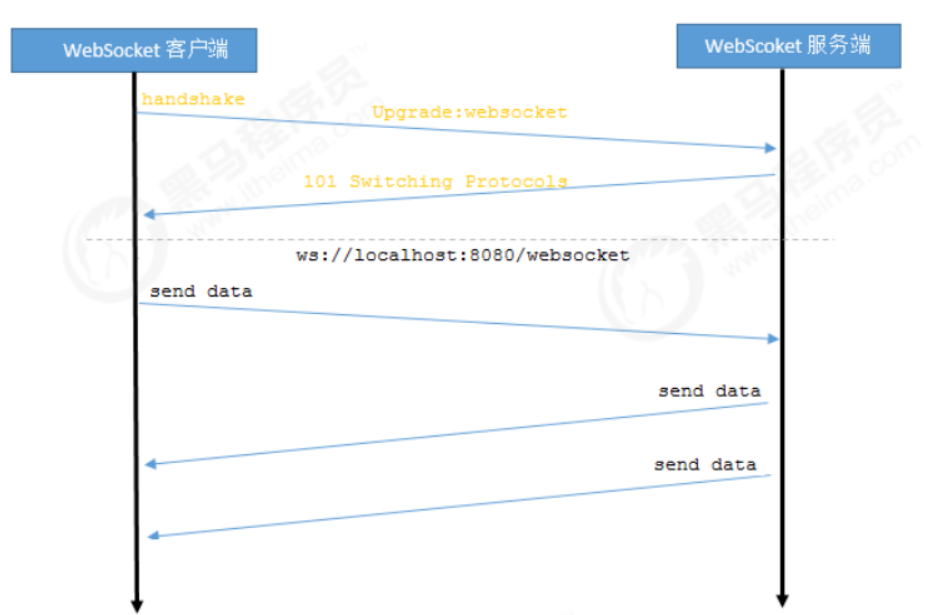

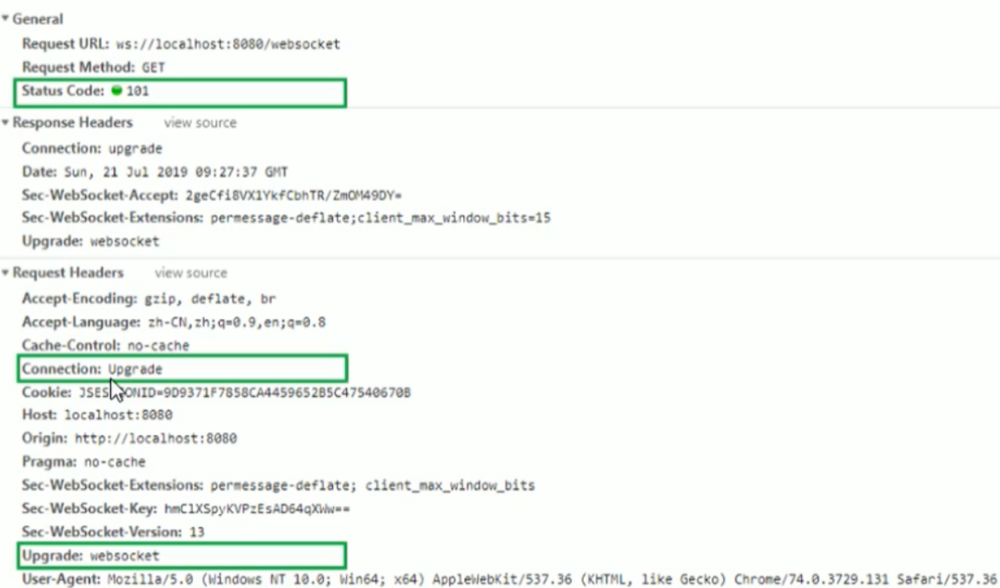

WebSocket 请求和普通的HTTP请求有几点不同：

\1. GET请求的地址不是类似 http://，而是以 ws:// 开头的地址；

\2. 请求头 Connection: Upgrade 和 请求头 Upgrade: websocket 表示这个连接将要被转换为WebSocket 连接；

\3. Sec-WebSocket-Key 是用于标识这个连接， 是一个BASE64编码的密文, 要求服务端响应一个对应加密的Sec-WebSocket-Accept头信息作为应答；

\4. Sec-WebSocket-Version 指定了WebSocket的协议版本;

\5. HTTP101 状态码表明服务端已经识别并切换为WebSocket协议 , Sec-WebSocket-Accept是服务端与客户端一致的秘钥计算出来的信息。

Tomcat的7.0.5 版本开始支持WebSocket,并且实现了Java WebSocket规范(JSR356), 而在7.0.5版本之前(7.0.2之后)则采用自定义API, 即WebSocketServlet实现。Java WebSocket应用由一系列的WebSocketEndpoint组成。Endpoint 是一个java对象，代表WebSocket链接的一端，对于服务端，我们可以视为处理具体WebSocket消息的接口， 就像Servlet之与http请求一样。我们可以通过两种方式定义Endpoint:

1). 第一种是编程式， 即继承类 javax.websocket.Endpoint并实现其方法。

2). 第二种是注解式, 即定义一个POJO, 并添加 @ServerEndpoint相关注解。Endpoint实例在WebSocket握手时创建，并在客户端与服务端链接过程中有效，最后在链接关闭时结束。在Endpoint接口中明确定义了与其生命周期相关的方法， 规范实现者确保生命周期的各个阶段调用实例的相关方法。生命周期方法如下：


通过为Session添加MessageHandler消息处理器来接收消息，当采用注解方式定义Endpoint时，我们还可以通过 [@OnMessage ](/OnMessage ) 注解指定接收消息的方法。发送消息则由RemoteEndpoint 完成， 其实例由Session维护， 根据使用情况， 我们可以通过Session.getBasicRemote获取同步消息发送的实例 ， 然后调用其sendXxx()方法就可以发送消息， 可以通过Session.getAsyncRemote 获取异步消息发送实例。 


<!--page footer-->
- 原文: <https://www.yuque.com/dabin-1eu6s/plc2v4/hkqhk5e90g15hk2g>