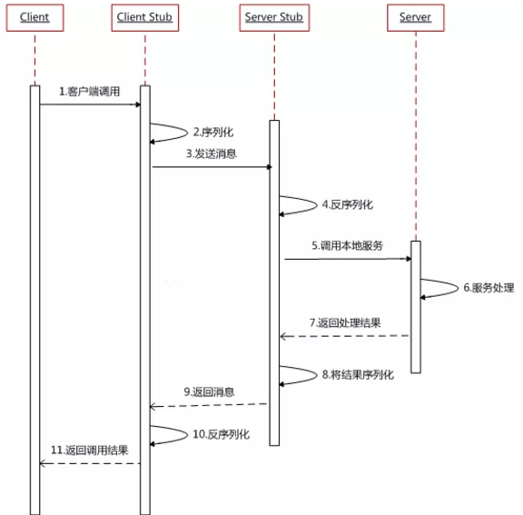

# RPC高频面试题
<!--page header-->

## RPC简介

RPC，英文全名remote procedure call，即远程过程调用。就是说一个应用部署在A服务器上，想要调用B服务器上应用提供的方法，由于不在一个内存空间，不能直接调用，需要通过网络来表达调用的语义和传达调用的数据。

可以这么说，RPC就是要像调用本地的函数一样去调远程函数。

RPC是一个完整的远程调用方案，它通常包括通信协议和序列化协议。

其中，通信协议包含**http协议**（如gRPC使用http2）、**自定义报文的tcp协议**（如dubbo）。序列化协议包含**基于文本编码**的xml、json，**基于二进制编码**的protobuf、hessian等。

> protobuf 即 Protocol Buffers，是一种轻便高效的结构化数据存储格式，与语言、平台无关，可扩展可序列化。protobuf 性能和效率大幅度优于 JSON、XML 等其他的结构化数据格式。protobuf 是以二进制方式存储，占用空间小，但也带来了可读性差的缺点（二进制协议，因为不可读而难以调试，不好定位问题）。
>  
> Protobuf序列化协议相比JSON有什么优点？
>  
> 1：序列化后体积相比Json和XML很小，适合网络传输
>  
> 2：支持跨平台多语言
>  
> 3：序列化反序列化速度很快，快于Json的处理速速

**一个完整的RPC过程，都可以用下面这张图来描述**：

> stub说的都是“一小块代码”，通常是有个caller要调用callee的时候，中间需要一些特殊处理的逻辑，就会用这种“小块代码”去做。

1. 服务消费端（client）以本地调用的方式调用远程服务；
2. 客户端 Stub（client stub） 接收到调用后负责将方法、参数等组装成能够进行网络传输的消息体（序列化）：`RpcRequest`；
3. 客户端 Stub（client stub） 找到远程服务的地址，并将消息发送到服务提供端；
4. 服务端 Stub（桩）收到消息将消息反序列化为Java对象: `RpcRequest`；
5. 服务端 Stub（桩）根据`RpcRequest`中的类、方法、方法参数等信息调用本地的方法；
6. 服务端 Stub（桩）得到方法执行结果并将组装成能够进行网络传输的消息体：`RpcResponse`（序列化）发送至消费方；
7. 客户端 Stub（client stub）接收到消息并将消息反序列化为Java对象:`RpcResponse` ，这样也就得到了最终结果。

## RPC 解决了什么问题？

让分布式或者微服务系统中不同服务之间的调用像本地调用一样简单。

## 常见的 RPC 框架有哪些?

- **Dubbo:** Dubbo是 阿里巴巴公司开源的一个高性能优秀的服务框架，使得应用可通过高性能的 RPC 实现服务的输出和输入功能，可以和 Spring框架无缝集成。目前 Dubbo 已经成为 Spring Cloud Alibaba 中的官方组件。
- **gRPC** ：基于HTTP2。gRPC是可以在任何环境中运行的现代开源高性能RPC框架。它可以通过可插拔的支持来有效地连接数据中心内和跨数据中心的服务，以实现负载平衡，跟踪，运行状况检查和身份验证。它也适用于分布式计算的最后一英里，以将设备，移动应用程序和浏览器连接到后端服务。
- **Hessian：** Hessian是一个轻量级的remoting on http工具，使用简单的方法提供了RMI的功能。 采用的是二进制RPC协议，因为采用的是二进制协议，所以它很适合于发送二进制数据。
- **Thrift：** Apache Thrift是Facebook开源的跨语言的RPC通信框架，目前已经捐献给Apache基金会管理，由于其跨语言特性和出色的性能，在很多互联网公司得到应用，有能力的公司甚至会基于thrift研发一套分布式服务框架，增加诸如服务注册、服务发现等功能。

## 有了HTTP ，为啥还要用RPC进行服务调用?

首先，RPC是一个完整的远程调用方案，它通常包括通信协议和序列化协议。而HTTP只是一个通信协议，不是一个完整的远程调用方案。这两者不是对等的概念，用来比较不太合适。

RPC框架可以使用 **HTTP协议**作为传输协议或者直接使用**自定义的TCP协议**作为传输协议，使用不同的协议一般也是为了适应不同的场景。

HTTP+Restful，其优势很大。它**可读性好**，且**应用广、跨语言的支持**。

但是使用该方案也有其缺点，这是与其优点相对应的：

- 首先是**有用信息占比少**，毕竟HTTP工作在第七层，包含了大量的HTTP头等信息。
- 其次是**效率低**，还是因为第七层的缘故，必须按照HTTP协议进行层层封装。

而使用**自定义tcp协议**的话，可以极大地精简了传输内容，这也是为什么有些后端服务之间会采用自定义tcp协议的rpc来进行通信的原因。

## 各种序列化技术

### XML

XML序列化的好处在于可读性好，方便阅读和调试。但是序列化以后的字节码文件比较大，而且效率不高，适用于对性能要求不高，而且QPS较低的企业级内部系统之间的数据交换场景。同时XML又具有语言无关性，所以还可以用于异构系统之间的数据交换和协议。比如我们熟知的WebService,就是采用XML格式对数据进行序列化的。XML序列化/反序列化的实现方式有很多，熟知的方式有XStream和Java自带的XML序列化和反序列化两种。

### JSON

JSON（JavaScript Object Notation）是一种轻量级的数据交换格式，相对于XML来说，JSON的字节流更小，而且可读性也非常好。现在JSON数据格式在企业运用是最普遍的。

JSON序列化常用的开源工具有很多：

1. Jackson（[https://github.com/FasterXML/jackson](https://github.com/FasterXML/jackson) ）
2. 阿里开源的FastJson（https://github.com/alibaba/fastjon）
3. 谷歌的GSON([https://github.com/google/gson](https://github.com/google/gson))

这几种json的序列化工具中，jackson与fastjson要比GSON的性能好，但是jackson、GSON的稳定性腰比Fastjson好。而fastjson的优势在于提供的api非常容易使用。

### Hession

Hessian是一个支持跨语言传输的二进制序列化协议，相对于Java默认的序列化机制来说，Hession具有更好的性能和易读性，而且支持多种不同的语言。

实际上Dubbo采用的就是Hessian序列化来实现，只不过Dubbo对Hessian进行了重构，性能更高。

### Avro

Avro是一个数据序列化系统，设计用于支持大批量数据交换的应用。它的主要特点有：支持二进制序列化方式，可以便捷，快速地处理大量数据。动态语言友好，Avro提供的机制是动态语言可以方便的处理Avro数据。

### Kryo

Kryo是一种非常成熟的序列化实现，已经在Hive、Storm中使用的比较广泛，不过它不能夸语言。目前Dubbo已经在2.6版本支持kyro的序列化机制。它的性能要由于之前的hessian2。

### Protobuf

Protobuf是Google的一种数据交换格式，它独立于语言、独立于平台。Google提供了多种语言来实现，比如Java、C、Go、Python，每一种实现都包含了相应语言的编译器和库文件，Protobuf是一个纯粹的表示层协议，可以和各种传输层协议一起使用。

Protobuf使用比较广泛，主要是空间开销小和性能比较好，非常适合用于公司内部对性能要求高的RPC调用。另外由于解析性能比较高，序列化以后数据量相对较少，所以也可以应用在对象的持久化场景中。

但是要使用Protobuf会相对来说麻烦些，因为他有自己的语法，有自己的编译器，如果需要用到的话必须要去投入成本在这个技术的学习中。

Protobuf有个缺点就是要传输每一个类的结构都要生成对应的proto文件，如果某个类发生修改，还得重新生成该类对应的proto文件。

## 序列化技术的选型

### 技术层面

1. 序列化空间开销，也就是序列化产生的结果大小，这个影响到传输性能。
2. 序列化过程中消耗的时长，序列化消耗时间过长影响到业务的响应时间。
3. 序列化协议是否支持夸平台，跨语言。因为现在的架构更加灵活，如果存在异构系统通信需求，那么这个是必须要考虑的。
4. 可扩展性、兼容性，在实际业务开发中，系统往往需要随着需求的快速迭代来实现快速更新，这就要求我们来采用序列化协议具有良好的可扩展性、兼容性，比如现有的序列化数据结构中新增一个业务字段，不会影响到现有的服务。
5. 技术的流行程度，越流行的技术意味着使用的公司越多，那么很多坑都已经淌过并且得到了解决，技术解决方案也相对成熟。
6. 学习难度和易用性。

### 选型建议

1. 对性能要求不高的场景，可以采用基于XML的SOAP协议
2. 性能和间接性有比较高要求的场景，那么Hessian、Protobuf、Thrift、Avro都可以。
3. 基于前后端分离，或者独立的对外API服务，选用JSON是比较好的，对于调试、可读性都很不错。
4. Avro设计理念偏于动态类型语言，那么这类的场景使用Avro是可以的。

<!--page footer-->
- 原文: <https://www.yuque.com/dabin-1eu6s/plc2v4/gxw5ie9rgoaut2rl>