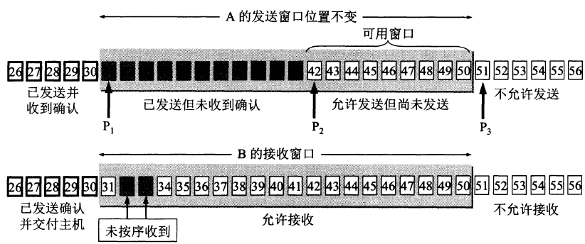

# TCP协议面试题
<!--page header-->

## 为什么需要TCP协议？

IP 层是「不可靠」的,它不保证网络包的交付、不保证网络包的按序交付、也不保证网络包中的数据的完整性。

因为 TCP 是一个工作在传输层的可靠数据传输的服务,它能确保接收端接收的网络包是无损坏、无间隔、非冗余和按序的。

## 说说TCP的三次握手

假设发送端为客户端，接收端为服务端。开始时客户端和服务端的状态都是`CLOSED`。

1. 第一次握手：客户端向服务端发起建立连接请求，客户端会随机生成一个起始序列号x，客户端向服务端发送的字段中包含标志位`SYN=1`，序列号`seq=x`。第一次握手前客户端的状态为`CLOSE`，第一次握手后客户端的状态为`SYN-SENT`。此时服务端的状态为`LISTEN`。
2. 第二次握手：服务端在收到客户端发来的报文后，会随机生成一个服务端的起始序列号y，然后给客户端回复一段报文，其中包括标志位`SYN=1`，`ACK=1`，序列号`seq=y`，确认号`ack=x+1`。第二次握手前服务端的状态为`LISTEN`，第二次握手后服务端的状态为`SYN-RCVD`，此时客户端的状态为`SYN-SENT`。（其中`SYN=1`表示要和客户端建立一个连接，`ACK=1`表示确认序号有效）
3. 第三次握手：客户端收到服务端发来的报文后，会再向服务端发送报文，其中包含标志位`ACK=1`，序列号`seq=x+1`，确认号`ack=y+1`。第三次握手前客户端的状态为`SYN-SENT`，第三次握手后客户端和服务端的状态都为`ESTABLISHED`。**此时连接建立完成。**

## 两次握手可以吗？

之所以需要第三次握手，主要为了**防止已失效的连接请求报文段**突然又传输到了服务端，导致产生问题。

- 比如客户端A发出连接请求，可能因为网络阻塞原因，A没有收到确认报文，于是A再重传一次连接请求。
- 然后连接成功，等待数据传输完毕后，就释放了连接。
- 然后A发出的第一个连接请求等到连接释放以后的某个时间才到达服务端B，此时B误认为A又发出一次新的连接请求，于是就向A发出确认报文段。
- 如果不采用三次握手，只要B发出确认，就建立新的连接了，**此时A不会响应B的确认且不发送数据，则B一直等待A发送数据，浪费资源。**

## 说说TCP的四次挥手

1. A的应用进程先向其TCP发出连接释放报文段（`FIN=1，seq=u`），并停止再发送数据，主动关闭TCP连接，进入`FIN-WAIT-1`（终止等待1）状态，等待B的确认。
2. B收到连接释放报文段后即发出确认报文段（`ACK=1，ack=u+1，seq=v`），B进入`CLOSE-WAIT`（关闭等待）状态，此时的TCP处于半关闭状态，A到B的连接释放。
3. A收到B的确认后，进入`FIN-WAIT-2`（终止等待2）状态，等待B发出的连接释放报文段。
4. B发送完数据，就会发出连接释放报文段（`FIN=1，ACK=1，seq=w，ack=u+1`），B进入`LAST-ACK`（最后确认）状态，等待A的确认。
5. A收到B的连接释放报文段后，对此发出确认报文段（`ACK=1，seq=u+1，ack=w+1`），A进入`TIME-WAIT`（时间等待）状态。此时TCP未释放掉，需要经过时间等待计时器设置的时间`2MSL`（最大报文段生存时间）后，A才进入`CLOSED`状态。B收到A发出的确认报文段后关闭连接，若没收到A发出的确认报文段，B就会重传连接释放报文段。

## 第四次挥手为什么要等待2MSL？

- **保证A发送的最后一个ACK报文段能够到达B**。这个`ACK`报文段有可能丢失，B收不到这个确认报文，就会超时重传连接释放报文段，然后A可以在`2MSL`时间内收到这个重传的连接释放报文段，接着A重传一次确认，重新启动2MSL计时器，最后A和B都进入到`CLOSED`状态，若A在`TIME-WAIT`状态不等待一段时间，而是发送完ACK报文段后立即释放连接，则无法收到B重传的连接释放报文段，所以不会再发送一次确认报文段，B就无法正常进入到`CLOSED`状态。
- **防止已失效的连接请求报文段出现在本连接中**。A在发送完最后一个`ACK`报文段后，再经过2MSL，就可以使这个连接所产生的所有报文段都从网络中消失，使下一个新的连接中不会出现旧的连接请求报文段。

## 为什么是四次挥手？

因为当Server端收到Client端的`SYN`连接请求报文后，可以直接发送`SYN+ACK`报文。**但是在关闭连接时，当Server端收到Client端发出的连接释放报文时，很可能并不会立即关闭SOCKET**，所以Server端先回复一个`ACK`报文，告诉Client端我收到你的连接释放报文了。只有等到Server端所有的报文都发送完了，这时Server端才能发送连接释放报文，之后两边才会真正的断开连接。故需要四次挥手。

## SIN/FIN不包含数据却要消耗序列号

凡是需要对端确认的，一定消耗TCP报文的序列号。SYN和FIN需要对端的确认，因此需要消耗一个序列号。

SYN作为三次握手的确认。FIN作为四次挥手的确认。如果没有序列号，会导致SYN请求多次重发，服务端多次处理，造成资源浪费

## 说说TCP报文首部有哪些字段，其作用又分别是什么？

- **16位端口号**：源端口号，主机该报文段是来自哪里；目标端口号，要传给哪个上层协议或应用程序
- **32位序号**：一次TCP通信（从TCP连接建立到断开）过程中某一个传输方向上的字节流的每个字节的编号。
- **32位确认号**：用作对另一方发送的tcp报文段的响应。其值是收到的TCP报文段的序号值加1。
- **4位头部长度**：表示tcp头部有多少个32bit字（4字节）。因为4位最大能标识15，所以TCP头部最长是60字节。
- **6位标志位**：URG(紧急指针是否有效)，ACk（表示确认号是否有效），PSH（缓冲区尚未填满），RST（表示要求对方重新建立连接），SYN（建立连接消息标志接），FIN（表示告知对方本端要关闭连接了）
- **16位窗口大小**：是TCP流量控制的一个手段。这里说的窗口，指的是接收通告窗口。它告诉对方本端的TCP接收缓冲区还能容纳多少字节的数据，这样对方就可以控制发送数据的速度。
- **16位校验和**：由发送端填充，接收端对TCP报文段执行CRC算法以检验TCP报文段在传输过程中是否损坏。注意，这个校验不仅包括TCP头部，也包括数据部分。这也是TCP可靠传输的一个重要保障。
- **16位紧急指针**：一个正的偏移量。它和序号字段的值相加表示最后一个紧急数据的下一字节的序号。因此，确切地说，这个字段是紧急指针相对当前序号的偏移，不妨称之为紧急偏移。TCP的紧急指针是发送端向接收端发送紧急数据的方法。

## TCP有哪些特点？

- TCP是**面向连接**的运输层协议。
- **点对点**，每一条TCP连接只能有两个端点。
- TCP提供**可靠交付**的服务。
- TCP提供**全双工通信**。
- **面向字节流**。

## TCP和UDP的区别？

1. TCP**面向连接**；UDP是无连接的，即发送数据之前不需要建立连接。
2. TCP提供**可靠的服务**；UDP不保证可靠交付。
3. TCP**面向字节流**，把数据看成一连串无结构的字节流；UDP是面向报文的。
4. TCP有**拥塞控制**；UDP没有拥塞控制，因此网络出现拥塞不会使源主机的发送速率降低（对实时应用很有用，如实时视频会议等）。
5. 每一条TCP连接只能是**点到点**的；UDP支持一对一、一对多、多对一和多对多的通信方式。
6. TCP首部开销20字节；UDP的首部开销小，只有8个字节。

## TCP 和 UDP 分别对应的常见应用层协议有哪些？

**基于TCP的应用层协议有：HTTP、FTP、SMTP、TELNET、SSH**

- **HTTP**：HyperText Transfer Protocol（超文本传输协议），默认端口80
- **FTP**: File Transfer Protocol (文件传输协议), 默认端口(20用于传输数据，21用于传输控制信息)
- **SMTP**: Simple Mail Transfer Protocol (简单邮件传输协议) ,默认端口25
- **TELNET**: Teletype over the Network (网络电传), 默认端口23
- **SSH**：Secure Shell（安全外壳协议），默认端口 22

**基于UDP的应用层协议：DNS、TFTP、SNMP**

- **DNS** : Domain Name Service (域名服务),默认端口 53
- **TFTP**: Trivial File Transfer Protocol (简单文件传输协议)，默认端口69
- **SNMP**：Simple Network Management Protocol（简单网络管理协议），通过UDP端口161接收，只有Trap信息采用UDP端口162。

## TCP的粘包和拆包

TCP是面向流，没有界限的一串数据。TCP底层并不了解上层业务数据的具体含义，它会根据TCP缓冲区的实际情况进行包的划分，所以在业务上认为，一**个完整的包可能会被TCP拆分成多个包进行发送**，**也有可能把多个小的包封装成一个大的数据包发送**，这就是所谓的TCP粘包和拆包问题。

**为什么会产生粘包和拆包呢?**

- 要发送的数据小于TCP发送缓冲区的大小，TCP将多次写入缓冲区的数据一次发送出去，将会发生粘包；
- 接收数据端的应用层没有及时读取接收缓冲区中的数据，将发生粘包；
- 要发送的数据大于TCP发送缓冲区剩余空间大小，将会发生拆包；
- 待发送数据大于MSS（最大报文长度），TCP在传输前将进行拆包。即TCP报文长度-TCP头部长度>MSS。

**解决方案：**

- 发送端将每个数据包封装为固定长度
- 在数据尾部增加特殊字符进行分割
- 将数据分为两部分，一部分是头部，一部分是内容体；其中头部结构大小固定，且有一个字段声明内容体的大小。

## 说说TCP是如何确保可靠性的呢？

- TCP的连接是基于**三次握手**，而断开则是基于**四次挥手**。确保连接和断开的可靠性。
- TCP的可靠性，还体现在**有状态**。TCP会记录哪些数据发送了，哪些数据被接收了，哪些没有被接受，并且保证数据包按序到达，保证数据传输不出差错。
- 确认和重传机制：建立连接时三次握手同步双方的“序列号 + 确认号 + 窗口大小信息”，是确认重传、流控的基础。传输过程中，如果Checksum校验失败、丢包或延时，发送端重传
- 流量控制：窗口和计时器的使用。TCP窗口中会指明双方能够发送接收的最大数据量
- 拥塞控制

## TCP的重传机制是什么？

由于TCP的下层网络（网络层）可能出现丢失、重复或失序的情况，TCP协议提供可靠数据传输服务。为保证数据传输的正确性，TCP会重传其认为已丢失（包括报文中的比特错误）的包。TCP使用两套独立的机制来完成重传，一是基于时间，二是基于确认信息。

TCP在发送一个数据之后，就开启一个定时器，若是在这个时间内没有收到发送数据的ACK确认报文，则对该报文进行重传，在达到一定次数还没有成功时放弃并发送一个复位信号。

## 说下TCP的滑动窗口机制

TCP 利用滑动窗口实现流量控制。流量控制是为了控制发送方发送速率，保证接收方来得及接收。 TCP会话的双方都各自维护一个发送窗口和一个接收窗口。接收窗口大小取决于应用、系统、硬件的限制。发送窗口则取决于对端通告的接收窗口。接收方发送的确认报文中的window字段可以用来控制发送方窗口大小，从而影响发送方的发送速率。将接收方的确认报文window字段设置为 0，则发送方不能发送数据。

TCP头包含window字段，16bit位，它代表的是窗口的字节容量，最大为65535。这个字段是接收端告诉发送端自己还有多少缓冲区可以接收数据。于是发送端就可以根据这个接收端的处理能力来发送数据，而不会导致接收端处理不过来。接收窗口的大小是约等于发送窗口的大小。

## 详细讲一下拥塞控制？

防止过多的数据注入到网络中。 几种拥塞控制方法：慢开始( slow-start )、拥塞避免( congestion avoidance )、快重传( fast retransmit )和快恢复( fast recovery )。

**慢开始**

把拥塞窗口 cwnd 设置为一个最大报文段MSS的数值。而在每收到一个对新的报文段的确认后，把拥塞窗口增加至多一个MSS的数值。每经过一个传输轮次，拥塞窗口 cwnd 就加倍。 为了防止拥塞窗口cwnd增长过大引起网络拥塞，还需要设置一个慢开始门限ssthresh状态变量。

当 cwnd < ssthresh 时，使用慢开始算法。

当 cwnd > ssthresh 时，停止使用慢开始算法而改用拥塞避免算法。

当 cwnd = ssthresh 时，既可使用慢开始算法，也可使用拥塞控制避免算法。

**拥塞避免**

让拥塞窗口cwnd缓慢地增大，每经过一个往返时间RTT就把发送方的拥塞窗口cwnd加1，而不是加倍。这样拥塞窗口cwnd按线性规律缓慢增长。

无论在慢开始阶段还是在拥塞避免阶段，只要发送方判断网络出现拥塞（其根据就是没有收到确认），就要把慢开始门限ssthresh设置为出现拥塞时的发送 方窗口值的一半（但不能小于2）。然后把拥塞窗口cwnd重新设置为1，执行慢开始算法。这样做的目的就是要迅速减少主机发送到网络中的分组数，使得发生 拥塞的路由器有足够时间把队列中积压的分组处理完毕。

**快重传**

有时个别报文段会在网络中丢失，但实际上网络并未发生拥塞。如果发送方迟迟收不到确认，就会产生超时，就会误认为网络发生了拥塞。这就导致发送方错误地启动慢开始，把拥塞窗口cwnd又设置为1，因而降低了传输效率。

快重传算法可以避免这个问题。快重传算法首先要求接收方每收到一个失序的报文段后就立即发出重复确认，使发送方及早知道有报文段没有到达对方。

发送方只要一连收到三个重复确认就应当立即重传对方尚未收到的报文段，而不必继续等待重传计时器到期。由于发送方尽早重传未被确认的报文段，因此采用快重传后可以使整个网络吞吐量提高约20%。

**快恢复**

当发送方连续收到三个重复确认，就会把慢开始门限ssthresh减半，接着把cwnd值设置为慢开始门限ssthresh减半后的数值，然后开始执行拥塞避免算法，使拥塞窗口缓慢地线性增大。

在采用快恢复算法时，慢开始算法只是在TCP连接建立时和网络出现超时时才使用。 采用这样的拥塞控制方法使得TCP的性能有明显的改进。

## 什么是 SYN 攻击?

我们都知道 TCP 连接建立是需要三次握手,假设攻击者短时间伪造不同 IP 地址的 SYN 报文,服务端每接收到 一个 SYN 报文,就进入 SYN_RCVD 状态,但服务端发送出去的 ACK + SYN 报文,无法得到未知 IP 主机的ACK 应答,久而久之就会占满服务端的 SYN 接收队列(未连接队列),使得服务器不能为正常用户服务。

## 如何唯一确定一个TCP连接呢？

TCP 四元组可以唯一的确定一个连接,四元组包括如下: 源地址 源端口 目的地址 目的端口。

源地址和目的地址的字段(32位)是在 IP 头部中,作用是通过 IP 协议发送报文给对方主机。

源端口和目的端口的字段(16位)是在 TCP 头部中,作用是告诉 TCP 协议应该把报文发给哪个进程。

## 说说TCP KeepAlive 的基本原理？

TCP 的连接，实际上是一种纯软件层面的概念，在物理层面并没有“连接”这种概念。TCP 通信双方建立交互的连接，但是并不是一直存在数据交互，有些连接会在数据交互完毕后，主动释放连接，而有些不会。在长时间无数据交互的时间段内，交互双方都有可能出现掉电、死机、异常重启等各种意外，当这些意外发生之后，这些 TCP 连接并未来得及正常释放，在软件层面上，连接的另一方并不知道对端的情况，它会一直维护这个连接，长时间的积累会导致非常多的半打开连接，造成端系统资源的消耗和浪费，为了解决这个问题，在传输层可以利用 TCP 的 KeepAlive 机制实现来实现。主流的操作系统基本都在内核里支持了这个特性。

TCP KeepAlive 的基本原理是，隔一段时间给连接对端发送一个探测包，如果收到对方回应的 ACK，则认为连接还是存活的，在超过一定重试次数之后还是没有收到对方的回应，则丢弃该 TCP 连接。

> 参考链接：[https://hit-alibaba.github.io/interview/basic/network/TCP.html](https://hit-alibaba.github.io/interview/basic/network/TCP.html)

<!--page footer-->
- 原文: <https://www.yuque.com/dabin-1eu6s/plc2v4/tox75ap1anvr5arq>