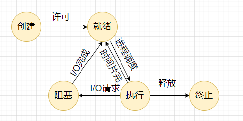

# 操作系统高频面试题
<!--page header-->

<a name="ec4bc90e"></a>
## 操作系统的四个特性？

并发：同一段时间内多个程序执行（与并行区分，并行指的是同一时刻有多个事件，多处理器系统可以使程序并行执行）

共享：系统中的资源可以被内存中多个并发执行的进线程共同使用

虚拟：通过分时复用（如分时系统）以及空分复用（如虚拟内存）技术把一个物理实体虚拟为多个

异步：系统进程用一种走走停停的方式执行，（并不是一下子走完），进程什么时候以怎样的速度向前推进是不可预知的

<a name="01687750"></a>
## 进程线程

进程是指一个内存中运行的应用程序，每个进程都有自己独立的一块内存空间。

线程是比进程更小的执行单位，它是在一个进程中独立的控制流，一个进程可以启动多个线程，每条线程并行执行不同的任务。

**进程和线程的区别如下**：

- 调度：进程是资源管理的基本单位，线程是程序执行的基本单位。
- 切换：线程上下文切换比进程上下文切换要快得多。
- 拥有资源： 进程是拥有资源的一个独立单位，线程不拥有系统资源，但是可以访问隶属于进程的资源。
- 系统开销： 创建或撤销进程时，系统都要为之分配或回收系统资源，如内存空间，I/O设备等，OS所付出的开销显著大于在创建或撤销线程时的开销，进程切换的开销也远大于线程切换的开销。

<a name="78c404e3"></a>
## 并发和并行

并发就是在一段时间内，多个任务都会被处理；但在某一时刻，只有一个任务在执行。单核处理器可以做到并发。比如有两个进程`A`和`B`，`A`运行一个时间片之后，切换到`B`，`B`运行一个时间片之后又切换到`A`。因为切换速度足够快，所以宏观上表现为在一段时间内能同时运行多个程序。

并行就是在同一时刻，有多个任务在执行。这个需要多核处理器才能完成，在微观上就能同时执行多条指令，不同的程序被放到不同的处理器上运行，这个是物理上的多个进程同时进行。

<a name="fdf7374c"></a>
## 多线程相较单线程的好处

1、并发提升程序执行效率

2、提升CPU利用率，访存的时候可以切换线程来执行

3、更快的响应速度，可以有专门的线程来监听用户请求和专门的线程来处理请求。比如监听线程和工作线程是两个线程，这样监听就负责监听，工作的就负责工作，监听到用户请求马上把请求转到工作线程去处理，监听线程继续监听

<a name="e5f48f02"></a>
## 什么是协程？

协程是一种用户态的轻量级线程。

协程不是由操作系统内核管理，而是完全由用户程序所控制，这样带来的好处就是性能得到了很大的提升，不会像线程切换那样消耗资源。

协程可以理解为可以暂停执行的函数。它拥有自己的寄存器上下文和栈。协程调度切换时，将寄存器上下文和栈保存到其他地方，在切回来的时候，恢复先前保存的寄存器上下文和栈，直接操作栈则基本没有内核切换的开销，可以不加锁的访问全局变量，所以上下文的切换非常快。

<a name="3fc37d68"></a>
## 线程和协程有什么区别呢？

1、线程是抢占式，而协程是非抢占式的，所以需要用户自己释放使用权来切换到其他协程，因此同一时间其实只有一个协程拥有运行权，相当于单线程的能力。
2、线程是协程的资源。协程通过 可以关联任意线程或线程池的执行器（Interceptor）来间接使用线程的资源的。

<a name="24da6400"></a>
## 进程通信

进程间通信方式有以下几种：

1、**管道通信**

匿名管道( pipe )：管道是一种半双工的通信方式，数据只能单向流动，而且只能在具有亲缘关系的进程间使用。进程的亲缘关系通常是指父子进程关系。
有名管道是半双工的通信方式，数据只能单向流动。

2、**消息队列**

3、**共享内存**。共享内存是最快的 IPC 方式，它是针对其他进程间通信方式运行效率低而专门设计的。它往往与其他通信机制，如信号量，配合使用，来实现进程间的同步和通信。

4、**信号量**。信号量是一个计数器，可以用来控制多个进程对共享资源的访问。它常作为一种锁机制，防止某进程正在访问共享资源时，其他进程也访问该资源。因此，主要作为进程间以及同一进程内不同线程之间的同步手段。

<a name="1765375e"></a>
## 什么是死锁？

死锁是指两个或两个以上的线程在执行过程中，因争夺资源而造成的一种互相等待的现象。若无外力作用，它们都将无法推进下去。

如下图所示，线程 A 持有资源 2，线程 B 持有资源 1，他们同时都想申请对方持有的资源，所以这两个线程就会互相等待而进入死锁状态。


下面通过例子说明线程死锁，代码来自并发编程之美。

```java
public class DeadLockDemo {
    private static Object resource1 = new Object();//资源 1
    private static Object resource2 = new Object();//资源 2

    public static void main(String[] args) {
        new Thread(() -> {
            synchronized (resource1) {
                System.out.println(Thread.currentThread() + "get resource1");
                try {
                    Thread.sleep(1000);
                } catch (InterruptedException e) {
                    e.printStackTrace();
                }
                System.out.println(Thread.currentThread() + "waiting get resource2");
                synchronized (resource2) {
                    System.out.println(Thread.currentThread() + "get resource2");
                }
            }
        }, "线程 1").start();

        new Thread(() -> {
            synchronized (resource2) {
                System.out.println(Thread.currentThread() + "get resource2");
                try {
                    Thread.sleep(1000);
                } catch (InterruptedException e) {
                    e.printStackTrace();
                }
                System.out.println(Thread.currentThread() + "waiting get resource1");
                synchronized (resource1) {
                    System.out.println(Thread.currentThread() + "get resource1");
                }
            }
        }, "线程 2").start();
    }
}
```

代码输出如下：

```java
Thread[线程 1,5,main]get resource1
Thread[线程 2,5,main]get resource2
Thread[线程 1,5,main]waiting get resource2
Thread[线程 2,5,main]waiting get resource1
```

线程 A 通过 `synchronized` (resource1) 获得 resource1 的监视器锁，然后通过 `Thread.sleep(1000)`。让线程 A 休眠 1s 为的是让线程 B 得到执行然后获取到 resource2 的监视器锁。线程 A 和线程 B 休眠结束了都开始企图请求获取对方的资源，然后这两个线程就会陷入互相等待的状态，这也就产生了死锁。

<a name="f6dd80b4"></a>
## 死锁怎么产生？怎么避免？

**死锁产生的四个必要条件**：

-  互斥：一个资源每次只能被一个进程使用 
-  请求与保持：一个进程因请求资源而阻塞时，不释放获得的资源 
-  不剥夺：进程已获得的资源，在未使用之前，不能强行剥夺 
-  循环等待：进程之间循环等待着资源 

**避免死锁的方法**：

- 互斥条件不能破坏，因为加锁就是为了保证互斥
- 一次性申请所有的资源，避免线程占有资源而且在等待其他资源
- 占有部分资源的线程进一步申请其他资源时，如果申请不到，主动释放它占有的资源
- 按序申请资源

<a name="1702db83"></a>
## 进程调度策略有哪几种？

-  **先来先服务**：非抢占式的调度算法，按照请求的顺序进行调度。有利于长作业，但不利于短作业，因为短作业必须一直等待前面的长作业执行完毕才能执行，而长作业又需要执行很长时间，造成了短作业等待时间过长。另外，对`I/O`密集型进程也不利，因为这种进程每次进行`I/O`操作之后又得重新排队。 
-  **短作业优先**：非抢占式的调度算法，按估计运行时间最短的顺序进行调度。长作业有可能会饿死，处于一直等待短作业执行完毕的状态。因为如果一直有短作业到来，那么长作业永远得不到调度。 
-  **最短剩余时间优先**：最短作业优先的抢占式版本，按剩余运行时间的顺序进行调度。 当一个新的作业到达时，其整个运行时间与当前进程的剩余时间作比较。如果新的进程需要的时间更少，则挂起当前进程，运行新的进程。否则新的进程等待。 
-  **时间片轮转**：将所有就绪进程按 `FCFS` 的原则排成一个队列，每次调度时，把 `CPU` 时间分配给队首进程，该进程可以执行一个时间片。当时间片用完时，由计时器发出时钟中断，调度程序便停止该进程的执行，并将它送往就绪队列的末尾，同时继续把 `CPU` 时间分配给队首的进程。
时间片轮转算法的效率和时间片的大小有很大关系：因为进程切换都要保存进程的信息并且载入新进程的信息，如果时间片太小，会导致进程切换得太频繁，在进程切换上就会花过多时间。 而如果时间片过长，那么实时性就不能得到保证。 
-  **优先级调度**：为每个进程分配一个优先级，按优先级进行调度。为了防止低优先级的进程永远等不到调度，可以随着时间的推移增加等待进程的优先级。 

<a name="f62fde64"></a>
## 进程有哪些状态？

进程一共有`5`种状态，分别是创建、就绪、运行（执行）、终止、阻塞。



- 运行状态就是进程正在`CPU`上运行。在单处理机环境下，每一时刻最多只有一个进程处于运行状态。
- 就绪状态就是说进程已处于准备运行的状态，即进程获得了除`CPU`之外的一切所需资源，一旦得到`CPU`即可运行。
- 阻塞状态就是进程正在等待某一事件而暂停运行，比如等待某资源为可用或等待`I/O`完成。即使`CPU`空闲，该进程也不能运行。

**运行态→阻塞态**：往往是由于等待外设，等待主存等资源分配或等待人工干预而引起的。
**阻塞态→就绪态**：则是等待的条件已满足，只需分配到处理器后就能运行。
**运行态→就绪态**：不是由于自身原因，而是由外界原因使运行状态的进程让出处理器，这时候就变成就绪态。例如时间片用完，或有更高优先级的进程来抢占处理器等。
**就绪态→运行态**：系统按某种策略选中就绪队列中的一个进程占用处理器，此时就变成了运行态。

<a name="63e67f65"></a>
## 操作系统里的内存碎片怎么理解？

内存碎片通常分为内部碎片和外部碎片：

1. 内部碎片是由于采用固定大小的内存分区，当一个进程不能完全使用分给它的固定内存区域时就会产生内部碎片。通常内部碎片难以完全避免
2. 外部碎片是由于某些未分配的连续内存区域太小，以至于不能满足任意进程的内存分配请求，从而不能被进程利用的内存区域。

**有什么解决办法**？

现在普遍采取的内存分配方式是段页式内存分配。将内存分为不同的段，再将每一段分成固定大小的页。通过页表机制，使段内的页可以不必连续处于同一内存区域。

<a name="84429675"></a>
## 虚拟内存

虚拟存储器就是具有请求调入功能，能从逻辑上对内存容量加以扩充的一种存储器系统，虚拟内存有多次性，对换性和虚拟性三个特征，它可以将程序分多次调入内存，使得在较小的用户空间可以执行较大的用户程序，所以同时容纳更多的进程并发执行，从而提高系统的吞吐量。发生缺页时可以调入一个段也可以调入一个页，取决于内存的存储管理方式。虚拟性表示虚拟内存和物理内存的映射。

Linux下，进程不能直接读写内存物理地址，只能访问【虚拟内存地址】。操作系统会把虚拟内存地址-->物理地址。

虚拟内存解决有限的内存空间加载较大应用程序的问题，根据需要在内存和磁盘之间来回传送数据。

通过段页表的形式，虚拟内存中取一段连续的内存空间映射到主内存中，主内存空间的程序段可以不连续 。

<a name="43fb87a5"></a>
## 什么是分页？

把内存空间划分为**大小相等且固定的块**，作为主存的基本单位。因为程序数据存储在不同的页面中，而页面又离散的分布在内存中，**因此需要一个页表来记录映射关系，以实现从页号到物理块号的映射。**

访问分页系统中内存数据需要**两次的内存访问** (一次是从内存中访问页表，从中找到指定的物理块号，加上页内偏移得到实际物理地址；第二次就是根据第一次得到的物理地址访问内存取出数据)。

<a name="61af8616"></a>
## 什么是分段？

**分页是为了提高内存利用率，而分段是为了满足程序员在编写代码的时候的一些逻辑需求(比如数据共享，数据保护，动态链接等)。**

分段内存管理当中，**地址是二维的，一维是段号，二维是段内地址；其中每个段的长度是不一样的，而且每个段内部都是从0开始编址的**。由于分段管理中，每个段内部是连续内存分配，但是段和段之间是离散分配的，因此也存在一个逻辑地址到物理地址的映射关系，相应的就是段表机制。

<a name="3d042360"></a>
## 分页和分段有什区别？

- 分页对程序员是透明的，但是分段需要程序员显式划分每个段。
- 分页的地址空间是一维地址空间，分段是二维的。
- 页的大小不可变，段的大小可以动态改变。
- 分页主要用于实现虚拟内存，从而获得更大的地址空间；分段主要是为了使程序和数据可以被划分为逻辑上独立的地址空间并且有助于共享和保护。

<a name="62ce86fe"></a>
## 页面置换算法

**为什么要页面置换：**

因为应用程序是分多次装入内存的，所以运行到一定的时间，一定会发生缺页。地址映射的过程中，如果页面中发现要访问的页面不在内存中，会产生缺页中断。此时操作系统必须在内存里选择一个页面把他移出内存，为即将调入的页面让出空间。选择淘汰哪一页的规则就是页面置换算法

**几种页面置换算法：**

**最佳置换算法（理想）**：将当前页面中在未来最长时间内不会被访问的页置换出去

**先进先出**：淘汰最早调入的页面

**最近最久未使用 LRU**：每个页面有一个t来记录上次页面被访问直到现在，每次置换时置换t值最大的页面（用寄存器或栈实现）

**时钟算法clock**（也被称为最近未使用算法NRU）：页面设置访问为，将页面链接为一个环形列表，每个页有一个访问位0/1, 1表示又一次获救的机会，下次循环指针指向它时可以免除此次置换，但是会把访问位置为0， 代表他下次如果碰到循环指针就该被置换了。页面被访问的时候访问位设为1。页面置换的时候，如果当前指针的访问位为0，置换，否则将这个值置为0，循环直到遇到访问位为0的页面。

**改进型Clock算法**：在clock算法的基础上添加一个修改位，优先替换访问位和修改位都是0的页面，其次替换访问位为0修改位为1的页面。

**最少使用算法LFU**：设置寄存器记录页面被访问次数，每次置换当前访问次数最少的。

<a name="1493da81"></a>
## 用户态和内核态

内核态：cpu可以访问内存的所有数据，包括外围设备，例如硬盘，网卡，cpu也可以将自己从一个程序切换到另一个程序。

用户态：只能受限的访问内存，且不允许访问外围设备，占用cpu的能力被剥夺，cpu资源可以被其他程序获取。

最大的区别就是权限不同，在运行在用户态下的程序不能直接访问操作系统内核数据结构和程序。

<a name="e5e1be97"></a>
### 为什么要有这两种状态？

内核速度快但是资源有限，能控制的进程数不多，所以需要速度慢一些的用户态协助，但是为了避免用户态被恶意利用，所以限制了用户态程序的权限。

需要限制不同的程序之间的访问能力，防止他们获取别的程序的内存数据，或者获取外围设备的数据，并发送到网络，CPU划分出**两个权限等级** -- 用户态和内核态。

<a name="0da11b52"></a>
### 什么时候转换

**1、系统调用**：

用户进程主动发起的。用户态进程通过系统调用申请使用操作系统提供的服务程序完成工作，比如fork()就是执行一个创建新进程的系统调用

用户程序使用系统调用，系统调用会转换为内核态并调用操作系统

**2、发生异常**：

会从当前运行进程切换到处理次此异常的内核相关程序中

**3、外围设备的中断：**

所有程序都运行在用户态，但在从硬盘读取数据、或从键盘输入时，这些事情只有操作系统能做，程序需要向操作系统请求以程序的名义来执行这些操作。这个时候用户态程序切换到内核态。

<a name="8e10250d"></a>
## 什么是缓冲区溢出？有什么危害？

缓冲区溢出是指当计算机向缓冲区填充数据时超出了缓冲区本身的容量，溢出的数据覆盖在合法数据上。

危害有以下两点：

- 程序崩溃，导致拒绝额服务
- 跳转并且执行一段恶意代码

造成缓冲区溢出的主要原因是程序中没有仔细检查用户输入。

<a name="ffed215a"></a>
## IO多路复用

**IO多路复用是指内核一旦发现进程指定的一个或者多个IO条件准备读取，它就通知该进程。IO多路复用适用如下场合**：

- 当客户处理多个描述字时（一般是交互式输入和网络套接口），必须使用I/O复用。
- 当一个客户同时处理多个套接口时，而这种情况是可能的，但很少出现。
- 如果一个TCP服务器既要处理监听套接口，又要处理已连接套接口，一般也要用到I/O复用。
- 如果一个服务器即要处理TCP，又要处理UDP，一般要使用I/O复用。
- 如果一个服务器要处理多个服务或多个协议，一般要使用I/O复用。
- 与多进程和多线程技术相比，I/O多路复用技术的最大优势是系统开销小，系统不必创建进程/线程，也不必维护这些进程/线程，从而大大减小了系统的开销。


<!--page footer-->
- 原文: <https://www.yuque.com/dabin-1eu6s/plc2v4/blq0g986ccw5tcia>